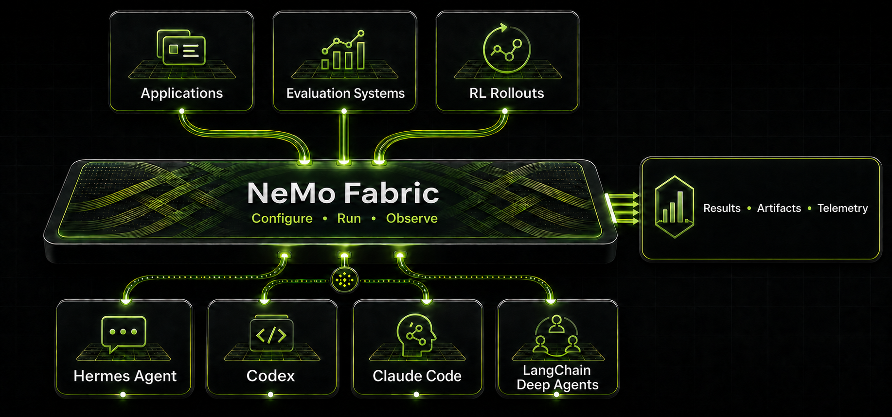
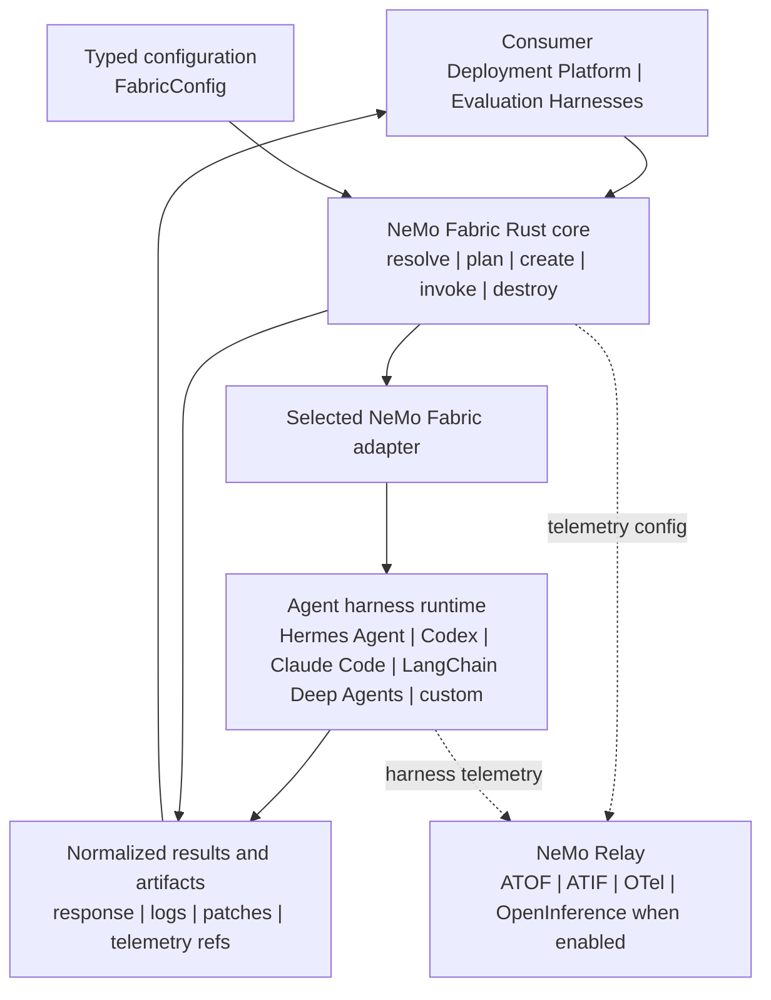

<!--
SPDX-FileCopyrightText: Copyright (c) 2026, NVIDIA CORPORATION & AFFILIATES. All rights reserved.
SPDX-License-Identifier: Apache-2.0
-->

# NVIDIA NeMo Fabric

[](https://github.com/NVIDIA/NeMo-Fabric/blob/main/LICENSE)
[](https://github.com/NVIDIA/NeMo-Fabric/)
[](https://github.com/NVIDIA/NeMo-Fabric/releases)
[](https://pypi.org/project/nemo-fabric/)
[](https://crates.io/crates/nemo-fabric-core)
[](https://crates.io/crates/nemo-fabric-cli)

<p align="center">
  
</p>

NVIDIA NeMo Fabric connects applications, evaluation systems, and reinforcement
learning rollout systems to agent harnesses such as Hermes Agent, Codex, Claude
Code, and LangChain Deep Agents through one configurable execution interface.

NeMo Fabric lets you change harnesses without rebuilding each integration,
isolate conflicting runtime dependencies, and manage harness configuration,
execution, and observability consistently. Every run returns normalized
results, artifacts, and telemetry for downstream systems to consume.

## Supported Harnesses

NeMo Fabric provides the following harness integrations:

| Agent Harness | Package Extra |
| --- | --- |
| [Claude Code](docs/integrations/harness/claude.mdx) | `nemo-fabric[claude]` |
| [Codex](docs/integrations/harness/codex.mdx) | `nemo-fabric[codex]` |
| [Hermes Agent](docs/integrations/harness/hermes.mdx) | `nemo-fabric[hermes]` |
| [LangChain Deep Agents](docs/integrations/harness/deepagents.mdx) | `nemo-fabric[deepagents]` |

## Supported Platforms

* Linux (x86_64, arm64)
* macOS (arm64)
* Windows (x86_64)

## Quick Start

The following example runs NeMo Fabric, the Hermes Agent adapter, and Hermes
Agent in one Python environment.

### Install NeMo Fabric and Hermes Agent

Create and activate a virtual environment, then install the required packages:

```bash
python -m venv .venv
source .venv/bin/activate
pip install "nemo-fabric[hermes,hermes-agent]"
```

### Set the API Key

Create an API key in the [NVIDIA API Catalog](https://build.nvidia.com/), then
set the `NVIDIA_API_KEY` environment variable:

```bash
export NVIDIA_API_KEY="<your-api-key>"
```

### Run Hermes Agent

Run the following Python example:

```python
import asyncio

from nemo_fabric import (
    Fabric,
    FabricConfig,
    HarnessConfig,
    MetadataConfig,
    ModelConfig,
)

config = FabricConfig(
    metadata=MetadataConfig(name="quickstart-agent"),
    harness=HarnessConfig(adapter_id="nvidia.fabric.hermes"),
    models={
        "default": ModelConfig(
            provider="nvidia",
            model="nvidia/nemotron-3-nano-30b-a3b",
            api_key_env="NVIDIA_API_KEY",
        )
    },
)

result = asyncio.run(Fabric().run(config, input="Who are you?"))
print(result.output.response)
```

`HarnessConfig.adapter_id` selects the Hermes Agent adapter. To use another
supported harness, install its package extra and set the corresponding adapter
ID. Pass harness-specific options through `HarnessConfig.settings`.

For a guided version of this example, refer to the
[`01_quickstart.ipynb` notebook](examples/notebooks/01_quickstart.ipynb). The
[example notebooks overview](examples/notebooks/README.md) describes the other
available notebooks.

## Use Separate Environments

The quick start uses one Python environment. Real-world deployments commonly
separate the application or evaluation host from the task environment where
NeMo Fabric and the selected harness run. For example, Harbor constructs
`FabricConfig` in its host process, then runs NeMo Fabric, the adapter, and the
harness inside an isolated task container. Refer to the
[Harbor execution model](examples/harbor/README.md#execution-model) for details.

NeMo Fabric can also run the runtime and harness in separate Python
environments. This setup can match existing deployment boundaries and isolate
their dependencies.

Create an environment for the NeMo Fabric runtime:

```bash
python -m venv .venv-fabric
source .venv-fabric/bin/activate
pip install "nemo-fabric[runtime]"
```

Create another environment for the adapter and harness. For example, install
the Hermes Agent integration:

```bash
python -m venv .venv-hermes
source .venv-hermes/bin/activate
pip install "nemo-fabric[hermes,hermes-agent]"
```

Run NeMo Fabric from its environment and set `ADAPTER_PYTHON` to the interpreter
that contains the adapter and harness:

```bash
source .venv-fabric/bin/activate
export ADAPTER_PYTHON="$PWD/.venv-hermes/bin/python"
```

For package options and platform-specific instructions, refer to the
[installation guide](docs/getting-started/install.mdx).

## Execution Flow

The following diagram shows how configuration moves through the core and
selected adapter to the harness, normalized results, artifacts, and telemetry:



## Next Steps

### Learn and Experiment

- [Example Notebooks](examples/notebooks/README.md) provide a guided tour of the Python SDK.
- [Python SDK guide](docs/sdk/python.mdx): typed configuration, planning,
  diagnostics, requests, multi-turn runtimes, parallelism, results, and errors.
- [Experimentation CLI](docs/experimentation/cli.mdx): presets, maintained
  examples, editable application scaffolds, and explicit non-goals.
- [Getting Started overview](docs/about-nemo-fabric/overview.mdx): interface
  selection and the end-to-end NeMo Fabric workflow.

### Consumer Integrations

Consumer integrations are northbound: they connect applications, evaluation
systems, and platforms to NeMo Fabric through its public interfaces.

- [Consumer integration skills](skills/README.md): repository-local coding-agent
  skills for integrating NeMo Fabric into an application through the Python SDK.
- [Harbor integration](docs/integrations/consumer/harbor.mdx): validate the
  integration with a deterministic, credential-free calculator smoke,
  optionally run the same task with Hermes Agent or Claude, and evaluate real
  coding tasks with SWE-Bench.

### Harness Integrations

Harness integrations are southbound: they connect NeMo Fabric to agent harnesses
through adapters.

- [Adapter compatibility and guides](adapters/README.md): compare bundled
  harness support, runtime ownership, telemetry integration, and package guides.

## Roadmap

- **Custom harnesses:** Publish the NeMo Fabric adapter contract so third-party
  developers can build Fabric-ready harness integrations. NeMo Fabric will
  support both Fabric-maintained first-party integrations and Fabric-ready
  third-party integrations.
- **Custom agents:** Support custom agents built on Fabric-maintained or
  Fabric-ready harnesses without requiring an additional, agent-specific
  adapter, while preserving the normalized NeMo Fabric lifecycle, results,
  artifacts, and telemetry.
