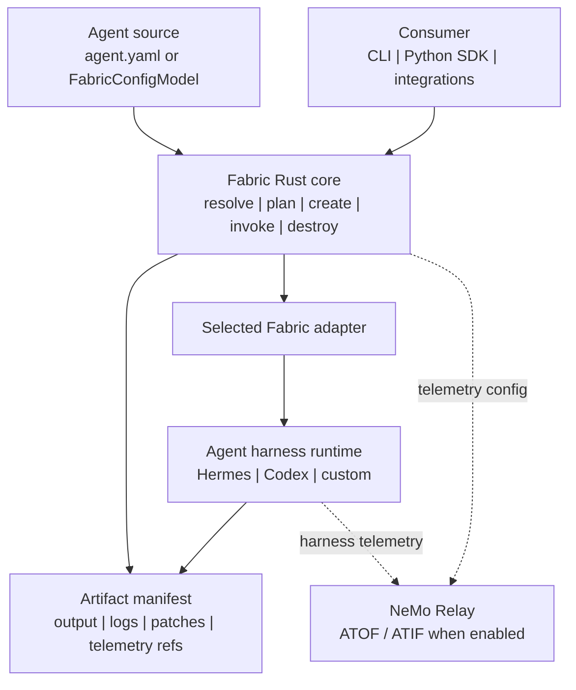

<!--
SPDX-FileCopyrightText: Copyright (c) 2026, NVIDIA CORPORATION & AFFILIATES. All rights reserved.
SPDX-License-Identifier: Apache-2.0
-->

# NVIDIA NeMo Fabric

Fabric is a runtime execution layer for agents. It turns multiple agent
harnesses into one configurable, observable lifecycle surface.

<p align="center">
  
</p>

## Architecture

NeMo Fabric standardizes how applications configure, launch, invoke, and collect
artifacts from agent harnesses.

Fabric provides:

- a versioned typed config contract, with `agent.yaml` as the portable file
  format;
- profile-based config variation for evaluation and ablation runs;
- adapter descriptors for harness-specific launch and control;
- a Rust core with a CLI and Python bindings;
- JSON Schema snapshots for the public config and runtime contract;
- normalized run results, artifact manifests, and telemetry references.



## Quick Start: Hermes SDK

This path installs Fabric, installs Hermes in a separate Python environment,
and runs one input through the Hermes SDK adapter.

Prerequisites:

- Rust and Cargo
- Python 3.10+ for Fabric
- Python 3.11-3.13 for Hermes
- [uv](https://docs.astral.sh/uv/getting-started/installation/)
- `just` 1.50.0+
- `NVIDIA_API_KEY` for NVIDIA-hosted model access

Install `just` if not already installed.
```bash
cargo install just --locked
```

Refer to the [official installation guide](https://just.systems/man/en/installation.html) for more details.

Install Fabric and the `fabric` CLI from the source checkout:

```bash
just build-all
export PATH="$HOME/.cargo/bin:$PATH"
```

Install Hermes into its own environment:

```bash
# Use any Python 3.11-3.13 interpreter for Hermes.
python3.12 -m venv .tmp/hermes-venv
.tmp/hermes-venv/bin/python -m pip install hermes-agent
```

If you are working from a local Hermes checkout, replace the final install line
with:

```bash
.tmp/hermes-venv/bin/python -m pip install -e ../hermes-agent
```

Run one input:

```bash
export NVIDIA_API_KEY=...
export HERMES_PYTHON="$PWD/.tmp/hermes-venv/bin/python"

fabric doctor examples/code-review-agent --profile hermes_sdk
fabric run examples/code-review-agent \
  --profile hermes_sdk \
  --input "Reply with exactly: fabric works"
```

The run returns a normalized `RunResult` JSON payload and writes logs/artifacts
under `examples/code-review-agent/artifacts/hermes-sdk/`.

## Core Concepts

- **Agent source:** callers provide either an agent package path or a typed
  `FabricConfigModel`. An agent package contains `agent.yaml` plus optional
  profiles, skills, repos, and artifacts. Start with
  `examples/code-review-agent/agent.yaml`.
- **Typed config:** SDK consumers can construct configuration in memory without
  materializing an agent directory. `agent.yaml` remains the portable
  representation for CLI use, examples, CI, and reproducible runs.
- **Profiles:** named variations of the base config. Use profiles to vary the
  harness, model, MCP, tools, skills, telemetry, or environment context without
  editing `agent.yaml`.
- **Adapters:** harness-specific integrations selected by `harness.adapter_id`.
  The Hermes SDK and CLI adapters live under `adapters/hermes-sdk/` and
  `adapters/hermes-cli/`; the Codex CLI adapter lives under
  `adapters/codex-cli/`. Harness-specific extensions belong under
  `harness.settings` so the normalized contract can remain stable.
- **Artifacts:** normalized output, logs, patches, and telemetry references
  returned through an `ArtifactManifest`.

Fabric applies profiles in caller order and validates the final effective config
before planning or running.

Path sources select profiles by name. Typed `FabricConfigModel` sources usually
compose the final config in Python; profile mappings remain available for callers
that need file-style overlays. The SDK rejects mixed profile stacks. See the
[Python SDK guide](docs/sdk/python.mdx) for the complete public API,
type definitions, lifecycle semantics, and compatibility rules.

## Use Fabric

Inspect the run plan before invoking a harness:

```bash
fabric plan examples/code-review-agent --profile hermes_sdk
fabric plan examples/code-review-agent --profile env_local --profile mcp_github
```

For temporary CLI experiments, apply dotted JSON overrides after profiles:

```bash
fabric inspect examples/code-review-agent \
  --profile hermes_sdk \
  --set telemetry.enabled=true \
  --set telemetry.output_dir=./artifacts/cli-set
```

Use Fabric from Python:

```python
import asyncio
from pathlib import Path

from nemo_fabric import Fabric

async def main():
    agent = Path("examples/code-review-agent")

    client = Fabric()
    resolved = client.resolve(agent, profiles=["hermes_sdk"])
    plan = client.plan(agent, profiles=["hermes_sdk"])
    report = await client.doctor(agent, profiles=["hermes_sdk"])

    print(resolved.agent_name)
    print(plan.agent_name)
    print(report.checks)

asyncio.run(main())
```

Consumers that already own a top-level job config can construct the Fabric slice
in code instead of materializing an agent directory:

```python
from nemo_fabric import Fabric, FabricConfigModel

config = FabricConfigModel(
    metadata={"name": "code-review-agent"},
    harness={"adapter_id": "nvidia.fabric.hermes.sdk"},
    models={
        "default": {
            "provider": "nvidia",
            "model": "nvidia/nemotron-3-nano-30b-a3b",
        }
    },
    runtime={
        "input_schema": "chat",
        "output_schema": "message",
    },
)
config.add_skill_path("./skills/code-review")
config.add_mcp_server(
    "github",
    transport="streamable-http",
    url="${GITHUB_MCP_URL}",
    exposure="harness_native",
)
config.enable_relay(output_dir="./artifacts/relay")

client = Fabric()
plan = client.plan(
    config,
    base_dir="examples/code-review-agent",
)
```

For runtime invocation, callers can either pass simple text or construct the
request explicitly. Results remain dict-compatible while exposing stable fields
as attributes:

```python
from nemo_fabric import Fabric, FabricConfigModel, FabricError, RunRequestModel

request = RunRequestModel(
    input="Review the workspace changes.",
    request_id="job-123-turn-1",
    context={"job_id": "job-123"},
    overrides={"max_iterations": 1},
)

async def run(raw_config):
    config = FabricConfigModel.from_mapping(raw_config)
    try:
        result = await Fabric().run(
            config,
            base_dir="examples/code-review-agent",
            request=request,
        )
    except FabricError as error:
        print(error.stage, error.code, error.retryable)
        raise

    print(result.status)
    print(result["runtime_id"])
```

`RunRequestModel.from_mapping(...)` accepts JSON-shaped request dictionaries
when callers load or compose requests outside the SDK. Per-request `context` is
caller-owned metadata; `overrides` are
request-scoped config changes applied only where the selected harness adapter
supports them. Failed runs expose structured
`result.error.stage`,
`result.error.code`, and `result.error.retryable` when the adapter returns a
normalized failure.

### Multi-Turn SDK Runtimes

Open a `Runtime` and invoke it repeatedly. The runtime keeps its adapter-owned
harness state active across turns rather than reconstructing state from a
Python-side transcript. Every `start_runtime(...)` call creates a new logical
runtime with its own structured `runtime_id`.

```python
import asyncio

from nemo_fabric import Fabric

async def chat():
    async with await Fabric().start_runtime(
        "examples/code-review-agent",
        profiles=["hermes_sdk"],
    ) as runtime:
        await runtime.invoke(input="My name is Robin.")
        reply = await runtime.invoke(input="What's my name?")   # recalls "Robin"
        print(runtime.runtime_id, runtime.status.value)
        print(reply["output"]["response"])

asyncio.run(chat())
```

`start_runtime(...)` accepts either an agent path with named profiles or a
`FabricConfigModel` with profile mappings. Each runtime permits one active
invocation at a time. Applications create independent runtimes and own queues,
retries, timeouts, and concurrency policy.

### Interactive CLI Chat

For local manual multi-turn testing, use `fabric chat`. It drives one started
runtime in an interactive loop:

```bash
fabric chat examples/code-review-agent \
  --profile hermes_cli \
  --verbose
```

The same runtime flow works with an existing Codex CLI login:

```bash
fabric chat examples/code-review-agent \
  --profile codex_cli
```

Each `fabric chat` start creates a new runtime. `fabric chat` prints a
`NEMO FABRIC` runtime banner with the agent, profile, harness, and runtime id at
startup and from `/info`, then uses a `you[profile:runtime]>` prompt and `agent>`
responses for the transcript.
`/help` shows commands, `/verbose on|off` toggles a fenced per-turn metadata
block after each agent response with request/invocation ids, status, artifact
count, and telemetry details, and `/clear` clears the terminal. `fabric run`
remains the machine-readable one-shot path. Because `chat` is an interactive
terminal UI, the transcript and metadata are written together on stderr.

The opt-in real integration checks are `tests/e2e/test_hermes_runtime.py` and
`tests/e2e/test_codex_cli.py`.

`Fabric()` uses the native Rust binding. SDK `run(...)` and
`start_runtime(...)` drive the core Fabric runtime lifecycle (`start_runtime` /
`invoke_runtime` / `stop_runtime`) so one-shot and multi-turn paths use the same
adapter execution contract. The CLI is a separate interface over the same Rust
core. For source-tree development, run `just build-python` before using the
SDK.

## Harbor Integration

Harbor can use Fabric as one external agent while Fabric selects the execution
harness from its ordered profile stack. Harbor retains task, environment,
verification, reward, and job ownership. `FabricAgent` invokes the Fabric Python
SDK inside the Harbor task environment; it does not invoke the Fabric CLI.

After preparing the demo build context as described in the
[Harbor multi-harness demo](integrations/harbor/demo/README.md), run the
credential-free integration example:

```bash
DEMO_DIR="$PWD/integrations/harbor/demo"

uv run --extra harbor harbor run \
  --path "$DEMO_DIR/task" \
  --agent nemo_fabric.integrations.harbor:FabricAgent \
  --ak fabric_config_path=/opt/fabric-demo/agent.yaml \
  --ak 'fabric_profile_paths=["/opt/fabric-demo/profiles/smoke.yaml"]' \
  --job-name fabric-smoke \
  --jobs-dir "$DEMO_DIR/runs" \
  --n-concurrent 1 \
  --n-attempts 1 \
  --force-build
```

The same Harbor agent can switch between the smoke, Hermes, Hermes with Relay
telemetry, and Codex profiles. See the
[Harbor integration guide](integrations/harbor/README.md) for ownership and
installation details, and the demo guide for the complete command matrix.

## Other Runs

Run one isolated Codex CLI turn using Codex's existing authentication and
configuration:

```bash
codex login status
fabric doctor examples/code-review-agent --profile codex_cli
fabric run examples/code-review-agent \
  --profile codex_cli \
  --input "Review the workspace and summarize the highest-risk issue."
```

Run the Hermes CLI adapter:

```bash
export NVIDIA_API_KEY=...
export PATH="$PWD/.tmp/hermes-venv/bin:$PATH"

fabric run examples/code-review-agent \
  --profile hermes_cli \
  --input "Reply with exactly: hermes cli ok"
```

## Tests

To run the full test suite, bootstrap a virtual environment with the optional dependencies.

```bash
uv venv --seed .venv --python 3.12'
source .venv/bin/activate
uv sync --all-groups --all-extras
```

Build Fabric and the Python extension, since we have already bootstrapped a virtual environment, we will pass the `no_uv` flag to avoid building reinstalling depdnendencies in the virtual environment.
```bash
just no_uv=true build-all
```

Run both Rust and Python tests:
```bash
just no_uv=true test-all
```

Run just the Rust tests:
```bash
just no_uv=true test-rust
```

Run just the Python tests:
```bash
just no_uv=true test-python
```

Running `pytest` directly:
```bash
pytest
```
