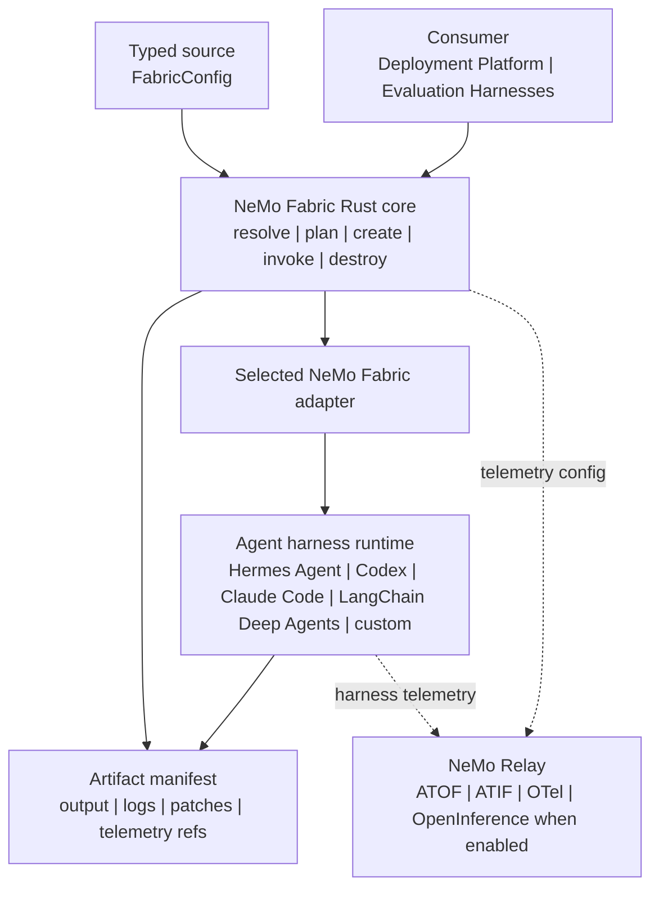

<!--
SPDX-FileCopyrightText: Copyright (c) 2026, NVIDIA CORPORATION & AFFILIATES. All rights reserved.
SPDX-License-Identifier: Apache-2.0
-->

[](https://github.com/NVIDIA/NeMo-Fabric/blob/main/LICENSE)
[](https://github.com/NVIDIA/NeMo-Fabric/)
[](https://github.com/NVIDIA/NeMo-Fabric/releases)
[](https://pypi.org/project/nemo-fabric/)
[](https://crates.io/crates/nemo-fabric-core)
[](https://crates.io/crates/nemo-fabric-cli)

# NVIDIA NeMo Fabric

<p align="center">
  
</p>

NeMo Fabric is a runtime execution layer that connects deployment platforms, evaluation harnesses, and RL rollout harnesses to multiple agent runtimes through one configurable, observable lifecycle surface.

You choose an agent harness-Hermes Agent, Codex, Claude Code, LangChain Deep Agents, or another harness integrated through a custom adapter-and call NeMo Fabric from your application or an evaluation harness such as Harbor; NeMo Fabric manages the harness lifecycle, and returns normalized results and artifacts.

## Installation

NeMo Fabric is capable of running in a seperate environment than the one used to run the agent harness, this avoids any potential dependency conflicts between the two.

Create an environment for NeMo Fabric, and install it.
```bash
python -m venv .venv
source .venv/bin/activate
pip install nemo-fabric[runtime]
```

In the environment used to run the agent harness, install the matching adapter for your agent harness. For example the Hermes Agent adapter:
```bash
pip install "nemo-fabric[hermes]"
```

**Supported Harnesses**

| Agent harness | Package extra |
| --- | --- |
| Claude Code | `nemo-fabric[claude]` |
| Codex | `nemo-fabric[codex]` |
| Hermes Agent | `nemo-fabric[hermes]` |
| LangChain Deep Agents | `nemo-fabric[deepagents]` |

**Supported Platforms**
* Linux (x86_64, arm64)
* macOS (arm64)
* Windows (x86_64)

Refer to [the installation guide](docs/getting-started/install.mdx) for more details.

## Quick Start

### Obtain API Keys

The following code example uses an NVIDIA-hosted model and requires an NVIDIA API key defined with the `NVIDIA_API_KEY`
environment variable. An API key can be obtained by creating an account on [`build.nvidia.com`](https://build.nvidia.com/).


```python
import asyncio

from nemo_fabric import (
    Fabric,
    FabricConfig,
    HarnessConfig,
    MetadataConfig,
    ModelConfig,
)

config = FabricConfig(
    metadata=MetadataConfig(name="quickstart-agent"),
    harness=HarnessConfig(adapter_id="nvidia.fabric.hermes"),
    models={
        "default": ModelConfig(
            provider="nvidia",
            model="nvidia/nemotron-3-nano-30b-a3b",
            api_key_env="NVIDIA_API_KEY",
        )
    },
)

result = asyncio.run(Fabric().run(config, input="Who are you?"))
print(result.output.response)
```

In the above example, the choice of harness is set by the `adapter_id` in the `HarnessConfig`. The example uses the Hermes Agent adapter, but you can change it to any other supported harness by changing the `adapter_id` to the appropriate value. Any harness-specific settings can be made by passing a dictionary to the `settings` field of the `HarnessConfig`.

A more detailed version of this example is available as a [Jupyter Notebook](https://jupyter.org/) at [`examples/notebooks/01_quickstart.ipynb`](examples/notebooks/01_quickstart.ipynb). Refer to [`examples/notebooks/README.md`](examples/notebooks/README.md) for other example notebooks.

## Architecture




## Next Steps

- [Example Notebooks](examples/notebooks/README.md) provide a guided tour of the Python SDK.
- [Python SDK guide](docs/sdk/python.mdx): typed configuration, planning,
  diagnostics, requests, multi-turn runtimes, parallelism, results, and errors.
- [Experimentation CLI](docs/experimentation/cli.mdx): presets, maintained
  examples, editable application scaffolds, and explicit non-goals.
- [Consumer integration skills](skills/README.md): repository-local coding-agent
  skills for integrating NeMo Fabric into an application through the Python SDK.
- [Getting Started overview](docs/about-nemo-fabric/overview.mdx): interface
  selection and the end-to-end NeMo Fabric workflow.
- [Harbor examples](examples/harbor/README.md): validate the integration with a
  deterministic, credential-free calculator smoke, optionally run the same
  task with Hermes Agent or Claude, and evaluate real coding tasks with SWE-Bench.
- [Adapter compatibility and guides](adapters/README.md): compare bundled
  harness support, runtime ownership, telemetry integration, and package guides.

