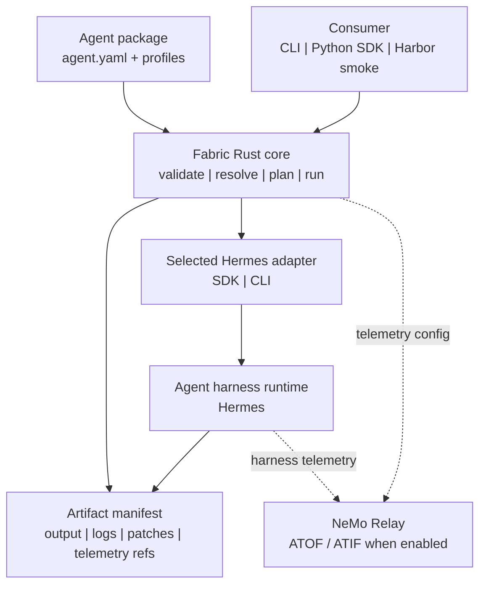

# NeMo Fabric

NeMo Fabric standardizes how applications configure, launch, invoke, and collect
artifacts from agent harnesses.

Fabric provides:

- a versioned `agent.yaml` config contract;
- profile-based config variation for evaluation and ablation runs;
- adapter descriptors for harness-specific launch and control;
- a Rust core with a CLI and Python bindings;
- JSON Schema snapshots for the public config and runtime contract;
- normalized run results, artifact manifests, and telemetry references.

## Architecture



## Repository Layout

```text
crates/fabric-core/      Rust core types, config resolution, planning, schemas
crates/fabric-cli/       `fabric` CLI
crates/fabric-python/    native Python extension
python/                  `nemo_fabric` Python SDK wrapper
schemas/                 committed JSON Schema snapshots
adapters/                maintained harness adapter implementations
integrations/            consumer integrations such as Harbor
examples/                sample agent packages and runnable demos
tests/                   CLI, SDK, Hermes, Relay, and Harbor smoke tests
```

## Requirements

- Rust and Cargo
- Python 3.10+
- `NVIDIA_API_KEY` for real Hermes/NVIDIA-hosted model runs
- `uv` only for the optional clean Hermes + Relay environment recipe

## Quick Start

Run the dependency-free checks:

```bash
cargo test
cargo check -p fabric-python
python3 tests/smoke_cli.py
python3 tests/smoke_hermes_cli.py
python3 tests/smoke_hermes_config_mapping.py
python3 tests/smoke_swebench_style.py
python3 python/tests/smoke_sdk.py
python3 python/tests/smoke_sdk_concurrency.py
```

Install the Python SDK with native bindings:

```bash
python3 -m venv .tmp/fabric-native-venv
.tmp/fabric-native-venv/bin/python -m pip install -e .
.tmp/fabric-native-venv/bin/python -c "from nemo_fabric import FabricClient; print(FabricClient().plan('examples/code-review-agent', profile='env_local')['agent_name'])"
.tmp/fabric-native-venv/bin/python python/tests/smoke_native_sdk.py
```

## CLI Usage

Validate and inspect the example agent package:

```bash
cargo run -p fabric-cli -- validate examples/code-review-agent
cargo run -p fabric-cli -- inspect examples/code-review-agent
cargo run -p fabric-cli -- doctor examples/code-review-agent --profile env_local
```

Plan a run with one or more profiles:

```bash
cargo run -p fabric-cli -- plan examples/code-review-agent --profile env_local
cargo run -p fabric-cli -- plan examples/code-review-agent --profile env_local --profile mcp_github
```

Generate or inspect JSON Schemas:

```bash
cargo run -p fabric-cli -- schema --name agent
cargo run -p fabric-cli -- schema --output-dir schemas
```

Run `cargo test` after regenerating schemas. The tests verify that committed
schema snapshots match the Rust core types.

## Python SDK Usage

```python
import asyncio
from pathlib import Path

from nemo_fabric import FabricClient

async def main():
    agent = Path("examples/code-review-agent")

    async with FabricClient() as client:
        plan = client.plan(agent, profile="env_local")
        report = await client.doctor(agent, profile="env_local")

    print(plan["agent_name"])
    print(report["checks"])

asyncio.run(main())
```

When installed from the repository root, `FabricClient()` uses the native Rust
binding. For source-tree debugging, pass an explicit CLI command:

```python
client = FabricClient(command=("cargo", "run", "-q", "-p", "fabric-cli", "--"))
```

## Agent Packages

Fabric supports an agent directory or a single `agent.yaml` file.

Canonical package:

```text
code-review-agent/
  agent.yaml
  profiles/
    env-local.yaml
    env-opensandbox.yaml
    hermes-cli.yaml
    hermes-real.yaml
    hermes-relay.yaml
    mcp-github.yaml
  repos/
  skills/
```

`agent.yaml` defines the default runnable package:

- `metadata`
- `harness`
- `models`
- `runtime`
- `environment`
- `tools`
- `skills`
- `mcp`
- `telemetry`
- `profiles.directories`

Profiles are named variations of the base config. Use profiles to vary harness,
model, MCP, tools, skills, telemetry, or environment context without editing
`agent.yaml`. Fabric applies profiles in the order provided by the caller and
validates the final effective config before planning or running.

Maintained adapter implementations live at the repository top level under
`adapters/`. Example agent packages reference adapters by `harness.adapter_id`;
they do not carry adapter implementation code. Package-local
`adapters/<adapter-name>/fabric-adapter.json` files are supported for custom
harnesses.

Adapter descriptors are adapter-owned JSON metadata. They tell Fabric which
runtime modes, transports, control locations, resolution strategies, runner
defaults, binaries, files, services, env vars, and plugin hooks an adapter
supports.

Adapter descriptors also declare same-runtime invocation concurrency. Fabric
does not schedule global parallelism; consumers may start multiple Fabric runs
or clients in parallel. Within one runtime handle, sessions are serialized by
default unless an adapter explicitly declares concurrent invocation support.

Run failures return structured `ErrorInfo` with lifecycle stage, stable code,
retryability, message, and adapter metadata. Consumers own job-level retries.

## Included Example Profiles

- `env_local`: local execution context with Relay disabled.
- `hermes_cli`: real Hermes CLI invocation through an installed `hermes`
  command.
- `hermes_real`: real Hermes SDK invocation through an installed Hermes Python
  environment.
- `hermes_relay`: real Hermes SDK invocation with Hermes-native NeMo Relay
  telemetry enabled.
- `mcp_github`: MCP capability variation layered on top of another profile.

## Optional Hermes CLI Run

The Hermes CLI path expects an installed `hermes` command and `NVIDIA_API_KEY`.
Fabric maps the resolved model, workspace, skill paths, MCP servers, selected
toolsets, and plugin settings into an isolated Hermes `config.yaml`, then runs
Hermes in one-shot mode.

```bash
export NVIDIA_API_KEY=...
cargo run -p fabric-cli -- run examples/code-review-agent --profile hermes_cli --input "Reply with exactly: hermes cli ok"
```

## Optional Hermes SDK Run

The real Hermes SDK path expects an installed Hermes Python environment and
`NVIDIA_API_KEY`.
Fabric maps the resolved model, workspace, skill paths, MCP servers, selected
toolsets, plugins, and Relay settings into an isolated Hermes `config.yaml`
before invoking the Hermes SDK.

```bash
export NVIDIA_API_KEY=...
export HERMES_PYTHON=/path/to/hermes/python
RUN_FABRIC_HERMES_INTEGRATION=1 python3 tests/smoke_hermes_real.py
```

If `HERMES_PYTHON` is unset, the smoke first tries the current Python
interpreter and then `python3`.

## Optional Hermes + NeMo Relay Run

The Hermes Relay path uses Hermes' native `observability/nemo_relay` plugin.
Fabric writes `relay-config.json`, prepares an isolated `HERMES_HOME`, enables
the Hermes plugin, maps the Fabric Relay config into Hermes export settings, and
lets Hermes emit ATOF/ATIF from the real session, LLM, and tool lifecycle.

For a sibling checkout layout:

```bash
uv venv .tmp/fabric-hermes-relay-venv --python 3.12
uv pip install --python .tmp/fabric-hermes-relay-venv/bin/python \
  -e ../nemo-relay \
  -e ../hermes-agent

export NVIDIA_API_KEY=...
export HERMES_PYTHON="$PWD/.tmp/fabric-hermes-relay-venv/bin/python"
RUN_FABRIC_RELAY_INTEGRATION=1 python3 tests/smoke_relay_integration.py
```

Adjust the editable install paths if your checkouts live elsewhere.

## Optional Harbor SWE-Bench Task Smoke

The Harbor SWE-Bench smoke keeps Harbor responsible for task materialization and
uses Fabric as the harness runner. It expects a sibling `../harbor` checkout
with the generated `django__django-13741` task and a local SWE-Bench image:

```bash
RUN_FABRIC_HARBOR_SWEBENCH_DOCKER=1 python3 tests/smoke_harbor_swebench_task.py
```

The smoke copies `/testbed` from
`swebench/sweb.eval.x86_64.django_1776_django-13741:latest`, invokes the
test fixture `harbor_swebench_django_13741` profile with a structured
`RunRequest`, and asserts that Fabric captures a patch artifact for
`django/contrib/auth/forms.py`.
