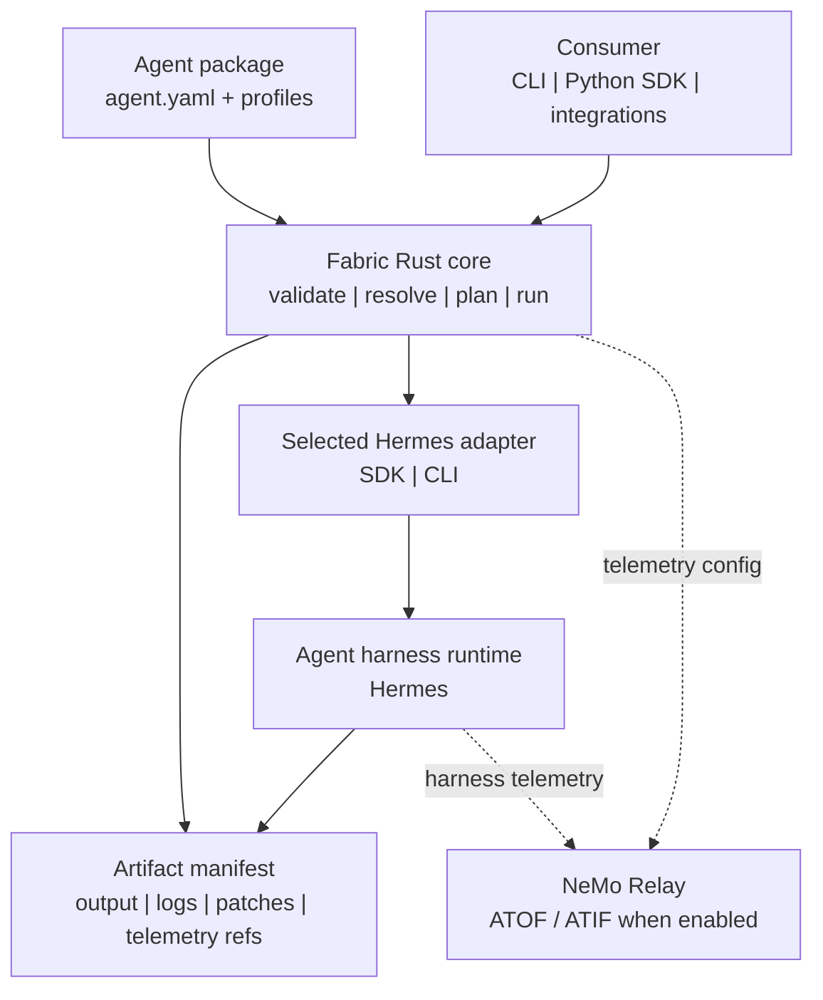

<!--
SPDX-FileCopyrightText: Copyright (c) 2026, NVIDIA CORPORATION & AFFILIATES. All rights reserved.
SPDX-License-Identifier: Apache-2.0
-->

# NVIDIA NeMo Fabric

Fabric is the harness-management layer that turns many agent runtimes into one
configurable, observable execution surface.

<p align="center">
  
</p>

## Architecture

NeMo Fabric standardizes how applications configure, launch, invoke, and collect
artifacts from agent harnesses.

Fabric provides:

- a versioned typed config contract, with `agent.yaml` as the portable file
  format;
- profile-based config variation for evaluation and ablation runs;
- adapter descriptors for harness-specific launch and control;
- a Rust core with a CLI and Python bindings;
- JSON Schema snapshots for the public config and runtime contract;
- normalized run results, artifact manifests, and telemetry references.



## Quick Start: Hermes SDK

This path installs Fabric, installs Hermes in a separate Python environment,
and runs one input through the Hermes SDK adapter.

Prerequisites:

- Rust and Cargo
- Python 3.10+ for Fabric
- Python 3.11-3.13 for Hermes
- `NVIDIA_API_KEY` for NVIDIA-hosted model access

Install Fabric and the `fabric` CLI:

```bash
python3 -m venv .tmp/fabric-venv
.tmp/fabric-venv/bin/python -m pip install -e .

cargo install --path crates/fabric-cli --locked --force
export PATH="$HOME/.cargo/bin:$PATH"
```

Install Hermes into its own environment:

```bash
# Use any Python 3.11-3.13 interpreter for Hermes.
python3.12 -m venv .tmp/hermes-venv
.tmp/hermes-venv/bin/python -m pip install hermes-agent
```

If you are working from a local Hermes checkout, replace the final install line
with:

```bash
.tmp/hermes-venv/bin/python -m pip install -e ../hermes-agent
```

Run one input:

```bash
export NVIDIA_API_KEY=...
export HERMES_PYTHON="$PWD/.tmp/hermes-venv/bin/python"

fabric doctor examples/code-review-agent --profile hermes_sdk
fabric run examples/code-review-agent \
  --profile hermes_sdk \
  --input "Reply with exactly: fabric works"
```

The run returns a normalized `RunResult` JSON payload and writes logs/artifacts
under `examples/code-review-agent/artifacts/hermes-sdk/`.

## Core Concepts

- **Agent package:** an `agent.yaml` file plus optional profiles, skills, repos,
  and artifacts. Start with `examples/code-review-agent/agent.yaml`.
- **Typed config:** the SDK can pass an in-memory config directly to Fabric.
  `agent.yaml` is the portable representation for CLI, examples, CI, and
  reproducible runs.
- **Profiles:** named variations of the base config. Use profiles to vary the
  harness, model, MCP, tools, skills, telemetry, or environment context without
  editing `agent.yaml`.
- **Adapters:** harness-specific integrations selected by `harness.adapter_id`.
  The Hermes SDK and CLI adapters live under `adapters/hermes-sdk/` and
  `adapters/hermes-cli/`.
- **Artifacts:** normalized output, logs, patches, and telemetry references
  returned through an `ArtifactManifest`.

Fabric applies profiles in caller order and validates the final effective config
before planning or running.

## Use Fabric

Inspect the run plan before invoking a harness:

```bash
fabric plan examples/code-review-agent --profile hermes_sdk
fabric plan examples/code-review-agent --profile env_local --profile mcp_github
```

Use Fabric from Python:

```python
import asyncio
from pathlib import Path

from nemo_fabric import FabricClient

async def main():
    agent = Path("examples/code-review-agent")

    async with FabricClient() as client:
        plan = client.plan(agent, profile="hermes_sdk")
        report = await client.doctor(agent, profile="hermes_sdk")

    print(plan["agent_name"])
    print(report["checks"])

asyncio.run(main())
```

Consumers that already own a top-level job config can construct the Fabric slice
in code instead of materializing an agent directory:

```python
plan = client.plan_config(
    {
        "schema_version": "fabric.agent/v1alpha1",
        "metadata": {"name": "code-review-agent"},
        "harness": {"adapter_id": "nvidia.fabric.hermes.sdk"},
        "models": {
            "default": {
                "provider": "nvidia",
                "model": "nvidia/nemotron-3-nano-30b-a3b",
            }
        },
        "runtime": {
            "mode": "session",
            "transport": "library",
            "input_schema": "chat",
            "output_schema": "message",
        },
    },
    base_dir="examples/code-review-agent",
)
```

### Multi-Turn SDK Sessions

Open a `Session` and invoke it repeatedly. The session
keeps one Fabric runtime handle active across turns; harness/adapter state is
authoritative rather than reconstructed from a Python-side transcript.
Pass `session_id` when the caller already owns the harness conversation id;
otherwise Fabric uses the generated runtime id:

```python
import asyncio

from nemo_fabric import FabricClient

async def chat():
    async with await FabricClient().start(
        "examples/code-review-agent",
        profile="hermes_session",
        session_id="review-session-123",
    ) as session:
        await session.invoke("My name is Robin.")
        reply = await session.invoke("What's my name?")   # recalls "Robin"
        print(session.runtime_id, session.session_id, session.status.value)
        print(reply["output"]["response"])

asyncio.run(chat())
```

Sessions require the native binding; `start_config(...)` is the typed-config
equivalent. `stream(...)` yields events then the final result (buffered today);
`cancel()` cooperatively aborts an in-flight turn. Session APIs require
`runtime.mode: session`.

### Interactive CLI Chat

For local manual multi-turn testing, use `fabric chat` with a session-mode
profile. It drives the same started runtime in an interactive loop:

```bash
fabric chat examples/code-review-agent \
  --profile hermes_cli_session \
  --session-id review-session-123 \
  --verbose
```

`--session-id` is optional. Pass it when you want to resume or share a known
harness conversation id; otherwise Fabric uses the generated runtime id.
`fabric chat` prints a `NEMO FABRIC` session banner with the agent, profile,
harness, runtime id, and session id at startup and from `/info`, then uses a
`you[profile:session]>` prompt and `agent>` responses for the transcript.
`/help` shows commands, `/verbose on|off` toggles a fenced per-turn metadata
block after each agent response with request/invocation ids, status, artifact
count, and telemetry details, and `/clear` clears the terminal. `fabric chat`
requires `runtime.mode: session`; use `fabric run` for oneshot profiles and
machine-readable stdout. Because `chat` is an interactive terminal UI, the
transcript and metadata are written together on stderr.

The real-Hermes integration check is `tests/smoke_hermes_session.py`.

When installed from the repository root, `FabricClient()` uses the native Rust
binding. SDK `run(...)`, `start(...)`, and their typed-config equivalents all
drive the core Fabric runtime lifecycle (`start_runtime` / `invoke_runtime` /
`stop_runtime`) so one-shot and session paths use the same adapter execution
contract.

For source-tree debugging, pass an explicit CLI command:

```python
client = FabricClient(command=("cargo", "run", "-q", "-p", "fabric-cli", "--"))
```

## Other Runs

Run the Hermes CLI adapter:

```bash
export NVIDIA_API_KEY=...
export PATH="$PWD/.tmp/hermes-venv/bin:$PATH"

fabric run examples/code-review-agent \
  --profile hermes_cli \
  --input "Reply with exactly: hermes cli ok"
```

Run Hermes with NeMo Relay enabled:

```bash
uv venv .tmp/fabric-hermes-relay-venv --python 3.12
uv pip install --python .tmp/fabric-hermes-relay-venv/bin/python \
  -e ../nemo-relay \
  -e ../hermes-agent

export NVIDIA_API_KEY=...
export HERMES_PYTHON="$PWD/.tmp/fabric-hermes-relay-venv/bin/python"
RUN_FABRIC_RELAY_INTEGRATION=1 python3 tests/smoke_relay_integration.py
```
