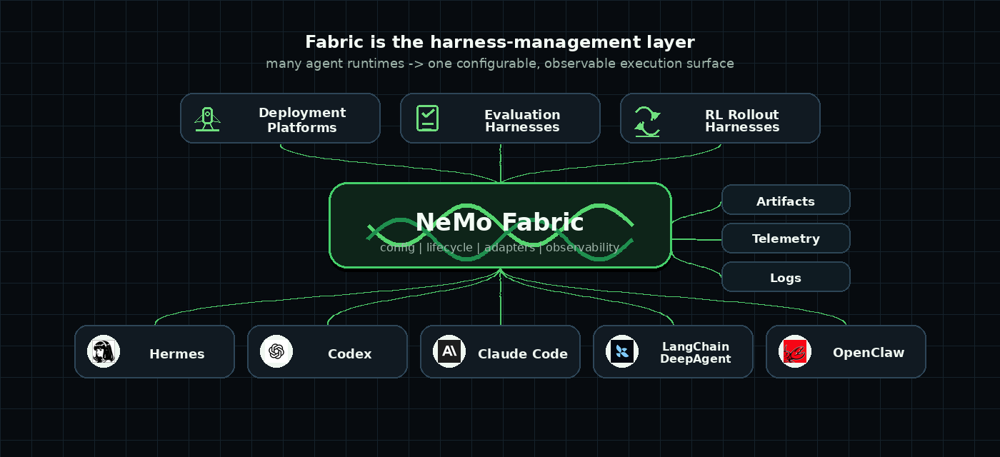
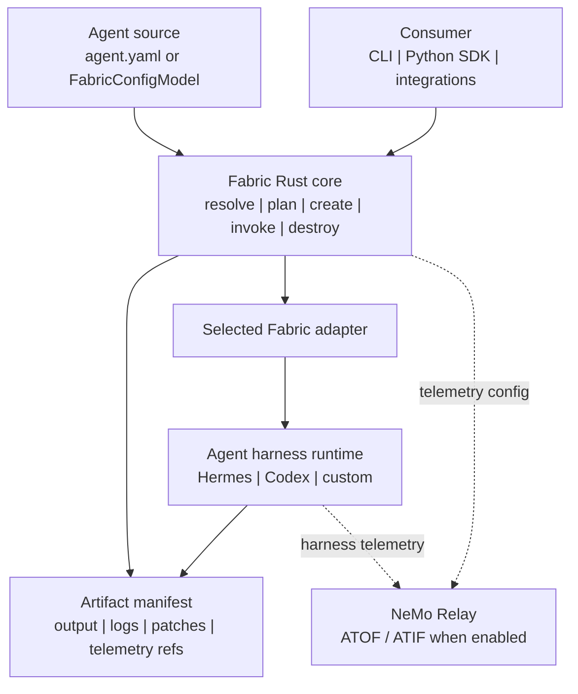

<!--
SPDX-FileCopyrightText: Copyright (c) 2026, NVIDIA CORPORATION & AFFILIATES. All rights reserved.
SPDX-License-Identifier: Apache-2.0
-->

# NVIDIA NeMo Fabric

Fabric is a runtime execution layer for agents. It turns multiple agent
harnesses into one configurable, observable lifecycle surface.

<p align="center">
  
</p>

## Architecture

NeMo Fabric standardizes how applications configure, launch, invoke, and collect
artifacts from agent harnesses.

Fabric provides:

- a versioned typed config contract, with `agent.yaml` as the portable file
  format;
- profile-based config variation for evaluation and ablation runs;
- adapter descriptors for harness-specific launch and control;
- a Rust core with a CLI and Python bindings;
- JSON Schema snapshots for the public config and runtime contract;
- normalized run results, artifact manifests, and telemetry references.



## Quick Start: Hermes SDK

This path installs Fabric, installs Hermes in a separate Python environment,
and runs one input through the Hermes SDK adapter.

Prerequisites:

- Rust and Cargo
- Python 3.10+ for Fabric
- Python 3.11-3.13 for Hermes
- [uv](https://docs.astral.sh/uv/getting-started/installation/)
- `just` 1.50.0+
- `NVIDIA_API_KEY` for NVIDIA-hosted model access

Install `just` if not already installed.
```bash
cargo install just --locked
```

Refer to the [official installation guide](https://just.systems/man/en/installation.html) for more details.

Install Fabric and the `fabric` CLI from the source checkout:

```bash
just build-all
export PATH="$HOME/.cargo/bin:$PATH"
```

Install Hermes into its own environment:

```bash
# Use any Python 3.11-3.13 interpreter for Hermes.
python3.12 -m venv .tmp/hermes-venv
.tmp/hermes-venv/bin/python -m pip install hermes-agent
```

If you are working from a local Hermes checkout, replace the final install line
with:

```bash
.tmp/hermes-venv/bin/python -m pip install -e ../hermes-agent
```

Run one input:

```bash
export NVIDIA_API_KEY=...
export HERMES_PYTHON="$PWD/.tmp/hermes-venv/bin/python"

fabric doctor examples/code-review-agent --profile hermes_sdk
fabric run examples/code-review-agent \
  --profile hermes_sdk \
  --input "Reply with exactly: fabric works"
```

The run returns a normalized `RunResult` JSON payload and writes logs/artifacts
under `examples/code-review-agent/artifacts/hermes-sdk/`.

## Core Concepts

- **Agent source:** callers provide either an agent package path or a typed
  `FabricConfigModel`. An agent package contains `agent.yaml` plus optional
  profiles, skills, repos, and artifacts. Start with
  `examples/code-review-agent/agent.yaml`.
- **Typed config:** SDK consumers can construct configuration in memory without
  materializing an agent directory. `agent.yaml` remains the portable
  representation for CLI use, examples, CI, and reproducible runs.
- **Profiles:** named variations of the base config. Use profiles to vary the
  harness, model, MCP, tools, skills, telemetry, or environment context without
  editing `agent.yaml`.
- **Adapters:** harness-specific integrations selected by `harness.adapter_id`.
  The Hermes SDK and CLI adapters live under `adapters/hermes-sdk/` and
  `adapters/hermes-cli/`; the Codex CLI adapter lives under
  `adapters/codex-cli/`. Harness-specific extensions belong under
  `harness.settings` so the normalized contract can remain stable.
- **Artifacts:** normalized output, logs, patches, and telemetry references
  returned through an `ArtifactManifest`.

Fabric applies profiles in caller order and validates the final effective config
before planning or running.

Path sources select profiles by name. Typed `FabricConfigModel` sources usually
compose the final config in Python; profile mappings remain available for callers
that need file-style overlays. The SDK rejects mixed profile stacks. See the
[Python SDK guide](docs/sdk/python.mdx) for the complete public API,
type definitions, lifecycle semantics, and compatibility rules.

## Python Quick Start

After completing the Hermes setup above, run the same agent package through the
Python SDK:

```python
import asyncio

from nemo_fabric import Fabric


async def main() -> None:
    result = await Fabric().run(
        "examples/code-review-agent",
        profiles=["hermes_sdk"],
        input="Reply with exactly: fabric works",
    )
    print(result.status)
    print(result.output)


asyncio.run(main())
```

`run(...)` owns the complete start, invoke, and stop lifecycle. For typed
in-memory configuration, planning and diagnostics, explicit requests,
multi-turn runtimes, application-owned parallelism, results, and errors, see
the [Python SDK guide](docs/sdk/python.mdx). Exact signatures are in the
[generated Python API reference](docs/reference/api/python-library-reference/index.md).

## More Workflows

- [Python SDK guide](docs/sdk/python.mdx): typed configuration, planning,
  diagnostics, requests, multi-turn runtimes, parallelism, results, and errors.
- [Getting Started overview](docs/getting-started/overview.mdx): interface
  selection and the end-to-end Fabric workflow.
- [Harbor integration guide](integrations/harbor/README.md) and
  [multi-harness demo](integrations/harbor/demo/README.md): ownership,
  installation, and complete command matrices.
- Adapter guides: [Hermes SDK](adapters/hermes-sdk/README.md),
  [Hermes CLI](adapters/hermes-cli/README.md), and
  [Codex CLI](adapters/codex-cli/README.md).

## Tests

To run the full test suite, bootstrap a virtual environment with the optional dependencies.

```bash
uv venv --seed .venv --python 3.12'
source .venv/bin/activate
uv sync --all-groups --all-extras
```

Build Fabric and the Python extension, since we have already bootstrapped a virtual environment, we will pass the `no_uv` flag to avoid building reinstalling depdnendencies in the virtual environment.
```bash
just no_uv=true build-all
```

Run both Rust and Python tests:
```bash
just no_uv=true test-all
```

Run just the Rust tests:
```bash
just no_uv=true test-rust
```

Run just the Python tests:
```bash
just no_uv=true test-python
```

Running `pytest` directly:
```bash
pytest
```
