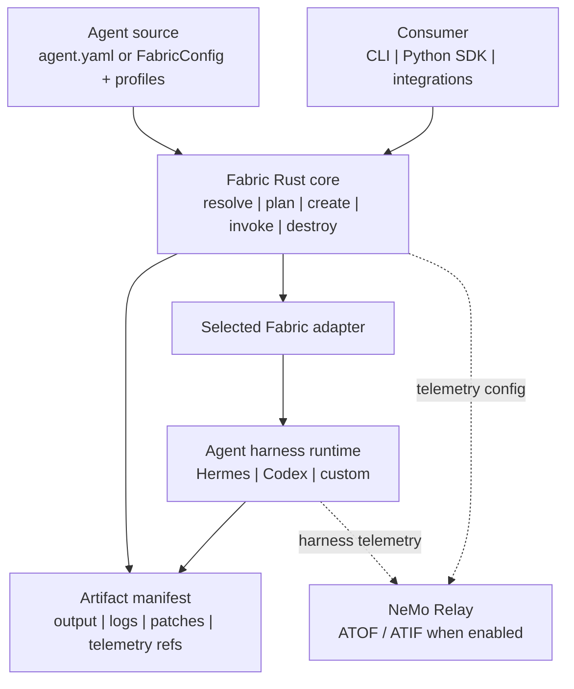

<!--
SPDX-FileCopyrightText: Copyright (c) 2026, NVIDIA CORPORATION & AFFILIATES. All rights reserved.
SPDX-License-Identifier: Apache-2.0
-->

# NVIDIA NeMo Fabric

Fabric is a runtime execution layer for agents. It turns multiple agent
harnesses into one configurable, observable lifecycle surface.

<p align="center">
  
</p>

## Architecture

NeMo Fabric standardizes how applications configure, launch, invoke, and collect
artifacts from agent harnesses.

Fabric provides:

- a versioned typed config contract, with `agent.yaml` as the portable file
  format;
- profile-based config variation for evaluation and ablation runs;
- adapter descriptors for harness-specific launch and control;
- a Rust core with a CLI and Python bindings;
- JSON Schema snapshots for the public config and runtime contract;
- normalized run results, artifact manifests, and telemetry references.



## Quick Start: Hermes SDK

This path installs Fabric, installs Hermes in a separate Python environment,
and runs one input through the Hermes SDK adapter.

Prerequisites:

- Rust and Cargo
- Python 3.10+ for Fabric
- Python 3.11-3.13 for Hermes
- [uv](https://docs.astral.sh/uv/getting-started/installation/)
- `just` 1.50.0+
- `NVIDIA_API_KEY` for NVIDIA-hosted model access

Install `just` if not already installed.
```bash
cargo install just --locked
```

Refer to the [official installation guide](https://just.systems/man/en/installation.html) for more details.

Install Fabric and the `fabric` CLI from the source checkout:

```bash
just build-all
export PATH="$HOME/.cargo/bin:$PATH"
```

Install Hermes into its own environment:

```bash
# Use any Python 3.11-3.13 interpreter for Hermes.
python3.12 -m venv .tmp/hermes-venv
.tmp/hermes-venv/bin/python -m pip install hermes-agent
```

If you are working from a local Hermes checkout, replace the final install line
with:

```bash
.tmp/hermes-venv/bin/python -m pip install -e ../hermes-agent
```

Run one input:

```bash
export NVIDIA_API_KEY=...
export HERMES_PYTHON="$PWD/.tmp/hermes-venv/bin/python"

fabric doctor examples/code-review-agent --profile hermes_sdk
fabric run examples/code-review-agent \
  --profile hermes_sdk \
  --input "Reply with exactly: fabric works"
```

The run returns a normalized `RunResult` JSON payload and writes logs/artifacts
under `examples/code-review-agent/artifacts/hermes-sdk/`.

## Core Concepts

- **Agent source:** callers provide either an agent package path or a typed
  `FabricConfig`. An agent package contains `agent.yaml` plus optional profiles,
  skills, repos, and artifacts. Start with
  `examples/code-review-agent/agent.yaml`.
- **Typed config:** SDK consumers can construct configuration in memory without
  materializing an agent directory. `agent.yaml` remains the portable
  representation for CLI use, examples, CI, and reproducible runs.
- **Profiles:** named variations of the base config. Use profiles to vary the
  harness, model, MCP, tools, skills, telemetry, or environment context without
  editing `agent.yaml`.
- **Adapters:** harness-specific integrations selected by `harness.adapter_id`.
  The Hermes SDK and CLI adapters live under `adapters/hermes-sdk/` and
  `adapters/hermes-cli/`; the Codex CLI adapter lives under
  `adapters/codex-cli/`. Harness-specific extensions belong under
  `harness.settings` so the normalized contract can remain stable.
- **Artifacts:** normalized output, logs, patches, and telemetry references
  returned through an `ArtifactManifest`.

Fabric applies profiles in caller order and validates the final effective config
before planning or running.

Path sources select profiles by name. Typed `FabricConfig` sources use ordered
`FabricProfileConfig` objects; the SDK rejects mixed profile stacks. See the
[Python SDK contract](docs/python-sdk-contract.md) for the complete public API,
type definitions, lifecycle semantics, and compatibility rules.

## Use Fabric

Inspect the run plan before invoking a harness:

```bash
fabric plan examples/code-review-agent --profile hermes_sdk
fabric plan examples/code-review-agent --profile env_local --profile mcp_github
```

Use Fabric from Python:

```python
import asyncio
from pathlib import Path

from nemo_fabric import Fabric

async def main():
    agent = Path("examples/code-review-agent")

    async with Fabric() as client:
        resolved = client.resolve(agent, profiles=["hermes_sdk"])
        plan = client.plan(agent, profiles=["hermes_sdk"])
        report = await client.doctor(agent, profiles=["hermes_sdk"])

    print(resolved.agent_name)
    print(plan.agent_name)
    print(report.checks)

asyncio.run(main())
```

Consumers that already own a top-level job config can construct the Fabric slice
in code instead of materializing an agent directory:

```python
from nemo_fabric import Fabric, FabricConfig

config = FabricConfig.from_mapping(
    {
        "schema_version": "fabric.agent/v1alpha1",
        "metadata": {"name": "code-review-agent"},
        "harness": {"adapter_id": "nvidia.fabric.hermes.sdk"},
        "models": {
            "default": {
                "provider": "nvidia",
                "model": "nvidia/nemotron-3-nano-30b-a3b",
            }
        },
        "runtime": {
            "input_schema": "chat",
            "output_schema": "message",
        },
    },
)

client = Fabric()
plan = client.plan(
    config,
    base_dir="examples/code-review-agent",
)
```

For runtime invocation, callers can either pass simple text or construct the
request explicitly. Results remain dict-compatible while exposing stable fields
as attributes:

```python
from nemo_fabric import Fabric, FabricConfig, FabricError, RunRequest

request = RunRequest(
    input="Review the workspace changes.",
    request_id="job-123-turn-1",
    context={"job_id": "job-123"},
    overrides={"max_iterations": 1},
)

async def run(raw_config):
    config = FabricConfig.from_mapping(raw_config)
    try:
        async with Fabric() as client:
            result = await client.run(
                config,
                base_dir="examples/code-review-agent",
                session_id="job-123",
                request=request,
            )
    except FabricError as error:
        print(error.stage, error.code, error.retryable)
        raise

    print(result.status)
    print(result["runtime_id"])
```

`RunRequest.from_mapping(...)` accepts JSON-shaped request dictionaries when
callers load or compose requests outside the SDK. Per-request `context` is
caller-owned metadata; `overrides` are
request-scoped config changes applied only where the selected harness adapter
supports them. `session_id` is a first-class convenience for passing the stable
conversation key through request context. Failed runs expose structured
`result.error.stage`,
`result.error.code`, and `result.error.retryable` when the adapter returns a
normalized failure.

### Multi-Turn SDK Sessions

Open a `Session` and invoke it repeatedly. The session keeps one Fabric runtime
handle active across turns; harness/adapter state is authoritative rather than
reconstructed from a Python-side transcript.

Fabric separates runtime identity from conversation identity. Each
`start_session(...)` call creates a new `runtime_id` for that runtime lifecycle.
`session_id` is the stable conversation key used for resume: if omitted, Fabric
uses the generated `runtime_id`; if supplied, Fabric uses the caller-provided
`session_id`.

```python
import asyncio

from nemo_fabric import Fabric

async def chat():
    async with await Fabric().start_session(
        "examples/code-review-agent",
        profiles=["hermes_session"],
        session_id="review-session-123",
    ) as session:
        await session.invoke(input="My name is Robin.")
        reply = await session.invoke(input="What's my name?")   # recalls "Robin"
        print(session.runtime_id, session.session_id, session.status.value)
        print(reply["output"]["response"])

asyncio.run(chat())
```

`start_session(...)` accepts either an agent path with named profiles or a
`FabricConfig` with typed profiles. `stream(...)` is the stable streaming API;
current adapters may buffer internally before yielding events and the final
result. Runtime updates and cancellation are capability-gated and raise
`FabricCapabilityError` when the selected runtime does not support them.
Session APIs require an adapter that advertises session capability.

Service mode is part of the forward SDK contract but is not implemented by the
current runtime. `start_service(...)` raises `FabricCapabilityError` rather than
silently emulating server or tenancy behavior outside Fabric's execution scope.

### Interactive CLI Chat

For local manual multi-turn testing, use `fabric chat` with a profile whose
adapter supports sessions. It drives the same started runtime in an interactive
loop:

```bash
fabric chat examples/code-review-agent \
  --profile hermes_cli_session \
  --session-id review-session-123 \
  --verbose
```

The same session flow works with an existing Codex CLI login:

```bash
fabric chat examples/code-review-agent \
  --profile codex_cli_session \
  --session-id review-session-123
```

`--session-id` is optional. Each `fabric chat` start creates a new `runtime_id`;
the session id is the stable resume key. If `--session-id` is omitted, Fabric
uses the generated `runtime_id` as the session id. If you want a later chat run
to resume the same conversation, pass that prior session id explicitly.
`fabric chat` prints a `NEMO FABRIC` session banner with the agent, profile,
harness, runtime id, and session id at startup and from `/info`, then uses a
`you[profile:session]>` prompt and `agent>` responses for the transcript.
`/help` shows commands, `/verbose on|off` toggles a fenced per-turn metadata
block after each agent response with request/invocation ids, status, artifact
count, and telemetry details, and `/clear` clears the terminal. `fabric run`
remains the machine-readable one-shot path. Because `chat` is an interactive
terminal UI, the transcript and metadata are written together on stderr.

The opt-in real integration checks are `tests/smoke_hermes_session.py` and
`tests/smoke_codex_cli.py`.

`Fabric()` uses the native Rust binding. SDK `run(...)` and
`start_session(...)` drive the core Fabric runtime lifecycle (`start_runtime` /
`invoke_runtime` / `stop_runtime`) so one-shot and session paths use the same
adapter execution contract. The CLI is a separate interface over the same Rust
core. For source-tree development, run `just build-python` before using the
SDK.

## Harbor Integration

Harbor can use Fabric as one external agent while Fabric selects the execution
harness from its ordered profile stack. Harbor retains task, environment,
verification, reward, and job ownership. `FabricAgent` invokes the Fabric Python
SDK inside the Harbor task environment; it does not invoke the Fabric CLI.

After preparing the demo build context as described in the
[Harbor multi-harness demo](integrations/harbor/demo/README.md), run the
credential-free integration example:

```bash
DEMO_DIR="$PWD/integrations/harbor/demo"

uv run --extra harbor harbor run \
  --path "$DEMO_DIR/task" \
  --agent nemo_fabric.integrations.harbor:FabricAgent \
  --ak fabric_config_path=/opt/fabric-demo/agent.yaml \
  --ak 'fabric_profile_paths=["/opt/fabric-demo/profiles/smoke.yaml"]' \
  --job-name fabric-smoke \
  --jobs-dir "$DEMO_DIR/runs" \
  --n-concurrent 1 \
  --n-attempts 1 \
  --force-build
```

The same Harbor agent can switch between the smoke, Hermes, Hermes with Relay
telemetry, and Codex profiles. See the
[Harbor integration guide](integrations/harbor/README.md) for ownership and
installation details, and the demo guide for the complete command matrix.

## Other Runs

Run one isolated Codex CLI turn using Codex's existing authentication and
configuration:

```bash
codex login status
fabric doctor examples/code-review-agent --profile codex_cli
fabric run examples/code-review-agent \
  --profile codex_cli \
  --input "Review the workspace and summarize the highest-risk issue."
```

Run the real one-shot and session smoke after installing Fabric with its native
extension:

```bash
python3 -m pip install -e ".[codex]"
RUN_FABRIC_CODEX_INTEGRATION=1 python3 tests/smoke_codex_cli.py
```

Run the Hermes CLI adapter:

```bash
export NVIDIA_API_KEY=...
export PATH="$PWD/.tmp/hermes-venv/bin:$PATH"

fabric run examples/code-review-agent \
  --profile hermes_cli \
  --input "Reply with exactly: hermes cli ok"
```

Run Hermes with NeMo Relay enabled:

```bash
uv venv .tmp/fabric-hermes-relay-venv --python 3.12
uv pip install --python .tmp/fabric-hermes-relay-venv/bin/python \
  -e ../nemo-relay \
  -e ../hermes-agent

export NVIDIA_API_KEY=...
export HERMES_PYTHON="$PWD/.tmp/fabric-hermes-relay-venv/bin/python"
RUN_FABRIC_RELAY_INTEGRATION=1 python3 tests/smoke_relay_integration.py
```
