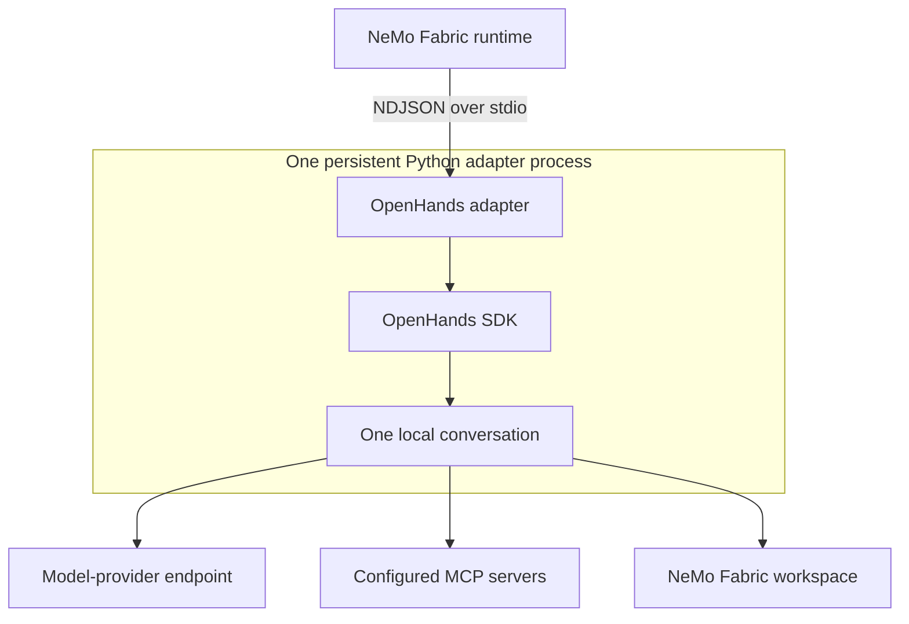

<!--
SPDX-FileCopyrightText: Copyright (c) 2026, NVIDIA CORPORATION & AFFILIATES. All rights reserved.
SPDX-License-Identifier: Apache-2.0
-->

# OpenHands Adapter for NVIDIA NeMo Fabric

This package runs one persistent OpenHands SDK conversation for each NeMo
Fabric runtime. It maps normalized model configuration, system instructions,
built-in tool selection, MCP servers, skills, the workspace, and the
per-invocation iteration limit into OpenHands.

## Install

Install the tested OpenHands SDK and tools, then install the adapter:

```bash
pip install "openhands-sdk==1.50.0" "openhands-tools==1.50.0"
pip install nemo-fabric-adapters-openhands
```

The 1.50.0 package pair is validated with NVIDIA NIM.

The adapter package supports Python 3.11 or later, while OpenHands requires
Python 3.12 or later. The adapter package does not install OpenHands.

For a source checkout, install the adapter and the compatible OpenHands packages
in the repository environment, then select that interpreter for Python adapter
processes:

```bash
uv sync --group adapter-tests
uv pip install "openhands-sdk==1.50.0" "openhands-tools==1.50.0"
export ADAPTER_PYTHON="$PWD/.venv/bin/python"
```

## Configure

Select `nvidia.fabric.openhands`. The built-in tool names are `terminal` (alias
`bash`) and `file_editor` (alias `edit`). OpenHands always retains its internal
finish and reasoning tools.

```python
from nemo_fabric import EnvironmentConfig
from nemo_fabric import FabricConfig
from nemo_fabric import HarnessConfig
from nemo_fabric import InstructionConfig
from nemo_fabric import InstructionsConfig
from nemo_fabric import ModelConfig
from nemo_fabric import RuntimeConfig
from nemo_fabric import ToolsConfig

config = FabricConfig(
    harness=HarnessConfig(adapter_id="nvidia.fabric.openhands"),
    models={
        "default": ModelConfig(
            provider="nvidia",
            model="nvidia/nemotron-3-nano-omni-30b-a3b-reasoning",
            api_key_env="NVIDIA_API_KEY",
            base_url="https://integrate.api.nvidia.com/v1",
        )
    },
    instructions=InstructionsConfig(
        system=InstructionConfig(content="Review the requested code change.")
    ),
    tools=ToolsConfig(enabled=["file_editor"]),
    runtime=RuntimeConfig(max_turns=20),
    environment=EnvironmentConfig(provider="local", workspace="."),
)
```

Relative skill and workspace paths resolve from the configuration base
directory. Each skill path must be a directory containing `SKILL.md`. The
adapter disables ambient OpenHands user, public, project, and memory loading;
only explicitly configured NeMo Fabric skills are loaded.

The initial adapter does not support Relay telemetry, native streaming,
interactive confirmation, MCP authentication, or per-server MCP tool filters.

## Understand the Runtime Lifecycle

The adapter runs the OpenHands SDK directly in a persistent Python adapter
process. It does not start or connect to an OpenHands server. `start` creates
one local conversation for the NeMo Fabric runtime, and ordered invocations
reuse that conversation and its history.



Each invocation returns only the final response and usage for that turn. `stop`
closes the conversation and removes the adapter-owned temporary profile state.
Create a new runtime to change the model, workspace, tools, MCP servers, or
skills.
