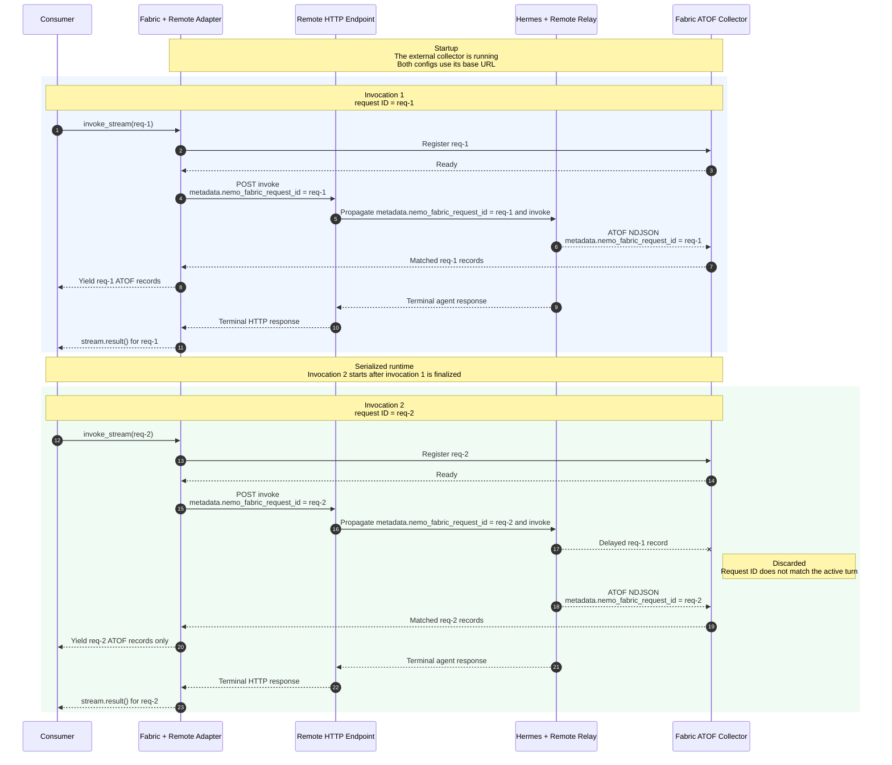

<!--
SPDX-FileCopyrightText: Copyright (c) 2026, NVIDIA CORPORATION & AFFILIATES. All rights reserved.
SPDX-License-Identifier: Apache-2.0
-->

# NVIDIA NeMo Fabric Remote Agent Adapter

Use the `nvidia.fabric.remote-agent` adapter to invoke a remote agent through
an OpenAI Responses, OpenAI Chat Completions, or Anthropic Messages HTTP API.

## Install

| Installation | Runtime | Adapter |
| --- | --- | --- |
| `pip install "nemo-fabric[remote-agent]"` | Yes | Yes |
| `pip install "nemo-fabric-adapters-remote-agent[harness]"` | No | Yes |
| `pip install nemo-fabric-adapters-remote-agent` | No | Yes |

The bare, `harness`, and `full` installations contain the same adapter and HTTP
client. They do not install the independently deployed remote service.

## Configuration

Configure the API root in `HarnessConfig.settings`. `base_url` is required and
includes `/v1`; `api_type` defaults to `openai-responses`.

| Setting | Accepted values |
| --- | --- |
| `base_url` | HTTP(S) API root, such as `https://agent.example.com/v1` |
| `api_type` | `openai-responses`, `openai-completions`, or `anthropic-messages` |
| `connect_timeout_seconds` | Connection timeout; defaults to `10` |
| `read_timeout_seconds` | Timeout between response bytes; defaults to `600` |
| `relay_streaming` | Opt in to request-ID correlation with a Relay-instrumented remote service. Supported only by `openai-responses` and `openai-completions`; defaults to `false`. |

The adapter accepts `models`, `models.temperature`, `models.top_p`,
`models.max_tokens`, and replacement `instructions.system` values. It maps the
token limit to `max_output_tokens` for OpenAI Responses,
`max_completion_tokens` for OpenAI Chat Completions, and `max_tokens` for
Anthropic Messages.
Set `models.default.api_key_env` when the service requires a credential. For
Anthropic Messages, the legacy `models.default.settings.max_tokens` key remains
accepted; `models.default.max_tokens` takes precedence. The adapter otherwise
uses `4096`.

## Relay-Backed Streaming

The adapter supports `Runtime.invoke_stream()` when the independently deployed
service is instrumented with NVIDIA NeMo Relay. Configure the Fabric runtime as
follows:

### Remote Agent Requirements

Relay-backed streaming has two sides:

- **Receiver (Fabric Runtime):**
  `start_runtime(..., streaming=True, launch_collector=False)` connects to the
  independently running collector at `collector_url`. The reserved
  `nemo-fabric-stream` entry in `FabricConfig` supplies the collector base URL.
- **Publisher (Remote Deployment):** The independently started remote service
  owns its Relay installation. Its Relay stream sink posts NDJSON ATOF records
  to the collector. Fabric does not start or configure the remote Relay
  installation or its sink.

Both sides must use the same collector. The adapter does not send the collector
URL to the remote service. For correlation, the adapter puts the Fabric request
ID in `metadata.nemo_fabric_request_id` in the invoke request body. The remote
endpoint must add this request ID to the Relay span metadata.

```python
collector_url = "http://fabric-host:43123"

config = FabricConfig(
    metadata=MetadataConfig(name="remote-agent"),
    harness=HarnessConfig(
        adapter_id="nvidia.fabric.remote-agent",
        settings={
            "base_url": "https://remote-agent.example.com/v1",
            "api_type": "openai-completions",
            "relay_streaming": True,
        },
    ),
    models={"default": ModelConfig(provider="remote", model="remote-hermes")},
).enable_relay(
    observability=RelayObservabilityConfig(
        atof=RelayAtofConfig(
            enabled=True,
            sinks=[
                RelayAtofStreamSinkConfig(
                    name="nemo-fabric-stream",
                    url=collector_url,
                    transport="ndjson",
                )
            ],
        )
    )
)

async with await Fabric().start_runtime(
    config,
    streaming=True,
    launch_collector=False,
) as runtime:
    for request_id, prompt in (
        ("req-1", "First request"),
        ("req-2", "Second request"),
    ):
        stream = runtime.invoke_stream(
            request=RunRequest(input=prompt, request_id=request_id)
        )
        async for record in stream:
            print(record)
        result = await stream.result()
        print(result.output)
```

Configure the remote deployment to publish ATOF to the same collector URL:

```yaml
atof:
  enabled: true
  sinks:
    - type: stream
      name: nemo-fabric-stream
      url: http://fabric-host:43123/v1/atof
      transport: ndjson
```

For Hermes, map the correlation metadata from the remote request into the
Hermes request:

```python
request_id = payload["metadata"]["nemo_fabric_request_id"]
result = await hermes_runtime.invoke(
    request=RunRequest(input=user_input, request_id=request_id)
)
```

The following sequence shows two serialized invocations:



### End-to-End Example with Hermes Agent

The following local example streams ATOF records from a Hermes Agent API server
through the Remote Agent adapter. Run the commands from the repository root in
separate terminals. It assumes that `NVIDIA_API_KEY` contains a valid NVIDIA API
key; the server and client use it for API authentication.

First, install Hermes Agent:

```bash
just install-hermes-agent
```

Start the collector:

```bash
nemo-fabric-collector --host 127.0.0.1 --port 8000 --log-level info
```

`--host` selects the bind address, `--port` selects the collector port, and
`--log-level` controls collector verbosity. These are the default values and
keep the unauthenticated collector on loopback. For a non-loopback collector,
configure TLS and the publish and control tokens described by
`nemo-fabric-collector --help`.

Create a `hermes-relay-plugins.toml` file in the current directory to send Hermes Relay ATOF records to that collector. `nemo-relay plugins edit` provides an interactive editor, but writing this file directly makes the example reproducible:

```toml
version = 1

[[components]]
kind = "observability"
enabled = true

[components.config]
version = 3

[components.config.atof]
enabled = true

[[components.config.atof.sinks]]
type = "stream"
name = "nemo-fabric-stream"
url = "http://127.0.0.1:8000/v1/atof"
transport = "ndjson"
timeout_millis = 10000
field_name_policy = "preserve"
```

Start the Hermes API server with that Relay configuration:

```bash
API_SERVER_ENABLED=true API_SERVER_HOST=127.0.0.1 API_SERVER_PORT=8642 API_SERVER_KEY="$NVIDIA_API_KEY" HERMES_NEMO_RELAY_PLUGINS_TOML="$PWD/hermes-relay-plugins.toml" hermes gateway
```

In the above adjust the `API_SERVER_PORT` environment variable as needed.

The following Python code snippet demonstrates how to invoke the Remote Agent adapter with Hermes Relay streaming. The values intentionally target the local
collector and Hermes server.

```python
import asyncio

from nemo_fabric import (
    Fabric,
    FabricConfig,
    HarnessConfig,
    MetadataConfig,
    ModelConfig,
    RelayAtofConfig,
    RelayAtofStreamSinkConfig,
    RelayObservabilityConfig,
    RunRequest,
)


config = FabricConfig(
    metadata=MetadataConfig(name="simple-relay-streaming"),
    harness=HarnessConfig(
        adapter_id="nvidia.fabric.remote-agent",
        settings={
            "base_url": "http://127.0.0.1:8642/v1",
            "api_type": "openai-responses",
            "relay_streaming": True,
        },
    ),
    models={
        "default": ModelConfig(
            provider="remote",
            model="remote-agent",
            api_key_env="NVIDIA_API_KEY",
        )
    },
).enable_relay(
    observability=RelayObservabilityConfig(
        atof=RelayAtofConfig(
            enabled=True,
            sinks=[
                RelayAtofStreamSinkConfig(
                    name="nemo-fabric-stream",
                    url="http://127.0.0.1:8000",
                    transport="ndjson",
                )
            ],
        )
    )
)


async def main() -> None:
    async with await Fabric().start_runtime(
        config,
        streaming=True,
        launch_collector=False,
    ) as runtime:
        stream = runtime.invoke_stream(
            request=RunRequest(
                input="Who are you?",
            )
        )
        async for record in stream:
            print(record)

        result = await stream.result()
        print(result.output.response)


asyncio.run(main())
```

### Invocation Constraints

Invocations on one runtime are serialized. The consumer must use a unique
request ID for each turn and fully consume or close one stream before starting
the next. The remote service can start before the Fabric runtime, but the
externally managed collector must be running before the first invocation.

Multiple Fabric runtimes can use `invoke` against the same remote agent, subject
to the remote service's concurrency and session-isolation behavior. Multiple
runtimes can also use `invoke_stream` through the same collector when every
request ID is unique.

The adapter retains the completed user/assistant transcript for ordered
invocations in one runtime.

## Limitations

The remote agent is configured and started independently of Fabric, so Fabric
cannot normalize or apply configuration that controls how the agent is
constructed. The adapter only normalizes `models`, `models.temperature`,
`models.top_p`, `models.max_tokens`, and replacement `instructions.system`
settings. MCP, skills, tool policy, and subagents can be configured by the
remote deployment, but the adapter does not expose them through `FabricConfig`.
