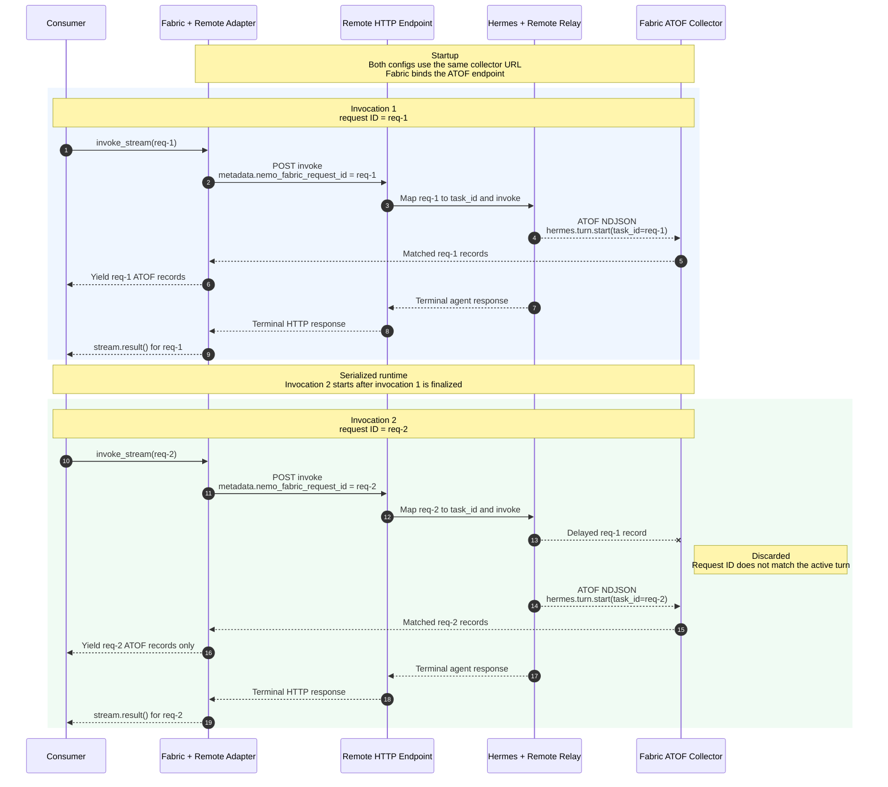

<!--
SPDX-FileCopyrightText: Copyright (c) 2026, NVIDIA CORPORATION & AFFILIATES. All rights reserved.
SPDX-License-Identifier: Apache-2.0
-->

# NVIDIA NeMo Fabric Remote Agent Adapter

Use the `nvidia.fabric.remote-agent` adapter to invoke a remote agent through
an OpenAI Responses, OpenAI Chat Completions, or Anthropic Messages HTTP API.

## Install

| Installation | Runtime | Adapter |
| --- | --- | --- |
| `pip install "nemo-fabric[remote-agent]"` | Yes | Yes |
| `pip install "nemo-fabric-adapters-remote-agent[harness]"` | No | Yes |
| `pip install nemo-fabric-adapters-remote-agent` | No | Yes |

The bare, `harness`, and `full` installations contain the same adapter and HTTP
client. They do not install the independently deployed remote service.

## Configuration

Configure the API root in `HarnessConfig.settings`. `base_url` is required and
includes `/v1`; `api_type` defaults to `openai-responses`.

| Setting | Accepted values |
| --- | --- |
| `base_url` | HTTP(S) API root, such as `https://agent.example.com/v1` |
| `api_type` | `openai-responses`, `openai-completions`, or `anthropic-messages` |
| `connect_timeout_seconds` | Connection timeout; defaults to `10` |
| `read_timeout_seconds` | Timeout between response bytes; defaults to `600` |
| `relay_streaming` | Opt in to request-ID correlation with a Relay-instrumented remote service; defaults to `false` |

The adapter accepts `models`, `models.temperature`, and replacement
`instructions.system` values.
Set `models.default.api_key_env` when the service requires a credential. For
Anthropic Messages, optionally set `models.default.settings.max_tokens`; it
otherwise uses `4096`.

## Relay-Backed Streaming

The adapter supports `Runtime.invoke_stream()` when the independently deployed
service is instrumented with NVIDIA NeMo Relay. Configure the Fabric runtime as
follows:

### Remote Agent Requirements

Relay-backed streaming has two sides:

- **Receiver — Fabric runtime:**
  `start_runtime(..., streaming=True)` opens the HTTP endpoint at
  `collector_url`. The reserved `nemo-fabric-stream` entry in `FabricConfig`
  supplies the address that Fabric binds.
- **Publisher — remote deployment:** The independently started remote service
  owns its Relay installation. Its Relay stream sink posts NDJSON ATOF records
  to the Fabric listener. Fabric does not start or configure the remote Relay
  installation or its sink.

Both sides must be configured with the same URL; the adapter does not send the
listener URL to the remote service. For correlation, the adapter puts the Fabric
request ID in `metadata.nemo_fabric_request_id` in the invoke request body. The
remote endpoint must use it as the request ID for its Relay-instrumented runtime.
For Hermes, map it to `RunRequest.request_id`, as shown below. The adapter sends
no correlation headers.

```python
collector_url = "http://fabric-host:43123/atof"

config = FabricConfig(
    metadata=MetadataConfig(name="remote-agent"),
    harness=HarnessConfig(
        adapter_id="nvidia.fabric.remote-agent",
        settings={
            "base_url": "https://remote-agent.example.com/v1",
            "api_type": "openai-completions",
            "relay_streaming": True,
        },
    ),
    models={
        "default": ModelConfig(provider="remote", model="remote-hermes")
    },
).enable_relay(
    observability=RelayObservabilityConfig(
        atof=RelayAtofConfig(
            enabled=True,
            sinks=[
                RelayAtofStreamSinkConfig(
                    name="nemo-fabric-stream",
                    url=collector_url,
                    transport="ndjson",
                )
            ],
        )
    )
)

async with await Fabric().start_runtime(config, streaming=True) as runtime:
    for request_id, prompt in (
        ("req-1", "First request"),
        ("req-2", "Second request"),
    ):
        stream = runtime.invoke_stream(
            request=RunRequest(input=prompt, request_id=request_id)
        )
        async for record in stream:
            print(record)
        result = await stream.result()
        print(result.output)
```

Configure the remote deployment to publish ATOF to the same collector URL:

```yaml
atof:
  enabled: true
  sinks:
    - type: stream
      name: nemo-fabric-stream
      url: http://fabric-host:43123/atof
      transport: ndjson
```

For Hermes, map the correlation metadata from the remote request into the
Hermes request:

```python
request_id = payload["metadata"]["nemo_fabric_request_id"]
result = await hermes_runtime.invoke(
    request=RunRequest(input=user_input, request_id=request_id)
)
```

The following sequence shows two serialized invocations:



### Invocation Constraints

Invocations on one runtime are serialized. The consumer must use a unique
request ID for each turn and fully consume or close one stream before starting
the next. The remote service can start before the Fabric runtime, but the Fabric
listener must be running before the first invocation.

Multiple Fabric runtimes can use `invoke` against the same remote agent, subject
to the remote service's concurrency and session-isolation behavior. With the
single remote sink shown above, only one Fabric runtime can use `invoke_stream`
at a time because only one runtime can bind the configured listener URL. This
configuration does not support parallel `invoke_stream` runtimes.

The adapter retains the completed user/assistant transcript for ordered
invocations in one runtime.

## Limitations

The remote agent is configured and started independently of Fabric, so Fabric
cannot normalize or apply configuration that controls how the agent is
constructed. The adapter normalizes only `models`, `models.temperature`, and
replacement `instructions.system` settings. MCP, skills, tool policy, and
subagents can be configured by the remote deployment, but the adapter does not
expose them through `FabricConfig`.

The descriptor keeps `capabilities.streaming: false` because that flag means
adapter-native OpenAI Chat Completions streaming. Protocol-native OpenAI and
Anthropic events are still reduced to the terminal result and are not exposed.
