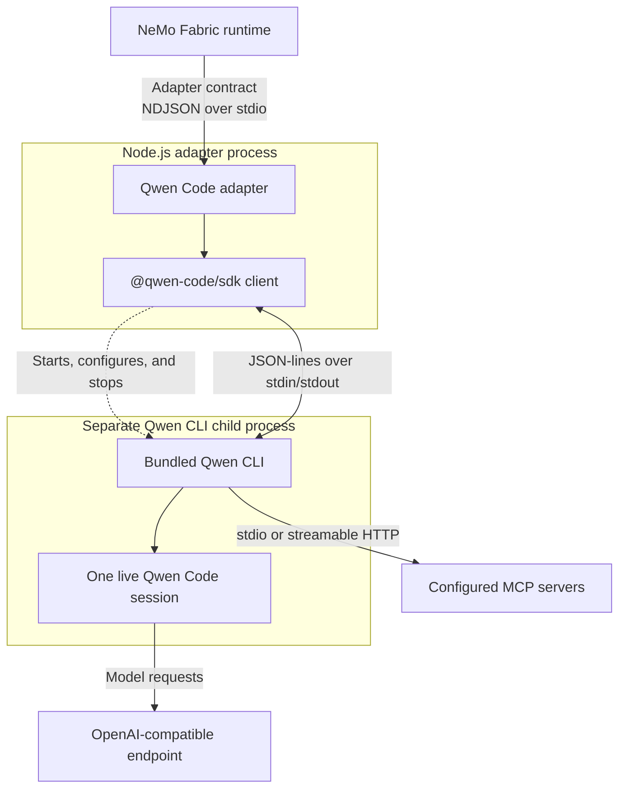

<!--
SPDX-FileCopyrightText: Copyright (c) 2026, NVIDIA CORPORATION & AFFILIATES. All rights reserved.
SPDX-License-Identifier: Apache-2.0
-->

# NVIDIA NeMo Fabric Qwen Code Adapter

This package provides the Qwen Code harness adapter for NVIDIA NeMo Fabric.
One persistent Node.js adapter process uses `@qwen-code/sdk` to start and manage
a separate, bundled Qwen CLI child process for each NeMo Fabric runtime. Ordered
invocations reuse one live Qwen Code session and its conversation history.

## Install the Adapter

Install Node.js 22.19 or later. Then install the adapter and its exact-pinned,
consumer-managed SDK in the project that owns the NeMo Fabric configuration:

```bash
npm install --save-exact nemo-fabric-adapters-qwen @qwen-code/sdk@0.1.16
```

The SDK is an optional peer and bundles the Qwen CLI. Installing the adapter
alone does not install it. Starting the adapter without the compatible SDK
reports `qwen_sdk_missing`.

For source development, run these commands from the repository root:

```bash
just install-typescript-qwen
npm run build --prefix adapter-contract/typescript
npm run build --prefix adapters/typescript --workspace nemo-fabric-adapters-common
npm run build --prefix adapters/typescript --workspace nemo-fabric-adapters-qwen
```

## Supported Configuration

The adapter supports the following normalized configuration:

- **Models:** Selects the `default` role, or the only configured role. It maps
  `model`, `api_key_env`, `base_url`, `temperature`, and `top_p` for the
  `openai` provider.
- **Instructions:** Supports `instructions.system` with `mode: replace` or
  `mode: append`.
- **Tools:** Maps Qwen-native tool names from `tools.blocked`. Tool definitions
  and `tools.enabled` are unsupported.
- **Skills:** Each `skills.paths` entry must be a directory containing
  `SKILL.md`.
- **MCP:** Supports stdio and streamable HTTP servers, including per-server
  allowed and blocked tool filters.
- **Harness settings:** Maps `permission_mode` to Qwen Code's `default`, `plan`,
  `auto-edit`, `auto`, or `yolo` approval mode.

### Model Endpoints

The adapter requires `models.<role>.provider: openai`. When `base_url` is set,
it must identify an OpenAI-compatible Chat Completions endpoint. Remote
endpoints require HTTPS, with HTTP allowed for loopback development servers.

The adapter reads the variable named by `api_key_env` from NeMo Fabric
`environment.env` first and then the parent process environment. It does not
write the credential to Qwen settings.

### MCP Configuration

Stdio servers map `url` to the executable and may define `args` and `env`, but
not HTTP headers. Streamable HTTP servers may define `custom_headers`, but not
process arguments or environment variables. Remote MCP endpoints require HTTPS
except for loopback development endpoints.

Header values may reference `${NAME}`. Resolution checks NeMo Fabric
`environment.env` first and then the parent process environment. Unresolved
references fail startup. `allowed_tools` and `blocked_tools` map to Qwen Code's
per-server filters. Normalized MCP authentication is unsupported.

Only explicitly configured server names are enabled. The pinned SDK discovers
external MCP servers on the first prompt and does not include them in
`mcpServerStatus()`. The adapter captures the SDK's MCP startup diagnostic and
returns `qwen_mcp_unavailable` instead of accepting a result produced without
every explicitly configured server.

### Runtime Behavior

The adapter accepts plain-text input and returns the terminal assistant text in
`output.response`. Qwen Code reports cumulative usage for a live query, so the
adapter returns the per-invocation difference. Create a new runtime to change
the selected model, workspace, system instructions, skills, MCP servers, tool
policy, or permission mode.

The adapter gives the child process isolated temporary Qwen home and runtime
directories. It disables usage statistics, telemetry, extensions, ambient
skills, and ambient MCP servers. Explicit NeMo Fabric `environment.env` values
and the selected model credential are forwarded to the child process.

In SDK mode, Qwen Code's `default` permission mode denies tool calls that need
interactive approval. Use `auto` for Qwen's classifier-mediated policy. Use
`yolo` only inside an appropriate task sandbox because it bypasses edit
approval. Qwen's permission policy is not a filesystem sandbox.

`models.max_tokens`, provider-specific model settings, `runtime.max_turns`,
`tools.enabled`, native streaming, cancellation, service mode, and Relay
telemetry are unsupported.

## Understand the Runtime Lifecycle

The Qwen Code harness is not embedded in the adapter process. `start` creates
isolated configuration and asks `@qwen-code/sdk` to launch its bundled Qwen CLI
as a child process. The SDK exchanges JSON-lines messages with the CLI over
stdin and stdout. `stop` closes the live query, terminates the child process,
and removes the temporary profile.



For installation, configuration, and operational guidance, refer to the
[Qwen Code integration guide](../../../docs/integrations/harness/qwen.mdx).
