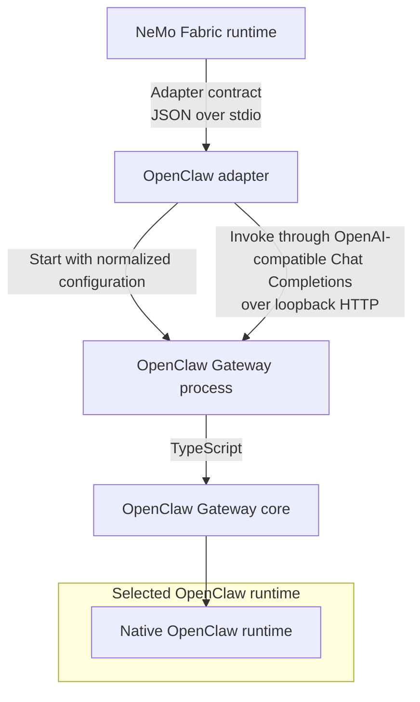

{/* SPDX-FileCopyrightText: Copyright (c) 2026, NVIDIA CORPORATION & AFFILIATES. All rights reserved.
SPDX-License-Identifier: Apache-2.0 */}

Use the `nvidia.fabric.openclaw` adapter to let NeMo Fabric configure, start,
invoke, and stop a local OpenClaw Gateway for each NeMo Fabric runtime.

The following diagram shows how the NeMo Fabric runtime uses the adapter to configure and invoke an isolated OpenClaw Gateway:



## Install OpenClaw and the Adapter

Refer to the official OpenClaw [installation documentation](https://docs.openclaw.ai/install) for detailed installation and usage instructions.

To install OpenClaw from an npm package, then install the NeMo Fabric runtime and adapter run the following commands.

```bash
# Requires Node.js >=24.16.0 <25 or >=26.1.0, and npm 11.16+
npm install --global openclaw@2026.9.4 --allow-scripts=openclaw
pip install "nemo-fabric[openclaw]"
```

To install the adapter without the NeMo Fabric runtime, use
`nemo-fabric-adapters-openclaw`. The adapter package does not install OpenClaw.

## Configure the Adapter

Select the adapter and, when necessary, specify the OpenClaw executable:

```python
from nemo_fabric import HarnessConfig

harness = HarnessConfig(
    adapter_id="nvidia.fabric.openclaw",
    settings={
        "openclaw_command": "/opt/openclaw/bin/openclaw",
        "startup_timeout_seconds": 30,
    },
)
```

Omit `openclaw_command` to resolve `openclaw` from `PATH`. A relative path that
contains a directory is resolved from the NeMo Fabric base directory. The adapter
uses the resolved executable for its version check, configuration validation,
and Gateway startup.

The adapter accepts normalized model provider, model, base URL, temperature,
`top_p`, `max_tokens`, replacement system instruction, workspace, skills, and
MCP configuration. Normalized MCP authentication is not supported. For a
custom OpenAI-compatible endpoint, set the model's `base_url` and, when needed,
`api_key_env`.

By default, the adapter chooses an available local base port. Set `port` to pin
one. OpenClaw's [derived-port mapping](https://docs.openclaw.ai/gateway/multiple-gateways#port-mapping-derived) uses `base_port + 2` for browser control and allocates browser CDP ports from `base_port + 11` through `base_port + 110`. The adapter verifies only that `base_port` and `base_port + 2` are available before startup. OpenClaw allocates the CDP ports on demand instead of reserving the complete range, so the adapter cannot guarantee that those ports will still be available when OpenClaw needs them. Keep the derived CDP range available when using OpenClaw browser features. The largest accepted base port is 65425.

## Execution and Isolation

Before startup, the adapter writes a complete temporary `openclaw.json` and
sets OpenClaw environment variables. It does not use the OpenClaw configuration
RPC. The generated configuration:

- binds the Gateway to loopback;
- enables the OpenAI-compatible Chat Completions endpoint;
- uses a cryptographically generated one-time Gateway token;
- applies the normalized workspace, model, skills, and MCP servers;
- disables OpenClaw anonymous telemetry; and
- uses a unique temporary state directory.

Each invocation sends a terminal request to `/v1/chat/completions` with the
NeMo Fabric runtime ID as the stable OpenClaw session key. Runtime shutdown closes
the HTTP client, terminates the Gateway process tree, and removes the temporary
configuration and state directory.

The adapter isolates the Gateway in its own process group, continuously checks
its readiness endpoint, and forwards `SIGINT` and `SIGTERM` on POSIX systems.
On Linux, the adapter uses `setpriv --pdeathsig SIGTERM` when `setpriv` is
available so that the kernel signals the Gateway after abrupt adapter
termination. Windows uses a kill-on-close Job Object for the Gateway process
tree. Without `setpriv`, Linux has the same catchable-signal protection as
macOS but cannot handle `SIGKILL`.

Relay telemetry, native OpenTelemetry, adapter-native response streaming,
cancellation, and live updates are not supported.
