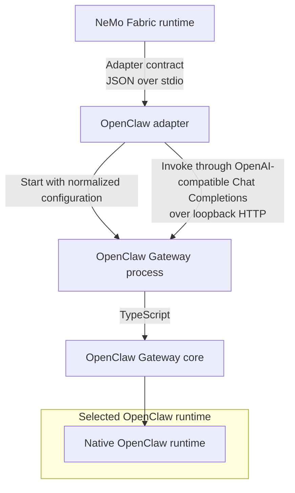

{/* SPDX-FileCopyrightText: Copyright (c) 2026, NVIDIA CORPORATION & AFFILIATES. All rights reserved.
SPDX-License-Identifier: Apache-2.0 */}

Use the `nvidia.fabric.openclaw` adapter to run an isolated OpenClaw Gateway
for one NeMo Fabric runtime or connect multiple runtimes to a shared Gateway.

The following diagram shows the managed-runtime path, where the adapter configures and invokes an isolated OpenClaw Gateway:



## Choose a Lifecycle

Choose the lifecycle that matches who owns the Gateway:

| Lifecycle | Gateway Ownership | Use Case |
| --- | --- | --- |
| Managed runtime | NeMo Fabric starts one Gateway for each runtime and stops it with the runtime. | Evaluation, benchmark runs, and other bounded jobs. |
| Prepared service | NeMo Fabric starts and supervises one Gateway that multiple runtimes can share. | Long-lived local deployments and OpenClaw chat channels. |
| Attached service | Another deployment system starts and supervises the Gateway; NeMo Fabric connects to it. | Existing or independently managed deployments. |

## Install OpenClaw and the Adapter

Refer to the official OpenClaw [installation documentation](https://docs.openclaw.ai/install) for detailed installation and usage instructions. 

To install OpenClaw from an npm package, then install the NeMo Fabric runtime and adapter run the following commands.

```bash
# Requires Node.js >=24.16.0 <25 or >=26.1.0, and npm 11.16+
npm install --global openclaw@2026.9.4 --allow-scripts=openclaw
pip install "nemo-fabric[openclaw]"
```

To install the adapter without the NeMo Fabric runtime, use
`nemo-fabric-adapters-openclaw`. The adapter package does not install OpenClaw.

## Configure the Adapter

Select the adapter and, when necessary, specify the OpenClaw executable:

```python
from nemo_fabric import HarnessConfig

harness = HarnessConfig(
    adapter_id="nvidia.fabric.openclaw",
    settings={
        "openclaw_command": "/opt/openclaw/bin/openclaw",
        "startup_timeout_seconds": 30,
    },
)
```

Omit `openclaw_command` to resolve `openclaw` from `PATH`. A relative path that
contains a directory is resolved from the NeMo Fabric base directory. The adapter
uses the resolved executable for its version check, configuration validation,
and Gateway startup.

The adapter supports only OpenClaw's default `openclaw` agent runtime.

The adapter accepts normalized model provider, model, base URL, temperature,
`top_p`, `max_tokens`, replacement system instruction, workspace, skills, and
MCP configuration. Normalized MCP authentication is not supported. For a
custom OpenAI-compatible endpoint, set the model's `base_url` and, when needed,
`api_key_env`.

For a NeMo Fabric-owned service, `harness.settings.channel_config` accepts
OpenClaw-native `channels` and `bindings`. This supports multiple accounts for
Telegram and other OpenClaw channels without a NeMo Fabric-specific channel schema.
Every binding must target the configured `agent_id`; OpenClaw validates the
nested channel settings. Chat-channel traffic goes directly between the
channel and OpenClaw rather than through a NeMo Fabric runtime.

By default, the adapter chooses an available local port range. Set `port_range`
to an inclusive consumer-allocated range with `start` and `end` fields. The
range must span at least 111 ports. OpenClaw's [derived-port mapping](https://docs.openclaw.ai/gateway/multiple-gateways#port-mapping-derived) uses `base_port + 2` for browser control and allocates browser CDP ports from `base_port + 11` through `base_port + 110`. The adapter verifies only that `base_port` and `base_port + 2` are available before startup. OpenClaw allocates the CDP ports on demand instead of reserving the complete range, so the adapter cannot guarantee that those ports will still be available when OpenClaw needs them. Keep the configured range reserved for the lifetime of the runtime or service when using OpenClaw browser features.

## Use a Shared Service

Call `prepare_service()` to map the normalized `FabricConfig` to
`openclaw.json` and start a NeMo Fabric-owned Gateway. Pass the returned service
to `start_runtime()` to give each runtime an independent OpenClaw session:

```python
from nemo_fabric import Fabric


async def invoke_with_prepared_service(config):
    fabric = Fabric()
    async with await fabric.prepare_service(config) as service:
        async with await fabric.start_runtime(config, service=service) as runtime:
            return await runtime.invoke(input="Review the workspace changes.")
```

Call `attach_service()` when another system owns the Gateway lifecycle. The
reference contains the endpoint and the name of an environment variable that
holds the Gateway token, never the token value:

```python
from nemo_fabric import Fabric
from nemo_fabric import ServiceReference


async def invoke_with_attached_service(config):
    reference = ServiceReference.from_mapping(
        {
            "adapter_id": "nvidia.fabric.openclaw",
            "service_type": "openclaw_gateway",
            "connection": {
                "gateway_url": "https://openclaw.example.com",
                "gateway_token_env": "OPENCLAW_GATEWAY_TOKEN",
                "agent_id": "default",
            },
        }
    )

    fabric = Fabric()
    async with await fabric.attach_service(config, reference) as service:
        async with await fabric.start_runtime(config, service=service) as runtime:
            return await runtime.invoke(input="Review the workspace changes.")
```

The service handle contains sanitized identity and connection information and
is valid only in the NeMo Fabric process that created it. Releasing a prepared
service stops its Gateway. Releasing an attached service closes NeMo
Fabric-owned clients and private connection material without stopping the
caller-owned Gateway. Attached Gateways must use HTTPS unless the URL contains
a literal loopback IP address. For an attached service, omit deployment-owned
model endpoints, API-key references, tools, MCP servers, skills, channel
configuration, and startup settings from `config` because NeMo Fabric cannot
apply them to an existing Gateway.

## Execution and Isolation

Before starting a managed runtime or prepared service, the adapter writes a
complete temporary `openclaw.json` and sets OpenClaw environment variables. It
does not use the OpenClaw configuration RPC. The generated configuration:

- binds the Gateway to loopback;
- enables the OpenAI-compatible Chat Completions endpoint;
- uses a cryptographically generated one-time Gateway token;
- applies the normalized workspace, model, skills, and MCP servers;
- disables OpenClaw anonymous telemetry; and
- uses a unique temporary state directory.

Each invocation sends a terminal request to `/v1/chat/completions` with the
NeMo Fabric runtime ID as the stable OpenClaw session key. A managed runtime
stops its Gateway during runtime shutdown. A prepared service keeps its Gateway
running until the service is released, so multiple runtimes can connect to it.

The adapter isolates the Gateway in its own process group, continuously checks
its startup endpoint, and forwards `SIGINT` and `SIGTERM` on POSIX systems.
On Linux, the adapter uses `setpriv --pdeathsig SIGTERM` when `setpriv` is
available so that the kernel signals the Gateway after abrupt adapter
termination. Windows uses a kill-on-close Job Object for the Gateway process
tree. Without `setpriv`, Linux has the same catchable-signal protection as
macOS but cannot handle `SIGKILL`.

Relay telemetry, native OpenTelemetry, adapter-native response streaming,
cancellation, and live updates are not supported.
