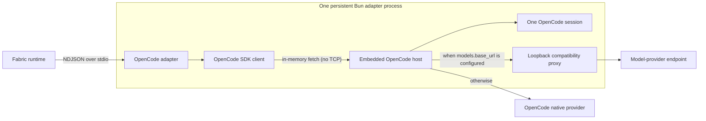

{/* SPDX-FileCopyrightText: Copyright (c) 2026, NVIDIA CORPORATION & AFFILIATES. All rights reserved.
SPDX-License-Identifier: Apache-2.0 */}

Use the `nvidia.fabric.opencode` adapter to run tasks with the OpenCode 2 SDK.
Each NVIDIA NeMo Fabric runtime starts one embedded OpenCode host and session.

## Install the Adapter

OpenCode adapter processes require Bun 1.4.2 or later on `PATH`.

To use a published adapter release, install the npm adapter and the compatible
OpenCode SDK in the project that owns the NeMo Fabric configuration:

```bash
npm install nemo-fabric-adapters-opencode @opencode/core@2.0.3 @opencode/sdk@2.0.3
```

OpenCode Core and the OpenCode SDK are optional peers, exact-pinned to the
supported OpenCode release. Installing the adapter alone does not install
either package. Starting the adapter without the compatible packages returns
`opencode_harness_unavailable`.

OpenCode 2.0.3 does not support npm's `install-strategy=nested`. The documented
command requires the default npm hoisted layout.

For source development, install the checked-out adapter workspace and its
pinned SDK from the repository root, then build the generated adapter CLI:

```bash
just install-typescript-opencode
npm run build --prefix adapter-contract/typescript
npm run build --prefix adapters/typescript --workspace nemo-fabric-adapters-common
npm run build --prefix adapters/typescript --workspace nemo-fabric-adapters-opencode
```

## Configure the Adapter

Select the OpenCode integration and point discovery at the adapter descriptor.
The following example uses the descriptor from an installed npm package:

```python
from nemo_fabric import DiscoveryConfig, FabricConfig, HarnessConfig
from nemo_fabric import MetadataConfig, ModelConfig

config = FabricConfig(
    metadata=MetadataConfig(name="opencode-review"),
    discovery=DiscoveryConfig(
        local_paths=[
            "./node_modules/nemo-fabric-adapters-opencode/opencode.fabric-adapter.json"
        ]
    ),
    harness=HarnessConfig(adapter_id="nvidia.fabric.opencode"),
    models={
        "default": ModelConfig(
            provider="nvidia",
            model="nvidia/nemotron-3.5-nano-30b-a3b",
            api_key_env="NVIDIA_API_KEY",
            base_url="https://integrate.api.nvidia.com/v1",
        )
    },
)
```

This example uses NVIDIA's hosted Nemotron 3.5 Nano model. Set
`NVIDIA_API_KEY` before starting the runtime.

For a source build, set `discovery.local_paths` to
`adapters/typescript/opencode/opencode.fabric-adapter.json` instead. The build
commands above create the descriptor's `dist/cli.js` runner.

## Supported Configuration

The adapter supports the following configuration:

- **Models:** Selects the `default` role, or the only configured role.
  `api_key_env` may use any portable environment-variable name. When no
  endpoint is configured, the provider and model must be supported by the
  installed OpenCode SDK.
- **Instructions:** Supports `instructions.system` with `mode: replace`.
  A replacement instruction replaces OpenCode's base prompt. OpenCode may still
  append runtime context.
- **Skills:** Each `skills.paths` entry must be a directory containing `SKILL.md`.
  Startup verifies that every skill loads and that names are unique.
- **MCP:** Supports `stdio` and `streamable-http`. Startup fails if a configured
  server cannot connect.

### Model Endpoints

To route model requests through a local or company-hosted endpoint, set
`base_url`. The endpoint must implement the OpenAI-compatible Chat Completions
protocol. It is a model-provider endpoint, not the address of a remote
OpenCode server. Remote endpoints must use HTTPS because requests include the
provider credential. HTTP is permitted only for loopback endpoints used in
local development and testing. The adapter removes OpenCode's
`prompt_cache_key` extension for configured endpoints, so providers that
reject that OpenAI-specific field can still use the core protocol. The proxy
buffers and rewrites request bodies up to 16 MiB. Larger requests receive HTTP
413 rather than consuming unbounded adapter memory.

`temperature` and `top_p` are supported only with `base_url`.

To configure a loopback OpenAI-compatible endpoint for development, set
`base_url` as follows:

```python
config.models["default"].base_url = "http://127.0.0.1:8080/v1"
```

### MCP Configuration

Streamable-HTTP servers may define headers but not command arguments. Stdio
servers may define command arguments and environment variables but not HTTP
headers.

Header values may reference `${NAME}`. Resolution checks `environment.env`
first, then the parent process environment. Unresolved references fail startup.
For MCP credentials, prefer parent-only variables so they are used to construct
the header without being added to OpenCode's tool environment.

SSE, MCP authentication objects, and per-server tool filters are unsupported.

### Runtime Behavior

The embedded session keeps the Fabric workspace as its working location, but
does not load ambient OpenCode project or user configuration and instructions
from that workspace or the host home directory.

At runtime, OpenCode receives only required operating-system variables,
explicit Fabric `environment.env` values, and the selected model credential.
Other variables inherited by the Fabric process are not exposed to OpenCode.

The adapter is non-interactive. It denies OpenCode requests to read `.env`
files (except `.env.example`), access outside the workspace, or ask follow-up
questions, rather than waiting for an approval that Fabric cannot supply.

The adapter accepts plain-text input and returns the final response in
`output.response`. Streaming, Relay, tool policy, subagents,
provider-specific model settings, and `max_tokens` are not supported.

## Understand the Runtime Lifecycle

The adapter runs in a persistent Bun process. `start` creates one embedded
OpenCode host and one OpenCode session for the NeMo Fabric runtime. Ordered
plain-text invocations reuse that session and its conversation history. A
successful result has `output.response`. Usage fields are present when OpenCode
reports them. `stop` removes the OpenCode session and closes the embedded host.



When OpenCode reports files changed by an invocation and the runtime has an
artifact root, the adapter writes the combined diff to a runtime- and
invocation-scoped path beneath `opencode/` and returns it as a `patch` artifact.
Without an artifact root, it returns no patch artifact.

Create a new runtime to change the selected model or workspace.
