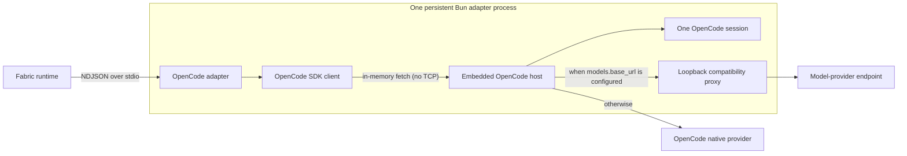

{/* SPDX-FileCopyrightText: Copyright (c) 2026, NVIDIA CORPORATION & AFFILIATES. All rights reserved.
SPDX-License-Identifier: Apache-2.0 */}

Use the `nvidia.fabric.opencode` adapter to run tasks with the OpenCode 2 SDK.
Each NVIDIA NeMo Fabric runtime starts one embedded OpenCode host and session.

## Install the Adapter

OpenCode adapter processes require Bun 1.4.2 or later on `PATH`.

To use a published adapter release, install the npm adapter and the compatible
OpenCode SDK in the project that owns the NeMo Fabric configuration:

```bash
npm install nemo-fabric-adapters-opencode @opencode/core@2.0.3 @opencode/sdk@2.0.3
```

OpenCode Core and the OpenCode SDK are optional peers, exact-pinned to the
supported OpenCode release. Installing the adapter alone does not install
either package. Starting the adapter without the compatible packages returns
`opencode_harness_unavailable`.

OpenCode 2.0.3 does not support npm's `install-strategy=nested`. The documented
command requires npm's default hoisted layout.

For source development, install the checked-out adapter workspace and its
pinned SDK from the repository root, then build the generated adapter CLI:

```bash
just install-typescript-opencode
npm run build --prefix adapter-contract/typescript
npm run build --prefix adapters/typescript --workspace nemo-fabric-adapters-common
npm run build --prefix adapters/typescript --workspace nemo-fabric-adapters-opencode
```

## Configure the Adapter

Select the OpenCode integration and point discovery at the adapter descriptor.
The following example uses the descriptor from an installed npm package:

```python
from nemo_fabric import DiscoveryConfig, FabricConfig, HarnessConfig
from nemo_fabric import MetadataConfig, ModelConfig

config = FabricConfig(
    metadata=MetadataConfig(name="opencode-review"),
    discovery=DiscoveryConfig(
        local_paths=[
            "./node_modules/nemo-fabric-adapters-opencode/opencode.fabric-adapter.json"
        ]
    ),
    harness=HarnessConfig(adapter_id="nvidia.fabric.opencode"),
    models={
        "default": ModelConfig(
            provider="nvidia",
            model="nvidia/nemotron-3.5-nano-30b-a3b",
            api_key_env="NVIDIA_API_KEY",
            base_url="https://integrate.api.nvidia.com/v1",
        )
    },
)
```

This example uses NVIDIA's hosted Nemotron 3.5 Nano model. Set
`NVIDIA_API_KEY` before starting the runtime.

For a source build, set `discovery.local_paths` to
`adapters/typescript/opencode/opencode.fabric-adapter.json` instead. The build
commands above create the descriptor's `dist/cli.js` runner.

The adapter selects the `default` model role or the only configured role. With
multiple roles, configure `default`. Set `api_key_env` to the name of the
environment variable that contains the provider credential; it must be a
portable environment-variable identifier (for example, `NVIDIA_API_KEY`). The
provider and model must be supported by the installed OpenCode SDK when no
endpoint is configured. The adapter passes this configured name explicitly to
OpenCode, so it does not need to be the provider's conventional
environment-variable name.

To route model requests through a local or company-hosted endpoint, set
`base_url`. The endpoint must implement the OpenAI-compatible Chat Completions
protocol. It is a model-provider endpoint, not the address of a remote
OpenCode server. Remote endpoints must use HTTPS because requests include the
provider credential; HTTP is permitted only for loopback endpoints used in
local development and testing. The adapter removes OpenCode's
`prompt_cache_key` extension for configured endpoints, so providers that
reject that OpenAI-specific field can still use the core protocol. The proxy
buffers and rewrites request bodies up to 16 MiB; larger requests receive HTTP
413 rather than consuming unbounded adapter memory.

```python
config.models["default"].base_url = "http://127.0.0.1:8080/v1"
```

The initial adapter exposes `models` and `models.base_url`. NeMo Fabric rejects
temperature, instructions, MCP, skills, tool policy, subagents, Relay, remote
OpenCode service configuration, and other undeclared configuration rather than
ignoring them.

The embedded session keeps the Fabric workspace as its working location, but
does not load ambient OpenCode project or user configuration and instructions
from that workspace or the host home directory.

## Understand the Runtime Lifecycle

The adapter runs in a persistent Bun process. `start` creates one embedded
OpenCode host and one OpenCode session for the NeMo Fabric runtime. Ordered
plain-text invocations reuse that session and its conversation history. A
successful result has `output.response`; usage fields are present when OpenCode
reports them. `stop` removes the OpenCode session and closes the embedded host.



When OpenCode reports files changed by an invocation and the runtime has an
artifact root, the adapter writes the combined diff to a runtime- and
invocation-scoped path beneath `opencode/` and returns it as a `patch` artifact.
Without an artifact root, it returns no patch artifact.

Create a new runtime to change the selected model or workspace.

## Limitations

The initial adapter does not expose streaming, caller-driven cancellation,
runtime updates, remote-service execution, Relay telemetry, MCP, skills, tool
policy, subagents, system instructions, or model settings.
