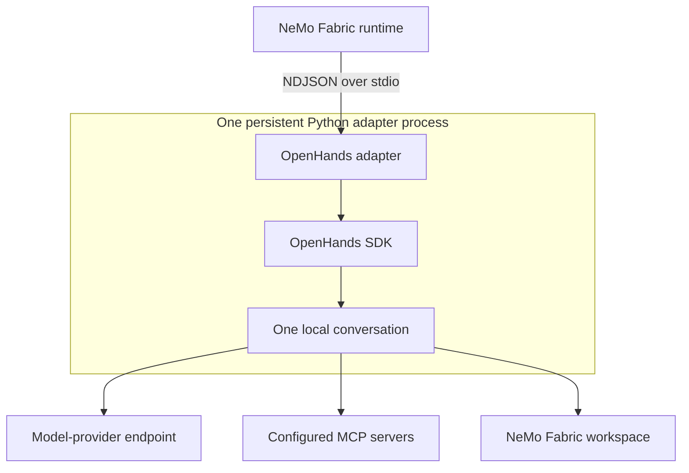

{/* SPDX-FileCopyrightText: Copyright (c) 2026, NVIDIA CORPORATION & AFFILIATES. All rights reserved.
SPDX-License-Identifier: Apache-2.0 */}

Use the NVIDIA NeMo Fabric `nvidia.fabric.openhands` adapter to run tasks with
the OpenHands SDK. The adapter keeps one OpenHands conversation alive for each
NeMo Fabric runtime, so ordered invocations retain conversation context.

## Install the Adapter

Install the tested OpenHands packages, then install the runtime and adapter:

```bash
pip install "openhands-sdk==1.50.0" "openhands-tools==1.50.0"
pip install "nemo-fabric[openhands]"
```

The 1.50.0 package pair is validated with NVIDIA NIM.

To install only the adapter, use:

```bash
pip install nemo-fabric-adapters-openhands
```

The adapter package supports Python 3.11 or later, while OpenHands requires
Python 3.12 or later. The adapter packages do not install OpenHands.

## Configure the Adapter

```python
from nemo_fabric import EnvironmentConfig, FabricConfig, HarnessConfig
from nemo_fabric import InstructionConfig, InstructionsConfig, ModelConfig
from nemo_fabric import RuntimeConfig, ToolsConfig

config = FabricConfig(
    harness=HarnessConfig(adapter_id="nvidia.fabric.openhands"),
    models={
        "default": ModelConfig(
            provider="nvidia",
            model="nvidia/nemotron-3-nano-omni-30b-a3b-reasoning",
            api_key_env="NVIDIA_API_KEY",
            base_url="https://integrate.api.nvidia.com/v1",
        )
    },
    instructions=InstructionsConfig(
        system=InstructionConfig(
            content="Review the requested code change.",
            mode="append",
        )
    ),
    tools=ToolsConfig(enabled=["terminal", "file_editor"]),
    runtime=RuntimeConfig(max_turns=20),
    environment=EnvironmentConfig(provider="local", workspace="."),
)
```

The adapter maps normalized model settings, `replace` and `append` system
instructions, `runtime.max_turns`, tool policy, MCP servers, skills, and the
workspace. Supported tool names are `terminal` (alias `bash`) and
`file_editor` (alias `edit`). OpenHands retains its internal finish and
reasoning tools.

Skill paths resolve from the configuration base directory and must contain a
`SKILL.md` file. The adapter disables ambient OpenHands user, public, project,
and memory loading, so only explicitly configured NeMo Fabric skills load.

The initial integration does not support Relay telemetry, native streaming,
interactive confirmation, MCP authentication, or per-server MCP tool filters.

## Understand the Runtime Lifecycle

The adapter runs the OpenHands SDK directly in a persistent Python adapter
process. It does not start or connect to an OpenHands server. `start` creates
one local conversation for the NeMo Fabric runtime, and ordered invocations
reuse that conversation and its history.



Each invocation returns only the final response and usage for that turn. `stop`
closes the conversation and removes the adapter-owned temporary profile state.
Create a new runtime to change the model, workspace, tools, MCP servers, or
skills.

## Run the Code Review Example

Set `NVIDIA_API_KEY`. For a source checkout, also point NeMo Fabric at the Python
environment that contains the adapter and OpenHands packages:

```bash
export ADAPTER_PYTHON="$PWD/.venv/bin/python"
```

Then run:

```bash
.venv/bin/python -m examples.code_review_agent \
  --variant openhands \
  --input "Review calculator.py" \
  --show-output
```

Do not combine the OpenHands variant with `--relay`.
