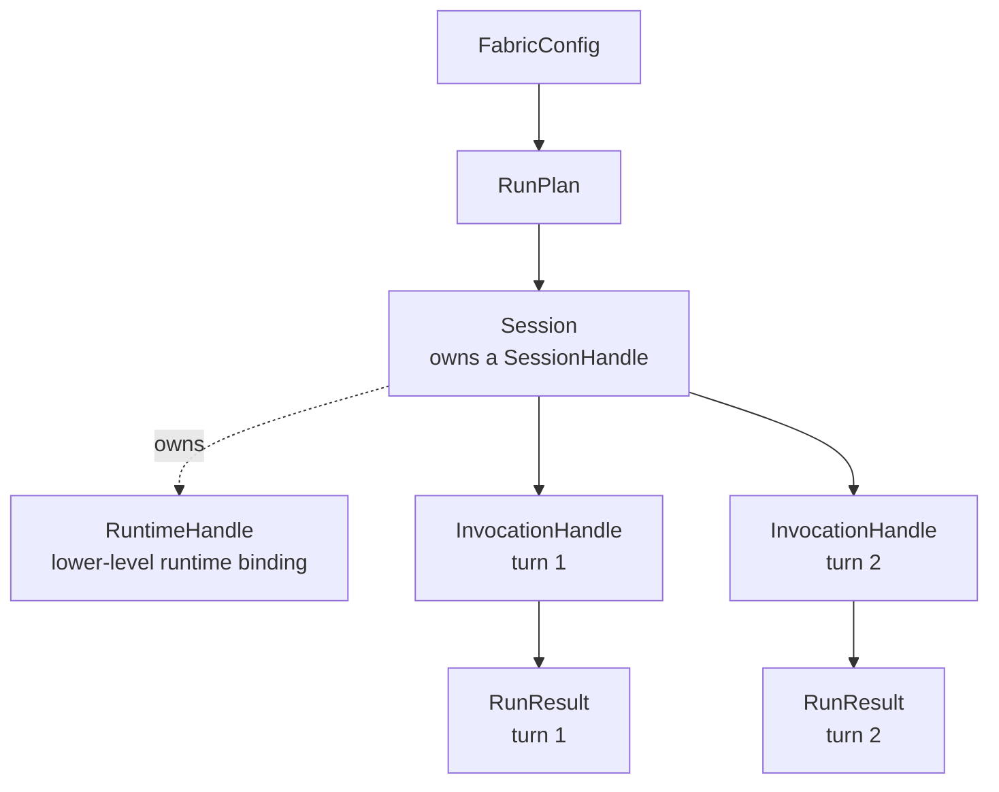

{/* SPDX-FileCopyrightText: Copyright (c) 2026, NVIDIA CORPORATION & AFFILIATES. All rights reserved.
SPDX-License-Identifier: Apache-2.0 */}

# Python SDK

The Python SDK is the application-facing interface for NeMo Fabric. It lets a
consumer configure an agent harness, validate the resolved plan, start a runtime,
send one or more turns, stream normalized events, stop the runtime, and collect
results, artifacts, logs, and telemetry references.

The SDK is config-first. Applications should construct a typed `FabricConfig`
from their own job, deployment, or evaluation config. Portable file formats such
as `agent.yaml` remain useful for examples, CI, and reproducibility, but the SDK
does not require callers to write intermediate files before invoking Fabric.

Generated API reference pages remain the source of truth for exact signatures.
This guide explains how the pieces are intended to fit together.

## Mental Model

Fabric separates configuration, runtime lifecycle, session lifecycle, and
individual invocations.

```text
FabricConfig
  -> RunPlan
  -> SessionHandle
  -> InvocationHandle
  -> RunResult
```



The important caller-facing handles are:

| Concept | What It Represents | How Consumers Use It |
| --- | --- | --- |
| `SessionHandle` | Public identity and lifecycle snapshot for one live or resumable session. | Use it for session IDs, status, adapter identity, capabilities, and result/event correlation. |
| `Session` | The Python object used to invoke, stream, update, cancel, and stop a session. | Use it for ordered conversations, stateful coding tasks, or service-style interaction. A session serializes turns by default. |
| `InvocationHandle` | One request or turn sent to a runtime. | Usually seen through `invocation_id`, events, and `RunResult` correlation rather than manipulated directly in Python. It is the core unit for status, artifacts, errors, and future cancellation/streaming control. |

`RuntimeHandle` is the lower-level binding to the harness runtime. SDK callers
normally work through `Session` and `SessionHandle`.

Product-level orchestration belongs to the consumer. Fabric does not schedule
jobs, manage queues, own retries, or scale workers. Platform, Harbor, Gym, and
local applications decide how many sessions or tasks to run.

## Configure In Code

Build typed config in one of two ways:

- start with a base config and use helpers to add or edit capabilities;
- provide the full nested config directly, which is often better for generated
  configs or complete application-owned config.

```python
from nemo_fabric import FabricConfig

config = FabricConfig(
    metadata={"name": "review-agent"},
    harness={
        "adapter_id": "nvidia.fabric.hermes.sdk",
        "resolution": "preinstalled",
    },
    models={
        "default": {
            "provider": "nvidia",
            "model": "nvidia/nemotron-3-nano-30b-a3b",
            "api_key_env": "NVIDIA_API_KEY",
        }
    },
    runtime={
        "input_schema": "chat",
        "output_schema": "message",
        "artifacts": "./artifacts",
    },
)

config.add_skill_path("./skills/code-review")
config.add_mcp_server(
    "github",
    transport="streamable-http",
    url="${GITHUB_MCP_URL}",
    exposure="harness_native",
)
config.enable_relay(project="fabric-review", output_dir="./artifacts/relay")
```

Config helpers edit the typed config before planning or starting a runtime. They
do not modify already-started runtimes.

For evaluation or deployment variations, construct the final config that should
run. Applications can do that with ordinary Python functions, config builders, or
copies of a typed config.

```python
def review_agent_config(*, github_mcp: bool, relay: bool) -> FabricConfig:
    config = FabricConfig(
        metadata={"name": "review-agent"},
        harness={"adapter_id": "nvidia.fabric.hermes.sdk"},
        models={
            "default": {
                "provider": "nvidia",
                "model": "nvidia/nemotron-3-nano-30b-a3b",
                "api_key_env": "NVIDIA_API_KEY",
            }
        },
    )
    if github_mcp:
        config.add_mcp_server(
            "github",
            transport="streamable-http",
            url="${GITHUB_MCP_URL}",
            exposure="harness_native",
        )
    if relay:
        config.enable_relay(project="fabric-review", output_dir="./artifacts/relay")
    return config

config = review_agent_config(github_mcp=True, relay=True)
```

Fabric validates the final config supplied by the caller. The SDK does not
require a separate profile overlay model for typed-config usage.

If a config contains relative paths, pass a `base_dir` when planning, checking,
or running. The base directory anchors paths such as skills, workspace, and
artifact locations to the caller's package or job layout.

## Schemas And Reference

The SDK models mirror the public Fabric schema. Use the schemas for exact field
definitions and the generated API reference for exact Python signatures.

| Contract | Source |
| --- | --- |
| Agent config | `schemas/agent.schema.json` |
| Run plan | `schemas/run-plan.schema.json` |
| Request/result/event contracts | `schemas/run-request.schema.json`, `schemas/run-result.schema.json`, `schemas/fabric-event.schema.json` |
| Session, runtime, and invocation handles | `schemas/session-handle.schema.json`, `schemas/runtime-handle.schema.json`, `schemas/invocation-handle.schema.json` |
| Artifacts and errors | `schemas/artifact-manifest.schema.json`, `schemas/error-info.schema.json` |

For schema maintenance details, see `schemas/SCHEMA.md`. For generated Python API
documentation, see the Python Library Reference under Reference.

## API Inventory

Use `Fabric` as the primary SDK entrypoint.

| API | Async | Use When | Notes |
| --- | --- | --- | --- |
| `Fabric.plan(config, base_dir=...)` | No | You need to inspect the selected adapter, capability mapping, and runtime capabilities before running. | Does not start a runtime. |
| `Fabric.doctor(config, base_dir=...)` | Yes | You need preflight diagnostics for adapter availability, config support, and environment assumptions. | Checks may touch runtime dependencies. |
| `Fabric.run(config, request=..., session_id=...)` | Yes | You need one complete start, invoke, result, stop lifecycle. | Convenience path for one-shot jobs. |
| `Fabric.start_session(config, session_id=..., overrides=...)` | Yes | You need a reusable multi-turn runtime. | Returns a `Session`. Use it as an async context manager. |
| `Session.invoke(...)` | Yes | You need one ordered turn on an existing session. | Same-session turns are serialized by default. |
| `Session.stream(...)` | Yes | You need events plus the terminal result through one async iterator. | Some adapters may buffer events internally. |
| `Session.update(...)` | Yes | You need to update a running runtime. | Only available when the adapter advertises update support. |
| `Session.cancel(...)` | Yes | You need best-effort cancellation. | Only available when the adapter advertises cancellation support. |
| `Session.stop()` | Yes | You need to stop or detach from the runtime. | Called automatically when using `async with`. |

## One-Shot Runs

Use `run(...)` when the application has one input and does not need to preserve
runtime state after the result is collected.

```python
from nemo_fabric import Fabric, RunRequest

request = RunRequest(
    input="Review the workspace changes.",
    request_id="job-123-turn-1",
    context={"job_id": "job-123"},
    overrides={"max_iterations": 1},
)

async with Fabric() as fabric:
    result = await fabric.run(
        config,
        base_dir="/workspace/review-agent",
        session_id="job-123",
        request=request,
    )

print(result.status)
print(result.output)
print(result.artifacts)
```

`session_id` is a caller-owned stable conversation or task key. Fabric encodes it
into request context so downstream adapters, telemetry, and results can correlate
work for the same logical task.

## Multi-Turn Sessions

Use `start_session(...)` when the selected harness should keep state across
turns. A session owns one runtime and stops it when the async context exits.

```python
from nemo_fabric import Fabric

async with Fabric() as fabric:
    async with await fabric.start_session(
        config,
        base_dir="/workspace/review-agent",
        session_id="review-session-123",
    ) as session:
        first = await session.invoke(input="Inspect the repository")
        second = await session.invoke(input="Now review the latest patch")

print(first.status, second.status)
```

Multiple independent sessions can run concurrently when the consumer schedules
them. A single session serializes turns by default because most harnesses treat a
session as ordered state.

```python
import asyncio

async def review_one(job_id: str, prompt: str):
    async with Fabric() as fabric:
        return await fabric.run(
            config,
            session_id=job_id,
            request={"input": prompt, "context": {"job_id": job_id}},
        )

results = await asyncio.gather(
    review_one("job-1", "Review patch A"),
    review_one("job-2", "Review patch B"),
)
```

## Streaming And Events

Use `Session.stream(...)` when the caller wants lifecycle or progress events
before receiving the terminal result.

```python
from nemo_fabric import Fabric, FabricEvent

async with Fabric() as fabric:
    async with await fabric.start_session(config, session_id="review-123") as session:
        async for item in session.stream(input="Review this patch"):
            if isinstance(item, FabricEvent):
                print("event", item.kind, item.message)
            else:
                print("result", item.status, item.output)
```

`Session.stream(...)` yields normalized `FabricEvent` objects followed by one
terminal `RunResult`. The API is streaming-shaped even when a specific adapter
buffers internally. Consumers should treat event timing as adapter-dependent
unless the selected adapter explicitly advertises real-time event streaming.

Events are useful for:

- progress updates in Platform or service UIs;
- logs and status forwarding in evaluation harnesses;
- correlating runtime, session, invocation, adapter, and telemetry IDs;
- reporting structured failures before or alongside the terminal result.

## Unified Run Results

Every successful SDK call that reaches the adapter boundary returns a normalized
`RunResult`, even when the harness invocation itself failed. This keeps consumer
code simple: inspect `status`, `error`, `events`, and `artifacts` first, then
process `output` when the status is successful.

Important fields:

| Field | Meaning |
| --- | --- |
| `status` | Terminal invocation status such as success, failure, or cancellation. |
| `output` | Harness output normalized to the configured output schema. |
| `error` | Structured failure metadata when available. |
| `artifacts` | Output files, logs, patches, native artifacts, and other materialized references. |
| `telemetry` | References to Relay or other telemetry streams produced by the run. |
| `events` | Ordered normalized lifecycle and invocation events. |
| `metadata` | Result-specific structured metadata. |
| `session_id`, `runtime_id`, `invocation_id`, `request_id` | IDs for correlation across sessions, logs, telemetry, and artifacts. |

If Fabric cannot resolve config, start a runtime, or obtain a normalized result,
the SDK raises a `FabricError` subclass instead of returning a partial
`RunResult`.

## Feature Support Across Harness Adapters

The SDK surface is stable, but harness adapters do not all support the same
features. For example, one adapter may support sessions and streaming while
another only supports one-shot execution.

Use `plan(...)` and `doctor(...)` before relying on optional features:

```python
async with Fabric() as fabric:
    plan = fabric.plan(config)
    report = await fabric.doctor(config)

if not plan.capabilities.sessions:
    raise RuntimeError("selected adapter does not support sessions")
```

Unsupported operations raise `FabricCapabilityError`. Consumers should use that
error to provide actionable messages, select a different adapter config, or fall
back to a supported execution mode.

## Install And Runtime Responsibilities

In production, the consumer or execution environment is responsible for
installing Fabric, the selected harness, adapter dependencies, model access,
credentials, and any required native tools. Fabric validates and diagnoses the
runtime assumptions, but it does not silently install harnesses or credentials at
invocation time.

Development environments may use extras, virtual environments, or local source
checkouts to make iteration easy. Production environments should prefer explicit
images, preinstalled dependencies, or managed deployment packages.

Near term, compatibility checks should make this more explicit by validating:

- Fabric SDK and native extension versions;
- selected adapter version;
- selected harness version or version range;
- required environment variables or secret references;
- optional capability support such as sessions, streaming, Relay, MCP, or tool
  exposure.

## Custom And Extra Fields

Fabric keeps the core config stable while allowing adapters and consumers to
carry additional structured data. Use normalized fields for portable concepts
such as models, MCP, tools, skills, telemetry, runtime input/output shape, and
artifacts. Put harness-specific settings under adapter-owned config fields.

Typed config models preserve unknown extension fields where supported, but
extension preservation is not the same as feature support. An adapter must still
declare and implement the behavior for any custom field it consumes. Use
`doctor(...)` to catch unsupported or ignored settings before launching a run.

## Errors

All public SDK errors inherit from `FabricError`.

| Error | Meaning |
| --- | --- |
| `FabricConfigError` | Invalid config, request, or override. |
| `FabricCapabilityError` | Selected adapter does not support the requested operation. |
| `FabricRuntimeError` | Runtime startup, invocation, or shutdown failed before a normalized result could be returned. |
| `FabricStateError` | Invalid session state transition, such as invoking after stop. |
| `FabricNativeUnavailableError` | Native extension is not installed or importable. |

Consumers own job-level retries and rollout-level failure policy. Fabric performs
best-effort cleanup for runtimes it starts, records structured error metadata
when possible, and propagates enough status, event, artifact, and exception
detail for the consumer to decide what to do next.
