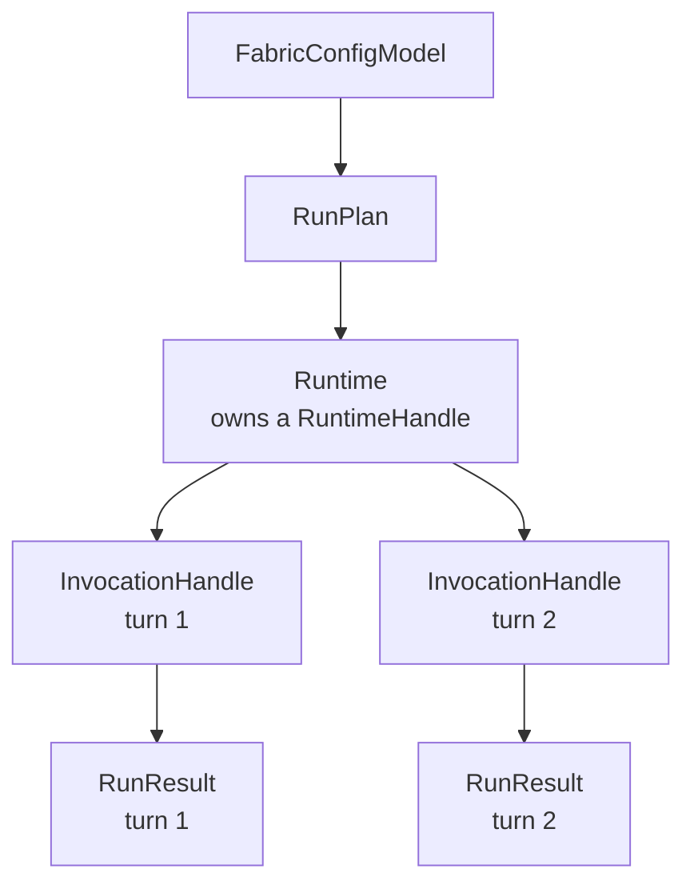

{/* SPDX-FileCopyrightText: Copyright (c) 2026, NVIDIA CORPORATION & AFFILIATES. All rights reserved.
SPDX-License-Identifier: Apache-2.0 */}

# Python SDK

The Python SDK is the application-facing interface for NeMo Fabric. It lets a
consumer configure an agent harness, validate the resolved plan, start a runtime,
send one or more turns, stream normalized events, stop the runtime, and collect
results, artifacts, logs, and telemetry references.

The SDK is config-first. Applications should construct a Pydantic
`FabricConfigModel` from their own job, deployment, or evaluation config.
Portable file formats such as `agent.yaml` remain useful for examples, CI, and
reproducibility, but the SDK does not require callers to write intermediate
files before invoking Fabric.

Generated API reference pages are the source of truth for exact signatures.
This guide explains how the pieces fit together.

## Execution Model

Fabric separates configuration, runtime planning, runtime lifecycle, and
individual invocations. It does not expose a separate portable session layer.

```text
FabricConfigModel
  -> RunPlan
  -> RuntimeHandle
  -> InvocationHandle
  -> RunResult
```



The important caller-facing handles are:

| Concept | What It Represents | How Consumers Use It |
| --- | --- | --- |
| `Runtime` | The Python object for one logical, stateful harness execution. | Use it to send ordered invocations and stop the execution. Use it as an async context manager for cleanup. |
| `RuntimeHandle` | The identity and opaque adapter binding for that execution. | Use its Fabric runtime ID for result, event, artifact, and telemetry correlation. Native thread/session IDs remain adapter-internal. |
| `InvocationHandle` | One request or turn sent to a runtime. | Usually seen through `invocation_id`, events, and `RunResult` correlation rather than manipulated directly in Python. It is the core unit for status, artifacts, errors, and future cancellation/streaming control. |

A runtime is a logical execution boundary, not necessarily an operating-system
process. An adapter may use an in-process SDK, a process, or shared service
infrastructure while preserving isolated state for each Fabric runtime.

Harness-native concepts such as a Codex thread, OpenCode or OpenClaw session,
Hermes session row, or Claude conversation live inside the adapter's opaque
runtime binding. They are not additional Fabric lifecycle objects.

Product-level orchestration belongs to the consumer. Fabric does not schedule
jobs, manage queues, own retries, or scale workers. Applications and other
consumers decide how many runtimes or tasks to run. For example, a Harbor job
starts its own Fabric runtime; Fabric does not interpret Harbor job IDs.

Fabric provides the runtime contract; applications own product policy around
that contract.

## Configure Agents In Code

Build typed config in one of two ways:

- start with a base config and use helpers to add or edit capabilities;
- provide the full nested config directly, which is often better for generated
  configs or complete application-owned config.

```python
from nemo_fabric import (
    FabricConfigModel,
    HarnessConfigModel,
    MetadataConfigModel,
    ModelConfigModel,
    RuntimeConfigModel,
)

config = FabricConfigModel(
    metadata=MetadataConfigModel(name="review-agent"),
    harness=HarnessConfigModel(
        adapter_id="nvidia.fabric.hermes.sdk",
        resolution="preinstalled",
    ),
    models={
        "default": ModelConfigModel(
            provider="nvidia",
            model="nvidia/nemotron-3-nano-30b-a3b",
            api_key_env="NVIDIA_API_KEY",
        )
    },
    runtime=RuntimeConfigModel(
        input_schema="chat",
        output_schema="message",
        artifacts="./artifacts",
    ),
)

config.add_skill_path("./skills/code-review")
config.add_mcp_server(
    "github",
    transport="streamable-http",
    url="${GITHUB_MCP_URL}",
    exposure="harness_native",
)
config.enable_relay(project="fabric-review", output_dir="./artifacts/relay")
```

Config helpers edit the typed config before planning or starting a runtime. They
do not modify already-started runtimes.

For evaluation or deployment variations, construct the final config that should
run. Applications can do that with ordinary Python functions, config builders, or
copies of a typed config.

```python
from nemo_fabric import (
    FabricConfigModel,
    HarnessConfigModel,
    MetadataConfigModel,
    ModelConfigModel,
)


def review_agent_config(*, github_mcp: bool, relay: bool) -> FabricConfigModel:
    config = FabricConfigModel(
        metadata=MetadataConfigModel(name="review-agent"),
        harness=HarnessConfigModel(adapter_id="nvidia.fabric.hermes.sdk"),
        models={
            "default": ModelConfigModel(
                provider="nvidia",
                model="nvidia/nemotron-3-nano-30b-a3b",
                api_key_env="NVIDIA_API_KEY",
            )
        },
    )
    if github_mcp:
        config.add_mcp_server(
            "github",
            transport="streamable-http",
            url="${GITHUB_MCP_URL}",
            exposure="harness_native",
        )
    if relay:
        config.enable_relay(project="fabric-review", output_dir="./artifacts/relay")
    return config

config = review_agent_config(github_mcp=True, relay=True)
```

Fabric validates the final config supplied by the caller. The SDK does not
require a separate profile overlay model for typed-config usage.

If a config contains relative paths, pass a `base_dir` when planning, checking,
or running. The base directory anchors paths such as skills, workspace, and
artifact locations to the caller's package or job layout.

## JSON Schemas And Pydantic Models

The SDK's Pydantic models are hand-maintained against the Rust-generated public
schemas. Use the schemas for exact persisted field definitions and the generated
API reference for exact Python signatures. The mapping-compatible `FabricConfig`
and `RunRequest` classes remain available as the normalization bridge used by
the runtime layer, but new application code should prefer `FabricConfigModel`
and `RunRequestModel` for authoring.

| Contract | Source |
| --- | --- |
| SDK Pydantic models | `nemo_fabric.models`; see the generated [Models reference](/reference/api/python-library-reference/models) |
| Agent config | `schemas/agent.schema.json` |
| Run plan | `schemas/run-plan.schema.json` |
| Request/result/event contracts | `schemas/run-request.schema.json`, `schemas/run-result.schema.json`, `schemas/fabric-event.schema.json` |
| Runtime and invocation handles | `schemas/runtime-handle.schema.json`, `schemas/invocation-handle.schema.json` |
| Artifacts and errors | `schemas/artifact-manifest.schema.json`, `schemas/error-info.schema.json` |

For schema maintenance details, see `schemas/SCHEMA.md`. For generated Python API
documentation, see the Python Library Reference under Reference.

## API Inventory

Use `Fabric` as the primary SDK entrypoint.

| API | Async | Use When | Notes |
| --- | --- | --- | --- |
| `Fabric.resolve(config, base_dir=...)` | No | You need the normalized effective config without resolving an adapter. | Does not start a runtime. |
| `Fabric.plan(config, base_dir=...)` | No | You need to inspect the selected adapter, capability mapping, and runtime capabilities before running. | Does not start a runtime. |
| `Fabric.doctor(config, base_dir=...)` | Yes | You need preflight diagnostics for adapter availability, config support, and environment assumptions. | Checks may touch runtime dependencies. |
| `Fabric.run(config, request=...)` | Yes | You need one complete start, invoke, result, stop lifecycle. | Convenience path for one-shot work. |
| `Fabric.start_runtime(config, overrides=...)` | Yes | You need state across multiple ordered invocations. | Returns a `Runtime`. Use it as an async context manager. |
| `Runtime.invoke(...)` | Yes | You need one turn on an existing runtime. | A runtime permits one active invocation at a time for the MVP. |
| `Runtime.stop()` | Yes | You need to stop or detach from the runtime. | Called automatically when using `async with`. |

## One-Shot Runs

Use `run(...)` when the application has one input and does not need to preserve
runtime state after the result is collected.

```python
from nemo_fabric import Fabric, RunRequestModel

request = RunRequestModel(
    input="Review the workspace changes.",
    request_id="request-123",
    context={"source": "review-service"},
    overrides={"max_iterations": 1},
)

async with Fabric() as fabric:
    result = await fabric.run(
        config,
        base_dir="/workspace/review-agent",
        request=request,
    )

print(result.status)
print(result.output)
print(result.artifacts)
```

Fabric generates runtime and invocation IDs for lifecycle correlation. An
application may include its own identifiers in opaque request metadata, but
Fabric does not interpret them as job, session, scheduling, or resume state.

## Multi-Turn Runtimes

Use `start_runtime(...)` when the selected harness should keep state across
turns. Every call creates a new logical Fabric runtime; callers reuse the
returned object rather than selecting it with a job or session ID. The runtime
stops when its async context exits.

```python
from nemo_fabric import Fabric

async with Fabric() as fabric:
    async with await fabric.start_runtime(
        config,
        base_dir="/workspace/review-agent",
    ) as runtime:
        first = await runtime.invoke(input="Inspect the repository")
        second = await runtime.invoke(input="Now review the latest patch")

print(first.status, second.status)
```

The adapter reuses its native state between calls. For example, the Codex
adapter uses one Codex thread for the runtime and maps each invocation to one
turn. That thread ID remains adapter-internal.

## Application-Owned Parallelism

Applications create independent runtimes when they want parallel work. Fabric
does not own a queue, worker pool, semaphore, retry policy, timeout policy, or
numeric concurrency limit. For the MVP, attempting overlapping invocations on
one runtime raises `FabricStateError`; this is an object-safety invariant rather
than application concurrency management.

```python
import asyncio

async def review_one(prompt: str):
    async with Fabric() as fabric:
        return await fabric.run(config, input=prompt)

results = await asyncio.gather(
    review_one("Review patch A"),
    review_one("Review patch B"),
)
```

Harbor follows the same boundary: each Harbor job starts an independent Fabric
runtime, and Harbor owns job IDs, queues, retries, timeouts, and concurrency.
Harbor may store its own job-to-runtime and job-to-invocation correlation, but
Fabric does not use a job ID to select or resume runtime state.

## Streaming And Events

The MVP returns normalized events on `RunResult.events`. A future
`Runtime.stream(...)` API may yield events before the terminal result when the
adapter supports genuine real-time streaming. Do not treat replaying buffered
events after `invoke()` as live streaming.

Streaming, live runtime updates, and cancellation remain reserved APIs until
their adapter transports and lifecycle semantics are implemented. Cancellation
may ultimately belong on a public invocation object rather than on `Runtime`.

Events are useful for:

- progress updates in application or service UIs;
- logs and status forwarding in evaluation harnesses;
- correlating runtime, invocation, adapter, and telemetry IDs;
- reporting structured failures before or alongside the terminal result.

## Unified Run Results

Every successful SDK call that reaches the adapter boundary returns a normalized
`RunResult`, even when the harness invocation itself failed. This keeps consumer
code simple: inspect `status`, `error`, `events`, and `artifacts` first, then
process `output` when the status is successful.

Important fields:

| Field | Meaning |
| --- | --- |
| `status` | Terminal invocation status such as success, failure, or cancellation. |
| `output` | Harness output normalized to the configured output schema. |
| `error` | Structured failure metadata when available. |
| `artifacts` | Output files, logs, patches, native artifacts, and other materialized references. |
| `telemetry` | References to Relay or other telemetry streams produced by the run. |
| `events` | Ordered normalized lifecycle and invocation events. |
| `metadata` | Result-specific structured metadata. |
| `runtime_id`, `invocation_id`, `request_id` | IDs for correlation across runtimes, logs, telemetry, and artifacts. |

These are structured correlation fields, not interchangeable metadata:
`runtime_id` identifies the runtime lifecycle, `invocation_id` identifies one
invocation within that runtime, and `request_id` correlates the caller's
request. Fabric-generated values use type-specific prefixes such as `runtime-`,
`invocation-`, and `request-`; callers may provide their own `request_id`.
Consumers should store and log each field separately and otherwise treat its
value as opaque rather than parsing the identifier encoding.

If Fabric cannot resolve config, start a runtime, or obtain a normalized result,
the SDK raises a `FabricError` subclass instead of returning a partial
`RunResult`.

## Feature Support Across Harness Adapters

The SDK presents one consistent shape across adapters, but harness adapters do
not all support the same optional features. For example, an adapter may provide
real-time event streaming while another returns events only with the terminal
result.

Use `plan(...)` and `doctor(...)` before relying on optional features:

```python
async with Fabric() as fabric:
    plan = fabric.plan(config)
    report = await fabric.doctor(config)

if not plan.capabilities.streaming:
    print("selected adapter returns buffered events")
```

Unsupported operations raise `FabricCapabilityError`. Consumers should use that
error to provide actionable messages, select a different adapter config, or fall
back to a supported execution mode.

## Install And Runtime Responsibilities

In production, the consumer or execution environment is responsible for
installing Fabric, the selected harness, adapter dependencies, model access,
credentials, and any required native tools. Fabric validates and diagnoses the
runtime assumptions, but it does not silently install harnesses or credentials at
invocation time.

Development environments may use extras, virtual environments, or local source
checkouts to make iteration easy. Production environments should prefer explicit
images, preinstalled dependencies, or managed deployment packages.

Runtime compatibility checks should validate:

- Fabric SDK and native extension versions;
- selected adapter version;
- selected harness version or version range;
- required environment variables or secret references;
- optional capability support such as streaming, Relay, MCP, or tool
  exposure.

## Custom Fields And Adapter Settings

Use normalized Fabric fields for portable behavior: models, runtime,
environment, skills, MCP, telemetry, tools, artifacts, and request context.

Use `harness.settings` for adapter-owned configuration that the selected adapter
understands. Examples include Hermes-specific launch options, Codex CLI flags,
or adapter-specific config file locations.

Use `metadata` for caller-owned annotations that Fabric should preserve and echo
back, but not interpret.

Adapter settings are not portable by default. An adapter must explicitly read
and implement a setting before it affects runtime behavior. Use `doctor(...)` to
catch unsupported, ignored, or malformed adapter settings before launching a run.

## Errors

All public SDK errors inherit from `FabricError`.

| Error | Meaning |
| --- | --- |
| `FabricConfigError` | Invalid config, request, or override. |
| `FabricCapabilityError` | Selected adapter does not support the requested operation. |
| `FabricRuntimeError` | Runtime startup, invocation, or shutdown failed before a normalized result could be returned. |
| `FabricStateError` | Invalid runtime state transition, such as invoking after stop or starting overlapping invocations. |
| `FabricNativeUnavailableError` | Native extension is not installed or importable. |

Consumers own job-level retries and rollout-level failure policy. Fabric performs
best-effort cleanup for runtimes it starts, records structured error metadata
when possible, and propagates enough status, event, artifact, and exception
detail for the consumer to decide what to do next.

## SDK Contract Boundaries

Fabric keeps a narrow execution contract. Applications own product behavior
around that contract.

### Versioning

Fabric uses explicit contract versions where persisted or independently
maintained artifacts cross package boundaries:

- `schema_version` identifies portable config documents such as `agent.yaml`
  and profile files.
- `contract_version` identifies the adapter descriptor contract implemented by
  a `fabric-adapter.json` file.
- Python and Rust package versions identify the installed SDK/core release.

Fabric versions top-level persisted documents and independently maintained
contracts. It does not version each config subsection independently. For
example, MCP, skills, models, telemetry, and runtime fields evolve under the
enclosing `schema_version`.

Fabric validates adapter descriptor contract versions during planning. Package
semver identifies the installed implementation, but it is not the compatibility
contract for saved agent packages or independently maintained adapters.

### Config Extensibility

The public schema has typed fields for stable Fabric concepts and controlled
extension points for adapter- or application-owned data. Use known fields for
portable concepts such as harness selection, models, runtime, skills, MCP,
telemetry, and artifacts. Use adapter-owned `harness.settings`, metadata, or
preserved extension fields for data Fabric should carry but not interpret.

Additive optional fields may be introduced within the existing document schema
version when old configs remain valid. Required fields, removed fields, or
semantic changes that alter how existing configs are interpreted require a new
enclosing document schema version or an explicit compatibility path.

Unknown data is not the same as supported behavior. An adapter must advertise
and implement a capability before Fabric treats it as runnable.

### Resilience

Fabric reports lifecycle failures; applications own recovery policy. If a
runtime process dies, a connection is permanently lost, or an adapter cannot
complete an invocation, Fabric marks the relevant runtime/invocation as
failed and returns structured error metadata when possible.

Transient I/O failures may be marked with retryable error metadata, but Fabric
does not perform job-level retries by default. Consumers decide whether to retry
the request, start a replacement runtime, fail the job, or escalate to a user.

### Scaling And Backpressure

Fabric does not schedule work, manage queues, or scale workers. Consumers decide
how many runtimes and jobs to run. Fabric keeps each runtime safe to use and
rejects overlapping invocations on one runtime for the MVP. Applications create
multiple runtimes and own any semaphore, worker-pool, retry, or timeout policy.
Fabric does not advertise or enforce a numeric concurrency limit.

If a harness reports capacity pressure, an adapter should surface it as a
structured error or event such as busy, rate limited, capacity exceeded, or
backpressure. The consumer decides whether to wait, retry, scale out, or fail.
