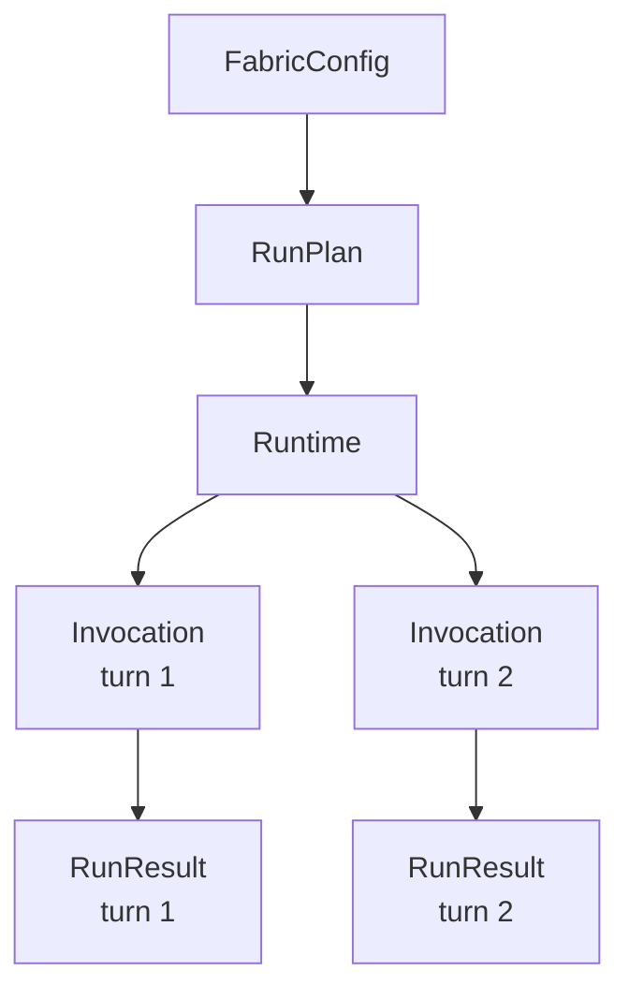

{/* SPDX-FileCopyrightText: Copyright (c) 2026, NVIDIA CORPORATION & AFFILIATES. All rights reserved.
SPDX-License-Identifier: Apache-2.0 */}

The Python SDK is the application-facing interface for NeMo Fabric. Use it to
configure an agent harness, inspect the resolved plan, run one request or a
multi-turn runtime, and collect normalized results, events, artifacts, and
telemetry references.

The SDK is config-first. Applications should construct a Pydantic
`FabricConfig` from their own job, deployment, or evaluation config.
Portable file formats such as `agent.yaml` remain useful for examples, CI, and
reproducibility, but the SDK does not require callers to write intermediate
files before invoking NeMo Fabric.

Generated API reference pages remain the source of truth for exact signatures.
This guide explains how the pieces are intended to fit together.

For installation and a package-backed example, start with the
[NeMo Fabric overview](/nemo/fabric/about-nemo-fabric/overview).

## Start With One Run

Construct a typed config, then pass it to `Fabric.run(...)`. The SDK starts a
runtime, invokes it once, collects the result, and stops the runtime.

```python
import asyncio

from nemo_fabric import (
    Fabric,
    FabricConfig,
    HarnessConfig,
    MetadataConfig,
    ModelConfig,
)

config = FabricConfig(
    metadata=MetadataConfig(name="review-agent"),
    harness=HarnessConfig(adapter_id="nvidia.fabric.hermes"),
    models={
        "default": ModelConfig(
            provider="nvidia",
            model="nvidia/nemotron-3-nano-30b-a3b",
            api_key_env="NVIDIA_API_KEY",
        )
    },
)


async def main() -> None:
    fabric = Fabric()
    result = await fabric.run(
        config,
        input="Review the workspace changes.",
    )

    print(result.status)
    print(result.output)


asyncio.run(main())
```

Use `base_dir` to resolve relative paths in an in-memory config. Before running
in a new environment, call `plan(...)` to inspect adapter selection and
`doctor(...)` to check runtime requirements.

The remaining examples reuse this `config` value.

## Execution Model

NeMo Fabric separates configuration, planning, runtime lifecycle, and individual
invocations. It does not expose a separate portable session layer.



Most application code works with four objects:

| Concept | What It Represents | How Consumers Use It |
| --- | --- | --- |
| `FabricConfig` | Typed configuration for the harness, models, runtime, and capabilities. | Construct it from application config before planning or running. |
| `RunPlan` | The resolved config, selected adapter, and declared capabilities. | Inspect it before starting work when adapter selection or feature support matters. |
| `Runtime` | The Python object for one logical, stateful harness execution. | Use it to send ordered invocations and stop the execution. Use it as an async context manager for cleanup. |
| `RunResult` | The normalized outcome of one invocation. | Read its status, output, error, events, artifacts, and correlation IDs. |

`Fabric` is a lightweight, reusable SDK facade. It resolves configuration,
creates plans and runtimes, and runs one-shot requests, but it does not
represent a started execution and does not require cleanup. A `Runtime` owns
stateful execution and shutdown, so it is the object used as an async context
manager.

`RuntimeHandle` and `InvocationHandle` carry lifecycle identity across the
native boundary. Most Python callers use their `runtime_id` and
`invocation_id` through `Runtime` and `RunResult` rather than manipulating the
handles directly.

A runtime is a logical execution boundary, not necessarily an operating-system
process. An adapter may use an in-process SDK, a process, or shared service
infrastructure while preserving isolated state for each NeMo Fabric runtime.

Harness-native threads, sessions, and conversations remain adapter-owned state
associated with the NeMo Fabric runtime. They are not additional NeMo Fabric lifecycle
objects.

NeMo Fabric provides the runtime contract. Applications own scheduling, queues,
retries, worker scaling, and the number of runtimes to run.

## Configure Agents In Code

Build the complete nested `FabricConfig` directly, or start with a base
config and use helpers to add capabilities. For example, extend the config from
the first example with skills, MCP, and telemetry:

```python
capability_config = config.model_copy(deep=True)
capability_config.add_skill_path("./skills/code-review")
capability_config.add_mcp_server(
    "github",
    transport="streamable-http",
    url="${GITHUB_MCP_URL}",
    exposure="harness_native",
)
capability_config.enable_relay(
    project="fabric-review",
    output_dir="./artifacts/relay",
)
```

Config helpers edit the typed config before planning or starting a runtime. They
do not modify already-started runtimes. Use `remove_mcp_server(name)` and
`remove_skill_path(path)` to remove capabilities from a copied config.
Telemetry is enabled by adding entries to `telemetry.providers`; Relay-specific
settings live in the top-level `relay` block.

For evaluation or deployment variations, use ordinary Python functions and
copies of the typed config. Supply the final config to NeMo Fabric when the variation
does not need file-profile merge semantics.

```python
def review_agent_config(base, *, github_mcp: bool, relay: bool):
    config = base.model_copy(deep=True)
    if github_mcp:
        config.add_mcp_server(
            "github",
            transport="streamable-http",
            url="${GITHUB_MCP_URL}",
            exposure="harness_native",
        )
    if relay:
        config.enable_relay(project="fabric-review", output_dir="./artifacts/relay")
    return config

variant = review_agent_config(config, github_mcp=True, relay=True)
```

Relay observability is represented directly in the SDK config's top-level
`relay` block, and additional Relay plugin components can be supplied
generically when their component package is available in the runtime
environment:

```python
from nemo_fabric import RelayComponentConfig

relay_config = config.model_copy(deep=True)
relay_config.enable_relay(
    output_dir="./artifacts/relay",
    components=[
        RelayComponentConfig(kind="switchyard", config={"route": "canary"}),
    ],
)
```

The repository's
[code-review example](https://github.com/NVIDIA/NeMo-Fabric/tree/main/examples/code_review_agent)
uses this pattern for complete Hermes Agent, Codex, Deep Agents,
environment, MCP, and telemetry variants.

When an in-memory caller needs the same ordered overlay behavior as file-backed
profiles, construct `FabricProfileConfig` values and pass them through
`profiles=[...]`. NeMo Fabric does not accept raw profile mappings.

If a config contains relative paths, pass a `base_dir` to `resolve(...)`,
`plan(...)`, `doctor(...)`, `run(...)`, or `start_runtime(...)`. The base
directory anchors skills, workspaces, artifacts, and other relative paths to
the caller's package or job layout.

## API Inventory

Create `Fabric()` as the primary SDK entrypoint. It is a regular Python object,
not a lifecycle context manager, and may be reused to plan, diagnose, or start
multiple independent runtimes.

| API | Async | Use When | Notes |
| --- | --- | --- | --- |
| `Fabric.resolve(config, base_dir=...)` | No | You need the normalized effective config without resolving an adapter. | Does not start a runtime. |
| `Fabric.plan(config, base_dir=...)` | No | You need to inspect the selected adapter, capability mapping, and runtime capabilities before running. | Does not start a runtime. |
| `Fabric.doctor(config, base_dir=...)` | Yes | You need preflight diagnostics for adapter availability, config support, and environment assumptions. | Checks may touch runtime dependencies. |
| `Fabric.run(config, input=...)` | Yes | You need one complete start, invoke, result, stop lifecycle. | Pass a `RunRequest` instead when the invocation needs IDs, context, or overrides. |
| `Fabric.start_runtime(config, ...)` | Yes | You need state across multiple ordered invocations. | Returns a `Runtime`. Use it as an async context manager. |
| `Runtime.invoke(...)` | Yes | You need one turn on an existing runtime. | A runtime permits one active invocation at a time. |
| `Runtime.stop()` | Yes | You need to stop or detach from the runtime. | Called automatically when using `async with`. |

## One-Shot Runs

Use `run(...)` when the application has one input and does not need to preserve
runtime state after the result is collected.

```python
from nemo_fabric import Fabric, RunRequest

request = RunRequest(
    input="Review the workspace changes.",
    request_id="request-123",
    context={"source": "review-service"},
)

fabric = Fabric()
result = await fabric.run(
    config,
    base_dir="/workspace/review-agent",
    request=request,
)

print(result.status)
print(result.output)
print(result.artifacts)
```

Use `input=...` for the common case. Use `request=RunRequest(...)` for structured
invocation metadata. Applications read files themselves and pass either the
loaded input or a validated request to NeMo Fabric.

NeMo Fabric generates runtime and invocation IDs for lifecycle correlation. An
application may include its own identifiers in opaque request metadata, but
NeMo Fabric does not interpret them as job, session, scheduling, or resume state.

## Multi-Turn Runtimes

Use `start_runtime(...)` when the selected harness should keep state across
turns. Every call creates a new logical NeMo Fabric runtime; callers reuse the
returned object rather than selecting it with a job or session ID. The runtime
stops when its async context exits.

```python
from nemo_fabric import Fabric

fabric = Fabric()
async with await fabric.start_runtime(
    config,
    base_dir="/workspace/review-agent",
) as runtime:
    first = await runtime.invoke(input="Inspect the repository")
    second = await runtime.invoke(input="Now review the latest patch")

print(first.status, second.status)
```

The adapter reuses its native state between calls. For example, the Codex
adapter uses one Codex thread for the runtime and maps each invocation to one
turn. That thread ID remains adapter-internal.

## Application-Owned Parallelism

Applications create independent runtimes when they want parallel work. NeMo Fabric
does not own a queue, worker pool, semaphore, retry policy, timeout policy, or
numeric concurrency limit. Each `Runtime` accepts one invocation at a time so
its ordered harness state cannot be changed by two calls at once. If an
application overlaps calls on the same `Runtime`, the second call raises
`FabricStateError`. To perform work in parallel, start independent runtimes;
the application decides how many to run.

Async lifecycle calls run blocking native work outside the Python event loop,
so independent runtimes can make progress concurrently. This does not add a
NeMo Fabric concurrency limit or scheduler.

```python
import asyncio


async def review_one(prompt: str):
    return await Fabric().run(config, input=prompt)


async def main() -> None:
    results = await asyncio.gather(
        review_one("Review patch A"),
        review_one("Review patch B"),
    )
    print([result.status for result in results])


asyncio.run(main())
```

For example, each Harbor job starts an independent NeMo Fabric runtime. Harbor owns
job IDs and concurrency policy; NeMo Fabric does not use a job ID to select or
resume runtime state.

## Unified Run Results

Every invocation that reaches the adapter boundary returns a normalized
`RunResult`, even when the harness invocation itself failed. Inspect `status`,
`error`, `events`, and `artifacts` first, then process `output` when the status
is successful.

Important fields:

| Field | Meaning |
| --- | --- |
| `status` | Terminal invocation status such as success, failure, or cancellation. |
| `output` | Harness output normalized to the configured output schema. |
| `error` | Structured failure metadata when available. |
| `artifacts` | Output files, logs, patches, native artifacts, and other materialized references. |
| `telemetry` | References to Relay or other telemetry streams produced by the run. |
| `events` | Ordered normalized lifecycle and invocation events. |
| `metadata` | Result-specific structured metadata. |
| `runtime_id`, `invocation_id`, `request_id` | IDs for correlation across runtimes, logs, telemetry, and artifacts. |

These are structured correlation fields, not interchangeable metadata:
`runtime_id` identifies the runtime lifecycle, `invocation_id` identifies one
invocation within that runtime, and `request_id` correlates the caller's
request. NeMo Fabric-generated values use type-specific prefixes such as `runtime-`,
`invocation-`, and `request-`; callers may provide their own `request_id`.
Consumers should store and log each field separately and otherwise treat its
value as opaque rather than parsing the identifier encoding.

If NeMo Fabric cannot resolve config, start a runtime, or obtain a normalized result,
the SDK raises a `FabricError` subclass instead of returning a partial
`RunResult`.

## Events

Each `RunResult` includes the normalized events collected for that invocation.
Event kinds and detail may vary by adapter, but their lifecycle and correlation
fields use the common NeMo Fabric contract.

Events are useful for:

- rendering invocation history in application or service UIs;
- forwarding logs and status to evaluation harnesses;
- correlating runtime, invocation, adapter, and telemetry IDs;
- reporting structured failures alongside the terminal result.

## Feature Support Across Harness Adapters

The SDK presents one consistent shape across adapters, but adapters differ in
their runtime requirements, accepted configuration, and optional capabilities.

Use `plan(...)` and `doctor(...)` before relying on optional features:

```python
fabric = Fabric()
plan = fabric.plan(config)
report = await fabric.doctor(config)

print(plan.adapter.adapter_id)
print(report.status)
```

Use the plan to confirm adapter selection and capability routing. Use the doctor
report to catch missing dependencies, unsupported settings, and environment
problems before starting a runtime.

## Install And Runtime Responsibilities

In production, the consumer or execution environment is responsible for
installing NeMo Fabric, the selected harness, adapter dependencies, model access,
credentials, and any required native tools. NeMo Fabric validates and diagnoses the
runtime assumptions, but it does not silently install harnesses or credentials at
invocation time.

Development environments may use extras, virtual environments, or local source
checkouts to make iteration easy. Production environments should prefer explicit
images, preinstalled dependencies, or managed deployment packages.

Runtime compatibility checks should validate:

- NeMo Fabric SDK and native extension versions;
- selected adapter version;
- selected harness version or version range;
- required environment variables or secret references;
- optional capability support such as Relay, MCP, or tool exposure.

## Custom Fields And Adapter Settings

Use normalized NeMo Fabric fields for portable behavior: models, runtime,
environment, skills, MCP, telemetry, tools, artifacts, and request context.

Use `harness.settings` for adapter-owned configuration that the selected adapter
understands. Examples include launch options specific to Hermes Agent, Codex controls,
or adapter-specific config file locations.

Use `metadata` for caller-owned annotations that NeMo Fabric should preserve and echo
back, but not interpret.

Adapter settings are not portable by default. An adapter must explicitly read
and implement a setting before it affects runtime behavior. Use `doctor(...)` to
catch unsupported, ignored, or malformed adapter settings before launching a run.

## Errors

All public SDK errors inherit from `FabricError`.

| Error | Meaning |
| --- | --- |
| `FabricConfigError` | Invalid config, request, or override. |
| `FabricCapabilityError` | Selected adapter does not support the requested operation. |
| `FabricRuntimeError` | Runtime startup, invocation, or shutdown failed before a normalized result could be returned. |
| `FabricStateError` | Invalid runtime state transition, such as invoking after stop or starting overlapping invocations. |
| `FabricNativeUnavailableError` | Native extension is not installed or importable. |

Consumers own job-level retries and rollout-level failure policy. One-shot runs
attempt to stop the runtime before returning. A `Runtime` used with `async with`
also attempts cleanup after an invocation error; if cleanup fails, that failure
is attached to the original exception rather than replacing it. NeMo Fabric records
structured error metadata when possible and returns enough detail for the
consumer to decide what to do next.

## SDK Contract Boundaries

NeMo Fabric keeps a narrow execution contract. Applications own product behavior
around that contract.

### Schemas And Python Models

The SDK's Pydantic models are maintained against the Rust-generated public
schemas. Use the schemas for persisted field definitions and the generated API
reference for exact Python signatures. New application code should prefer
`FabricConfig` and `RunRequest` for validated SDK inputs.

| Contract | Source |
| --- | --- |
| SDK Pydantic models | `nemo_fabric.models`; see the generated [Models reference](/reference/api/python-library-reference/models) |
| Agent config | `schemas/agent.schema.json` |
| Run plan | `schemas/run-plan.schema.json` |
| Request, result, and events | `schemas/run-request.schema.json`, `schemas/run-result.schema.json`, `schemas/fabric-event.schema.json` |
| Runtime and invocation handles | `schemas/runtime-handle.schema.json`, `schemas/invocation-handle.schema.json` |
| Artifacts and errors | `schemas/artifact-manifest.schema.json`, `schemas/error-info.schema.json` |

### Versioning

NeMo Fabric uses explicit contract versions where persisted or independently
maintained artifacts cross package boundaries:

- `schema_version` identifies portable config documents such as `agent.yaml`
  and profile files.
- `contract_version` identifies the adapter descriptor contract implemented by
  a `fabric-adapter.json` file.
- Python and Rust package versions identify the installed SDK/core release.

NeMo Fabric versions top-level persisted documents and independently maintained
contracts. It does not version each config subsection independently. For
example, MCP, skills, models, telemetry, and runtime fields evolve under the
enclosing `schema_version`.

NeMo Fabric validates adapter descriptor contract versions during planning. Package
semver identifies the installed implementation, but it is not the compatibility
contract for saved agent packages or independently maintained adapters.

### Config Extensibility

The public schema has typed fields for stable NeMo Fabric concepts and controlled
extension points for adapter- or application-owned data. Use known fields for
portable concepts such as harness selection, models, runtime, skills, MCP,
telemetry, and artifacts. Use adapter-owned `harness.settings`, metadata, or
preserved extension fields for data NeMo Fabric should carry but not interpret.

Additive optional fields may be introduced within the existing document schema
version when old configs remain valid. Required fields, removed fields, or
semantic changes that alter how existing configs are interpreted require a new
enclosing document schema version or an explicit compatibility path.

Unknown data is not the same as supported behavior. An adapter must advertise
and implement a capability before NeMo Fabric treats it as runnable.

### Resilience

NeMo Fabric reports lifecycle failures; applications own recovery policy. If a
runtime process dies, a connection is permanently lost, or an adapter cannot
complete an invocation, NeMo Fabric marks the relevant runtime/invocation as
failed and returns structured error metadata when possible.

Transient I/O failures may be marked with retryable error metadata, but NeMo Fabric
does not perform job-level retries by default. Consumers decide whether to retry
the request, start a replacement runtime, fail the job, or escalate to a user.

### Capacity And Backpressure

If a harness reports capacity pressure, an adapter should surface it as a
structured error or event such as busy, rate limited, capacity exceeded, or
backpressure. The consumer decides whether to wait, retry, scale out, or fail.

## Next Steps
- Review the examples in the GitHub repo [`examples/`](https://github.com/NVIDIA/NeMo-Fabric/tree/main/examples).
