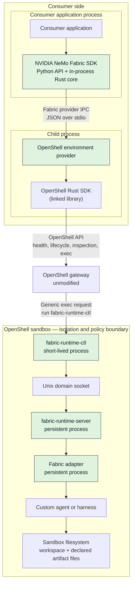
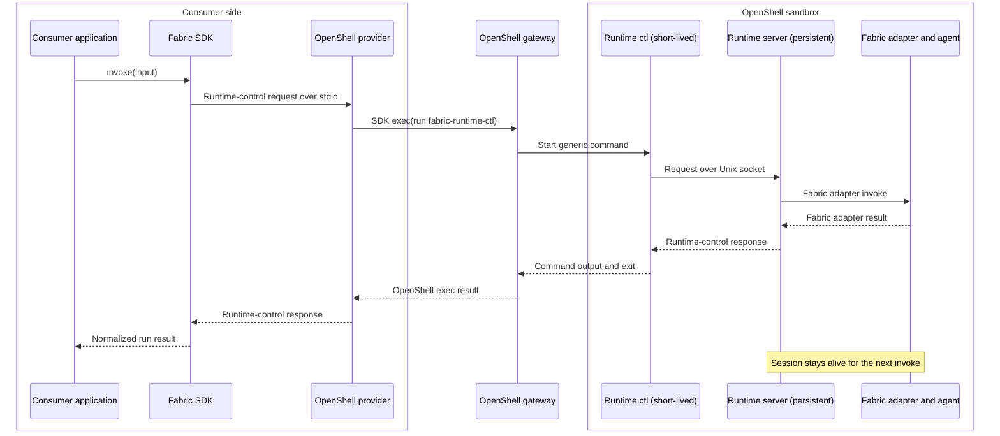

<!--
SPDX-FileCopyrightText: Copyright (c) 2026, NVIDIA CORPORATION & AFFILIATES. All rights reserved.
SPDX-License-Identifier: Apache-2.0
-->

# OpenShell Environment Provider for NVIDIA NeMo Fabric

The OpenShell environment provider runs an existing NeMo Fabric adapter and
its agent inside an OpenShell sandbox. Agent code does not need an
OpenShell-specific execution path.

> **Status: Experimental.** The provider interface, packaging, and operational
> behavior can change as this integration moves toward product support.

The deployment consumer creates and manages the sandbox. Fabric verifies the
sandbox, binds one runtime session to it, and normalizes agent lifecycle
operations. Fabric-managed sandbox creation is an optional development
convenience.

> **The runtime-control layer does not redefine how agents integrate with
> Fabric. It transports the existing Fabric adapter contract across a sandbox
> boundary while preserving a persistent session.**

## Architecture

The consumer application and NVIDIA NeMo Fabric SDK run in one process. The
SDK contains the Python API and its in-process Rust runtime coordinator. The
coordinator starts the OpenShell provider as a separate child process. The
runtime-control processes, adapter, and agent run inside the sandbox.



**Legend:** Green boxes are Fabric components.

The OpenShell provider translates Fabric environment and runtime operations
into OpenShell SDK calls. The SDK supplies the typed, authenticated client for
gateway operations such as inspecting, creating, executing in, and deleting a
sandbox. The gateway does not interpret Fabric lifecycle operations. For a
runtime operation, the provider uses the SDK's generic exec API to run
`fabric-runtime-ctl` with the Fabric request on standard input.

Fabric starts the provider lazily on the first OpenShell operation and reuses
the child process for later operations. Correlated requests and responses use
a bounded, newline-delimited JSON transport over standard input and output.

The initial transport serializes provider operations within one Fabric
process. Multiplexing requests for independent runtimes is a product follow-up;
consumers that need concurrency during this experimental stage can use
independent Fabric processes.

Inside the sandbox, `fabric-runtime-server` retains one adapter process for the
runtime session. Each OpenShell exec starts a short-lived `fabric-runtime-ctl`,
which forwards one request to the server over a local Unix domain socket.

## API Boundaries

The integration spans three API layers:

| Boundary | Caller → Callee | Operations |
| --- | --- | --- |
| Consumer-facing Fabric API | Consumer application → Fabric | `prepare_environment`, `attach_environment`, `start_runtime`, `start_runtime_in`, `Runtime.invoke`, `Runtime.stop`, `release_environment` |
| Fabric provider IPC (JSON over stdio) | Fabric SDK Rust core → OpenShell provider | `prepare`, `attach`, `runtime_control`, `collect_artifacts`, `release` |
| Fabric adapter contract | Runtime server → Fabric adapter | `start`, `invoke`, `stop` |

`start_runtime_in` is the explicit-environment counterpart to `start_runtime`.
Both ultimately send the existing `start` operation to the adapter;
`start_runtime_in` does not extend the adapter contract.

## Lifecycle

Environment lifecycle and runtime lifecycle are separate:

```text
Environment:  prepare or attach --------------------------> release
Runtime:                         start -> invoke* -> stop
```

The consumer calls each Fabric operation. The following table separates the
work Fabric performs from the resulting effect inside the sandbox.

| Fabric Operation | What Fabric Does | What Happens in the Sandbox |
| --- | --- | --- |
| `attach_environment` | Verify a caller-owned sandbox by immutable identity, readiness, image, command, and expected policy | None |
| `prepare_environment` | Ask OpenShell to create a Fabric-owned development sandbox and wait for readiness | Start a sandbox from the configured agent runtime image |
| `start_runtime_in` | Validate the plan, allocate a runtime ID, and reserve the environment | Start and retain one adapter session |
| `invoke` | Normalize and correlate one request | Send the request to the existing adapter session |
| `stop` | End the runtime binding | Stop the adapter; keep the sandbox |
| `release_environment` | Detach from a caller-owned sandbox or delete a Fabric-owned sandbox | Preserve or delete the sandbox according to ownership |

A single runtime accepts ordered invocations. The consumer creates independent
environment and runtime pairs when it needs concurrency.

## Invocation Path

One user input follows this sequence:



Every input creates a new OpenShell exec operation. It does not create a new
Fabric runtime or agent process.

## Environment Ownership

Production deployments should use caller-owned environments:

1. The consumer or platform provisions the OpenShell sandbox.
2. The consumer passes its name and immutable ID to `attach_environment`.
3. Fabric verifies and uses the sandbox without gaining deletion authority.
4. `release_environment` detaches Fabric; the consumer decides when to delete
   the sandbox.

For self-contained development, `prepare_environment` can create a
Fabric-owned sandbox. In that mode, `release_environment` deletes it. Runtime
start never creates or releases an environment implicitly.

## Agent Runtime Image

An agent runtime image is an OCI-compatible image that contains:

- `fabric-runtime-server` and `fabric-runtime-ctl`;
- the selected Fabric adapter;
- the custom agent or harness and its dependencies; and
- the expected workspace and artifact layout.

The image is not the sandbox. OpenShell instantiates the image as a sandbox and
applies its filesystem, process, resource, and network controls.

The runtime-control binaries are provider-neutral. Another environment
provider can reuse them when it offers a persistent Unix environment, a shared
Unix socket, and a way to execute commands with stdin and stdout.

Runtime control remains a private workspace component during this experimental
stage. The example builds the binaries from source and places them in the agent
runtime image; NeMo Fabric does not publish a runtime-control crate.

## Current Capability

The initial integration supports:

- caller-owned attach and detach;
- optional Fabric-owned development creation and deletion;
- one sequential runtime session per environment;
- one lazily started provider process reused across lifecycle operations;
- buffered `start`, `invoke`, and `stop` operations;
- process and Python adapters; and
- bounded collection of adapter-declared artifacts.

Streaming, cancellation, and reconnection are not part of this initial
capability.

## Example

Run the [Portable Courier LangGraph example](../../examples/langgraph_openshell/README.md)
to exercise the complete integration against an unmodified OpenShell gateway.
