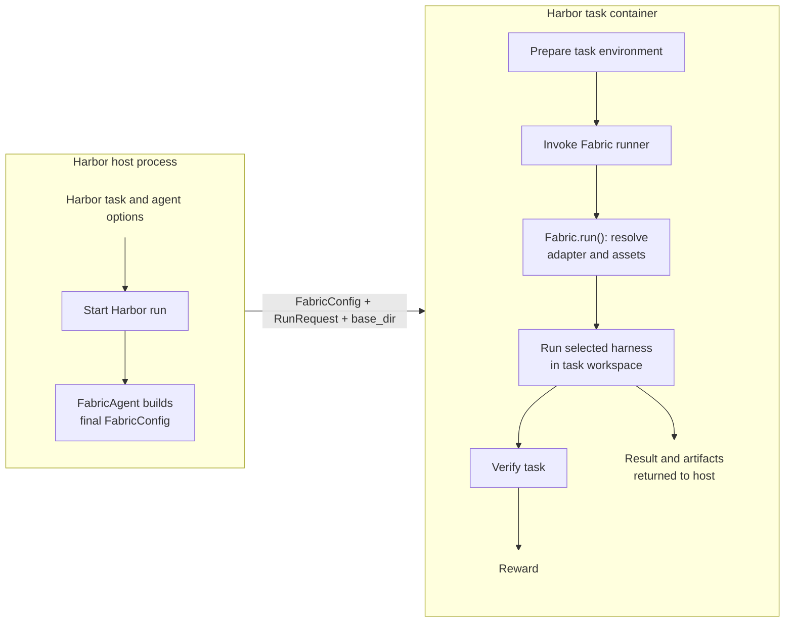

<!--
SPDX-FileCopyrightText: Copyright (c) 2026, NVIDIA CORPORATION & AFFILIATES. All rights reserved.
SPDX-License-Identifier: Apache-2.0
-->

# Run Fabric Agents with Harbor

This example runs an unchanged Harbor SWE-Bench task while Harbor options vary
the resulting in-memory `FabricConfig`. Harbor owns the task, container,
verifier, reward, retries, concurrency, and job layout. `FabricAgent` translates
the selected adapter, model, skills, MCP servers, tool policy, and telemetry
mode into one final typed config and asks Fabric to run it inside the task
container.



`FabricAgent` and `FabricConfig` construction run in the Harbor host process.
The pinned Fabric package, adapter discovery, harness execution, workspace, and
verifier run inside the isolated task container. Constructing the config does
not read task paths; adapter and asset resolution is deferred to
`Fabric.run()` with the task-local `base_dir`.

Run every command from the repository root on an x86_64 Linux host with Docker
and the Compose plugin available. The commands use Python 3.12, Harbor 0.18,
and the single task `swe-bench/django__django-13741`.

## Prepare the Host and Task Bundle

Create the host environment and verify the relevant entry points:

```bash
cd "$(git rev-parse --show-toplevel)"
uv sync --python 3.12 --extra runtime --extra harbor
uv run --extra runtime --extra harbor harbor --version
uv run --extra runtime --extra harbor python -c \
  'from nemo_fabric.integrations.harbor import FabricAgent; print(FabricAgent.import_path())'
docker version
docker compose version
```

The Harbor command must report 0.18.x, and the Python command must print
`nemo_fabric.integrations.harbor.fabric_agent:FabricAgent`.

Build the Fabric wheels and Relay executable that will be uploaded into the
isolated task container:

> **TEMP — remove when Fabric is released:** This source-checkout bootstrap is
> needed only while Fabric wheels are unavailable from PyPI. At release, the
> docs writer should replace `FABRIC_PACKAGE` with a pinned PyPI requirement and
> remove `prepare_swebench.sh`, `.fabric-package`, `.wheelhouse`,
> `FABRIC_FIND_LINKS`, and every `PIP_FIND_LINKS` argument. If the Claude Relay
> executable is not yet distributed or discovered automatically, retain only
> the Relay CLI preparation until that is resolved.

```bash
./examples/harbor/prepare_swebench.sh

export FABRIC_AGENT='nemo_fabric.integrations.harbor:FabricAgent'
export FABRIC_BUNDLE="$PWD/examples/harbor/swebench"
export FABRIC_PACKAGE="$(< "$FABRIC_BUNDLE/.fabric-package")"
export FABRIC_FIND_LINKS='/tmp/nemo-fabric-config/.wheelhouse'
export RUNS_DIR="$PWD/.tmp/harbor/fabric-swebench"
```

The preparation script builds the native runtime in a manylinux2014 container,
builds the standalone Relay 0.5.0 CLI in Debian Bullseye, and writes the exact
task-local package requirement to `.fabric-package`. The generated files are
ignored by Git.

### Docker installed with Snap

The Snap build of Docker sees a private `/tmp`, while Harbor creates temporary
Docker Compose overlays in the host temporary directory. If `command -v docker`
prints `/snap/bin/docker`, run this in every shell used for Harbor:

```bash
mkdir -p "$HOME/harbor-tmp"
export TMPDIR="$HOME/harbor-tmp"
uv run --extra runtime --extra harbor python -c \
  'import tempfile; print(tempfile.gettempdir())'
```

The final command must print a path under `$HOME/harbor-tmp`.

### Verify installation inside SWE-Bench

Run the credential-free installation gate before spending model tokens:

```bash
uv run --extra runtime --extra harbor harbor run \
  --task swe-bench/django__django-13741 \
  --agent "$FABRIC_AGENT" \
  --ak fabric_adapter_id=nvidia.fabric.hermes \
  --ak fabric_config_bundle="$FABRIC_BUNDLE" \
  --ak "fabric_package=$FABRIC_PACKAGE" \
  --ae "PIP_FIND_LINKS=$FABRIC_FIND_LINKS" \
  --install-only \
  --job-name django-13741-install \
  --jobs-dir "$RUNS_DIR" \
  --n-concurrent 1
```

The job must complete with one trial and no exception.

## How Harbor Inputs Become FabricConfig

`FabricAgent` starts with the selected adapter and Harbor task workspace, then
applies every run input through typed Fabric models before crossing the task
container boundary:

| Harbor input | `FabricConfig` field |
| --- | --- |
| `--ak fabric_adapter_id=...` | `harness.adapter_id` |
| `--model` | `models.default` |
| `--skill` | `skills.paths` |
| `--mcp-config` | `mcp.servers` |
| `--ak fabric_blocked_tools='[...]'` | `tools.blocked` |
| `--ak fabric_telemetry=relay` | `telemetry` and Relay ATOF/ATIF configuration |
| `--ak fabric_harness_settings='{...}'` | `harness.settings` for adapter-specific runtime controls |

The result is the complete `FabricConfig` uploaded with the `RunRequest` and
task-local `base_dir`. The container-side runner deserializes that payload and
passes it to `Fabric.run()` without adding configuration policy. The task,
verifier, and `FabricAgent` stay fixed, so each experiment changes only the
named Harbor input and its resulting evidence remains attributable.

The uploaded bundle contains adapter descriptors, the example MCP server,
generated wheels, and Relay. It does not contain a persisted `FabricConfig`.

## Run One Task with Hermes

The default Hermes command uses NVIDIA's hosted API:

```bash
: "${NVIDIA_API_KEY:?Export NVIDIA_API_KEY before running Hermes}"

uv run --extra runtime --extra harbor harbor run \
  --task swe-bench/django__django-13741 \
  --agent "$FABRIC_AGENT" \
  --model nvidia/nemotron-3-nano-30b-a3b \
  --ak fabric_adapter_id=nvidia.fabric.hermes \
  --ak fabric_config_bundle="$FABRIC_BUNDLE" \
  --ak "fabric_package=$FABRIC_PACKAGE" \
  --ae "PIP_FIND_LINKS=$FABRIC_FIND_LINKS" \
  --ae "NVIDIA_API_KEY=$NVIDIA_API_KEY" \
  --job-name django-13741-hermes \
  --jobs-dir "$RUNS_DIR" \
  --n-concurrent 1 \
  --n-attempts 1 \
  --max-retries 1
```

For a self-hosted OpenAI-compatible model, change `--model` and add a
`base_url` to `fabric_harness_settings`. The server must support automatic tool
calling; a successful plain chat completion is not sufficient for SWE-Bench.

## Run the Same Task with Claude

The task and verifier are unchanged. Only the adapter, model, credential, and
job name differ. Relay is enabled so the resulting ATIF confirms that the
harness switch reached Claude.

```bash
: "${ANTHROPIC_API_KEY:?Export ANTHROPIC_API_KEY before running Claude}"

uv run --extra runtime --extra harbor harbor run \
  --task swe-bench/django__django-13741 \
  --agent "$FABRIC_AGENT" \
  --model anthropic/claude-sonnet-4-5 \
  --ak fabric_adapter_id=nvidia.fabric.claude \
  --ak fabric_config_bundle="$FABRIC_BUNDLE" \
  --ak fabric_telemetry=relay \
  --ak 'fabric_harness_settings={"nemo_relay_command":"/tmp/nemo-fabric-config/.relay/bin/nemo-relay"}' \
  --ak "fabric_package=$FABRIC_PACKAGE" \
  --ae "PIP_FIND_LINKS=$FABRIC_FIND_LINKS" \
  --ae "ANTHROPIC_API_KEY=$ANTHROPIC_API_KEY" \
  --job-name django-13741-claude \
  --jobs-dir "$RUNS_DIR" \
  --n-concurrent 1 \
  --n-attempts 1 \
  --max-retries 1
```

Claude uses unattended permissions only inside Harbor's ephemeral task
container. Do not apply that permission mode to a normal host environment.

## Vary One Fabric Capability

Start from the Hermes command, replace its `--job-name`, and add the option in
the middle column. Relay is enabled for every capability variation so its ATIF
can confirm that the input reached the harness.

| Experiment | Add to the Hermes command | Replacement job name |
| --- | --- | --- |
| Skill | `--skill "$PWD/examples/harbor/swebench/skills/swebench-debugging" --ak fabric_telemetry=relay` | `django-13741-hermes-skill` |
| MCP | `--mcp-config "$FABRIC_BUNDLE/mcp/repo-inspector.mcp.json" --ak fabric_telemetry=relay` | `django-13741-hermes-mcp` |
| Blocked tool | `--ak 'fabric_blocked_tools=["browser"]' --ak fabric_telemetry=relay` | `django-13741-hermes-tools` |
| Telemetry only | `--ak fabric_telemetry=relay` | `django-13741-hermes-relay` |

For example, the complete skill variation is:

```bash
: "${NVIDIA_API_KEY:?Export NVIDIA_API_KEY before running Hermes}"

uv run --extra runtime --extra harbor harbor run \
  --task swe-bench/django__django-13741 \
  --agent "$FABRIC_AGENT" \
  --model nvidia/nemotron-3-nano-30b-a3b \
  --skill "$PWD/examples/harbor/swebench/skills/swebench-debugging" \
  --ak fabric_adapter_id=nvidia.fabric.hermes \
  --ak fabric_config_bundle="$FABRIC_BUNDLE" \
  --ak fabric_telemetry=relay \
  --ak "fabric_package=$FABRIC_PACKAGE" \
  --ae "PIP_FIND_LINKS=$FABRIC_FIND_LINKS" \
  --ae "NVIDIA_API_KEY=$NVIDIA_API_KEY" \
  --job-name django-13741-hermes-skill \
  --jobs-dir "$RUNS_DIR" \
  --n-concurrent 1 \
  --n-attempts 1 \
  --max-retries 1
```

The MCP definition starts the dependency-free
[`repo_inspector.py`](swebench/mcp/repo_inspector.py) inside the task container.
The MCP definition itself enters through Harbor's `--mcp-config` option.

For a pure telemetry comparison, run the Hermes baseline once without
`fabric_telemetry`, then repeat it with `--ak fabric_telemetry=relay`. No other
model, harness, capability, task, or verifier input changes.

## Verify Reward and Relay Evidence

Harbor's verifier is the correctness authority. Relay telemetry is separate run
evidence and never replaces or changes the SWE-Bench reward.

Select a completed job and verify that it has one completed trial, no errors,
and a verifier reward. A reward of `0.0` is still a valid verifier result; it
means the proposed patch did not pass the task tests.

```bash
export JOB_NAME=django-13741-hermes
export RESULT_PATH="$RUNS_DIR/$JOB_NAME/result.json"

uv run --extra runtime --extra harbor python - "$RESULT_PATH" <<'PY'
import json
import sys

result = json.load(open(sys.argv[1], encoding="utf-8"))
stats = result["stats"]
assert stats["n_completed_trials"] == 1, stats
assert stats["n_errored_trials"] == 0, stats
rewards = {
    reward
    for evaluation in stats["evals"].values()
    for reward, trials in evaluation["reward_stats"]["reward"].items()
    if trials
}
assert rewards, "Harbor did not record a verifier reward"
print("verifier reward:", ", ".join(sorted(rewards)))
PY

uv run --extra runtime --extra harbor harbor view "$RUNS_DIR/$JOB_NAME"
```

For a Relay-enabled job, select its job name and inspect the published evidence:

```bash
export JOB_NAME=django-13741-hermes-relay

find "$RUNS_DIR/$JOB_NAME" \
  -path '*/agent/telemetry-validation.json' \
  -exec uv run --extra runtime --extra harbor python -m json.tool {} \;
find "$RUNS_DIR/$JOB_NAME" \
  -path '*/agent/trajectory.json' \
  -exec uv run --extra runtime --extra harbor python -m json.tool {} \;
find "$RUNS_DIR/$JOB_NAME" \
  \( -name '*.atof.jsonl' -o -name '*.atif.json' \) -print
```

Relay-enabled runs preserve the direct Relay ATOF and ATIF files. Fabric
promotes Relay's ATIF to `agent/trajectory.json`, Harbor's canonical ATIF path,
and also publishes `agent/telemetry-validation.json` plus the normalized
`agent/fabric-result-<id>.json`. Validate ATOF and ATIF independently.

Sample output from successful Relay-enabled Hermes and Claude runs is checked
in under [`swebench/sample-artifacts/`](swebench/sample-artifacts/). Large
telemetry files use Git LFS.

## Progress to a Full Run

Complete the install gate and the single-task experiments first. Then run a
five-task Hermes shard with Relay enabled:

```bash
: "${NVIDIA_API_KEY:?Export NVIDIA_API_KEY before running Hermes}"

uv run --extra runtime --extra harbor harbor run \
  --dataset swe-bench/swe-bench-verified \
  --n-tasks 5 \
  --agent "$FABRIC_AGENT" \
  --model nvidia/nemotron-3-nano-30b-a3b \
  --ak fabric_adapter_id=nvidia.fabric.hermes \
  --ak fabric_config_bundle="$FABRIC_BUNDLE" \
  --ak fabric_telemetry=relay \
  --ak "fabric_package=$FABRIC_PACKAGE" \
  --ae "PIP_FIND_LINKS=$FABRIC_FIND_LINKS" \
  --ae "NVIDIA_API_KEY=$NVIDIA_API_KEY" \
  --job-name swebench-verified-hermes-5 \
  --jobs-dir "$RUNS_DIR" \
  --n-concurrent 1 \
  --n-attempts 1 \
  --max-retries 1
```

Spot-check progress and evidence without changing the running job:

```bash
export JOB_NAME=swebench-verified-hermes-5
uv run --extra runtime --extra harbor harbor view "$RUNS_DIR/$JOB_NAME"
find "$RUNS_DIR/$JOB_NAME" -name result.json -print | head
find "$RUNS_DIR/$JOB_NAME" \
  -path '*/agent/telemetry-validation.json' -print | head
```

Inspect every exception and reward plus at least one Fabric result and telemetry
summary. Resume an interrupted job from its recorded configuration:

```bash
export JOB_NAME=swebench-verified-hermes-5
uv run --extra runtime --extra harbor harbor job resume \
  --job-path "$RUNS_DIR/$JOB_NAME"
```

Remove `--n-tasks` only after the shard is healthy, and choose concurrency that
respects model and Docker resource limits.
