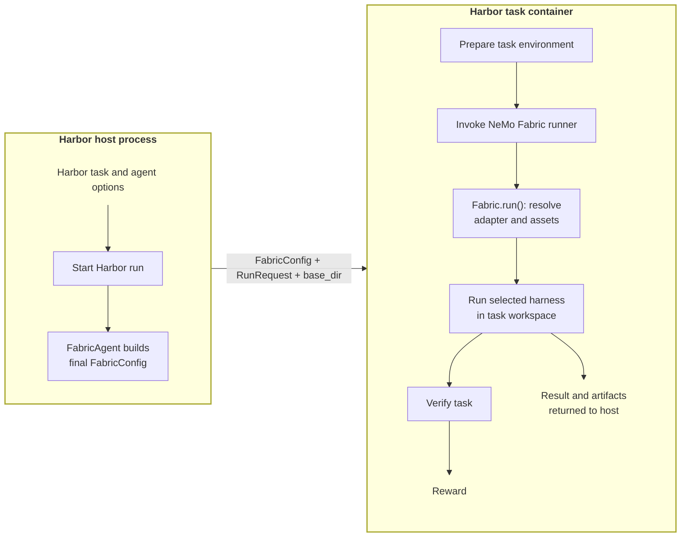

<!--
SPDX-FileCopyrightText: Copyright (c) 2026, NVIDIA CORPORATION & AFFILIATES. All rights reserved.
SPDX-License-Identifier: Apache-2.0
-->

# Run NVIDIA NeMo Fabric Agents with Harbor

These examples keep Harbor in control of tasks, containers, verification,
rewards, retries, concurrency, and job layout while `FabricAgent` translates
Harbor options into one final typed `FabricConfig`. Complete the shared host
setup below, then use any walkthrough that matches the integration behavior
you want to exercise.

## Walkthroughs

| Walkthrough | What it demonstrates |
| --- | --- |
| [Calculator walkthrough](calculator/README.md) | Validate the complete integration and Harbor reward with a deterministic, credential-free smoke test, then optionally run the same task with the LLM-backed Hermes Agent or Claude harness. |
| [SWE-Bench walkthrough](swebench/README.md) | Run Hermes Agent and Claude experiments with skills, MCP servers, tool policy, Relay telemetry, and SWE-Bench verification. |

The calculator's scripted run is useful for validating a new checkout or
environment without calling an LLM. Its Hermes Agent and Claude runs exercise real
model integrations on the same small task. SWE-Bench exercises a real coding
task and supports comparisons across configuration variations.

## Execution Model



`FabricAgent` and `FabricConfig` construction run in the Harbor host process.
The pinned NeMo Fabric package, adapter discovery, harness execution, workspace, and
verifier run inside the isolated task container. Constructing the config does
not read task paths; adapter and asset resolution is deferred to
`Fabric.run()` with the task-local `base_dir`.

## How Harbor Inputs Become FabricConfig

`FabricAgent` starts with the selected adapter and Harbor task workspace, then
applies every run input through typed NeMo Fabric models before crossing the task
container boundary:

| Harbor input | `FabricConfig` field |
| --- | --- |
| `--ak fabric_adapter_id=...` | `harness.adapter_id` |
| `--model` | `models.default` |
| `--skill` | `skills.paths` |
| `--mcp-config` | `mcp.servers` |
| `--ak fabric_blocked_tools='[...]'` | `tools.blocked` |
| `--ak fabric_telemetry=relay` | `telemetry` and Relay ATOF/ATIF configuration |
| `--ak fabric_harness_settings='{...}'` | `harness.settings` for adapter-specific runtime controls |

The result is the complete `FabricConfig` uploaded with the `RunRequest` and
task-local `base_dir`. The container-side runner deserializes that payload and
passes it to `Fabric.run()` without adding configuration policy. The task,
verifier, and `FabricAgent` stay fixed, so each experiment changes only the
named Harbor input and its resulting evidence remains attributable.

## Shared Host Setup

Run every command from the repository root on an x86_64 Linux host with Python
3.12, `uv`, Docker, and the Docker Compose plugin. Create the host environment
and verify the relevant entry points:

```bash
cd "$(git rev-parse --show-toplevel)"
uv sync --python 3.12 --extra runtime --extra harbor
uv run --extra runtime --extra harbor harbor --version
uv run --extra runtime --extra harbor python -c \
  'from nemo_fabric.integrations.harbor import FabricAgent; print(FabricAgent.import_path())'
docker version
docker compose version
```

The Harbor command must report 0.18.x, and the Python command must print
`nemo_fabric.integrations.harbor.fabric_agent:FabricAgent`.

### Docker Installed with Snap

The Snap build of Docker sees a private `/tmp`, while Harbor creates temporary
Docker Compose overlays in the host temporary directory. If `command -v docker`
prints `/snap/bin/docker`, run this in every shell used for Harbor:

```bash
mkdir -p "$HOME/harbor-tmp"
export TMPDIR="$HOME/harbor-tmp"
uv run --extra runtime --extra harbor python -c \
  'import tempfile; print(tempfile.gettempdir())'
```

The final command must print a path under `$HOME/harbor-tmp`. Keep this shell
open and continue with either the [calculator](calculator/README.md) or
[SWE-Bench](swebench/README.md) guide.
