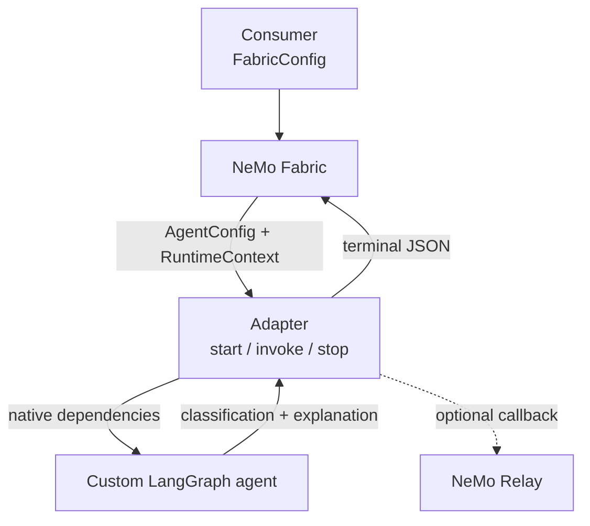
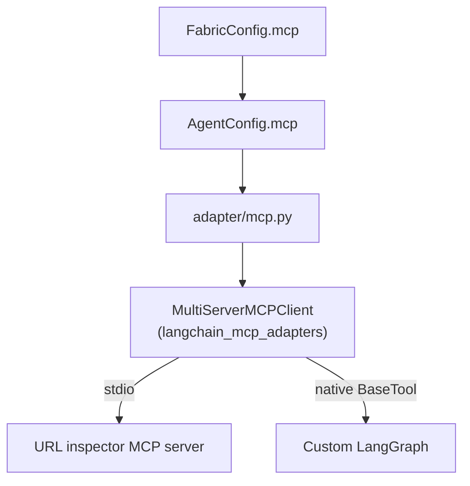

<!--
SPDX-FileCopyrightText: Copyright (c) 2026, NVIDIA CORPORATION & AFFILIATES. All rights reserved.
SPDX-License-Identifier: Apache-2.0
-->

# NVIDIA NeMo Fabric LangGraph Custom Agent Adapter

This source-only example uses a small email-phishing analyzer to demonstrate
the NeMo Fabric adapter contract for a custom LangGraph agent. The graph owns
application behavior, the adapter owns translation and lifecycle, and the
consumer owns `FabricConfig`.

The following diagram shows those ownership boundaries:



The application-owned LangGraph agent has no dependency on NeMo Fabric or NeMo
Relay.

This is a dedicated custom-agent adapter: selecting its `adapter_id` selects
this email analyzer. It is not a generic loader for arbitrary LangGraph agents
and therefore does not accept `workflow`.

## Minimum Contract

Custom-agent adapter developers should start with
`adapter/email-phishing.fabric-adapter.json`
and `adapter/runtime.py`. The descriptor declares the adapter contract, while
the runtime implements its lifecycle and delegates configuration translation
and optional integrations to the adjacent modules.

The descriptor selects typed southbound configuration and advertises only the
fields the adapter applies:

```json
"config": {
  "accepts": [
    "models",
    "models.base_url",
    "models.temperature",
    "instructions.system",
    "mcp",
    "mcp.tool_filters"
  ],
  "system_instruction_modes": ["replace", "append"]
}
```

The minimum path configures only a model and instruction; MCP is an optional
extension described below. NeMo Fabric projects configured values from
`FabricConfig` into `AgentConfig`. The adapter resolves `models.default` into
`ChatOpenAI`, replaces or appends the normalized system instruction as
configured, compiles one graph during `start`, and retains it for ordered
invocations. The custom graph
receives native dependencies; it does not parse either NeMo Fabric
configuration type.

The local-host lifecycle transport carries invocation requests and results in
JSON envelopes. That extraction stays at the edge of `adapter/runtime.py`;
`AgentRunRequest` and `AgentRunResult` are not negotiated by this transport.

A successful terminal output is deliberately small:

```json
{
  "classification": "phishing",
  "response": "The email combines several phishing signals.",
  "signals": [
    "urgency",
    "credential_request",
    "external_link",
    "account_threat"
  ]
}
```

## Warm Session Continuation

The adapter retains a rolling completed-assessment history on its NeMo Fabric
runtime and passes that history into an otherwise stateless graph. The following
example runs two ordered invocations on one live runtime without requiring
caller-side replay.

```python
async with await fabric.start_runtime(config, base_dir=base_dir) as runtime:
    first = await runtime.invoke(
        input="Urgent: verify your password at https://example.invalid."
    )
    second = await runtime.invoke(input="Team lunch is at noon.")
```

The second result includes `previous_classification: "phishing"`, proving that
it observed the first assessment. Invocation results and telemetry remain
independent. The history is owned by the adapter runtime, so another runtime
cannot see it and `stop()` ends the continuation window.

By default, the runtime retains the 20 most recent assessments and discards
the oldest entry when the window is full. Consumers can set
`harness.settings.continuation.max_history_entries` to a value from 1 through
1000. This adapter-specific setting bounds both retained memory and the prior
assessments included in later model prompts.

This is warm continuation, not durable resume. The example does not serialize
conversation state or recreate it after the adapter host stops.

## Configuration Variations

Every variation returns an independent `FabricConfig`:

| Variation | Consumer API or CLI | Southbound Effect |
| --- | --- | --- |
| Model | `--model` | `models.default.model` |
| Instruction | `with_system_instruction(..., mode=...)`, `--system-instruction`, and `--system-instruction-mode` | `instructions.system` with `replace` or `append` |
| Temperature | `with_temperature(...)` or `--temperature` | `models.default.temperature` |
| Continuation history | `with_continuation_history_limit(...)` or `--max-history-entries` | `harness.settings.continuation.max_history_entries` |
| stdio MCP | `with_url_inspector_mcp(...)` or `--mcp` | `mcp.servers` and per-server tool policy |

The descriptor bounds variation. Unsupported providers, extra model roles,
model-specific settings, missing endpoints, and missing credential variables
fail explicitly rather than being ignored.

## Optional stdio MCP Tool

`with_url_inspector_mcp(config)` adds a deterministic URL-inspection server as
an optional capability beyond the minimum adapter surface:



The adapter validates stdio transport, converts normalized server settings
through the official LangChain MCP adapter, and applies each server's allow
and block lists. The graph receives only the resulting native `BaseTool`; it
does not know about NeMo Fabric or MCP configuration. The tool checks URL
syntax locally and makes no network requests. Startup fails if the configured
policy does not expose exactly one `inspect_url` tool.

Add `--mcp` to a live command to exercise this path. MCP sessions and stdio
processes are scoped to discovery or tool calls by `MultiServerMCPClient`; the
NeMo Fabric runtime retains the compiled graph and native tool between
invocations.

## Optional Relay Telemetry

`with_relay(config)` enables ATOF and ATIF without changing the adapter
lifecycle. During `invoke`, NeMo Fabric supplies `RuntimeContext.telemetry`; the
adapter loads that generated configuration, opens one invocation-level Agent
scope, and passes `NemoRelayCallbackHandler` through LangGraph
runnable config. Relay records the graph and its model-backed node, while the
terminal result remains separate.

Relay is imported only on the enabled path. This adapter does not implement a
streaming operation: NeMo Fabric's Relay-backed `Runtime.invoke_stream()` still
runs the ordinary adapter `invoke` operation.

## Run the Source Example

Because this is a source-only example, make the repository importable. The
consumer config discovers the adjacent descriptor through an explicit local
path:

```bash
uv sync --group langgraph-example
export FABRIC_LANGGRAPH_EXAMPLE="$PWD/.tmp/langgraph-custom-agent"
export PYTHONPATH="$PWD"
export ADAPTER_PYTHON="$PWD/.venv/bin/python"
```

Planning is credential-free:

```bash
.venv/bin/python -m examples.langgraph_custom_agent.consumer \
  --base-dir "$FABRIC_LANGGRAPH_EXAMPLE" --plan
```

Run the default model through `https://integrate.api.nvidia.com/v1`:

```bash
export NVIDIA_API_KEY="..."
.venv/bin/python -m examples.langgraph_custom_agent.consumer \
  --base-dir "$FABRIC_LANGGRAPH_EXAMPLE"
```

The endpoint key must grant access to the configured model. Use `--model` when
the endpoint exposes a different authorized model ID.

Add `--relay` to either live command to produce correlated ATOF and ATIF under
`$FABRIC_LANGGRAPH_EXAMPLE/artifacts/relay/`.

Add `--mcp` to include URL inspection before classification. The two optional
paths compose, so `--mcp --relay` traces the MCP-backed graph node as well as
the model-backed explanation.

Pass `--follow-up "Team lunch is at noon."` to run two ordered invocations on
one live runtime and inspect the retained assessment context. Add
`--max-history-entries 10` to select the runtime's rolling history window.

The example intentionally omits generic workflow loading, named tools, skills,
durable checkpointing, cancellation, cold resume, updates, and native
streaming. The stdio MCP path is kept optional so the required adapter
lifecycle remains easy to identify.
