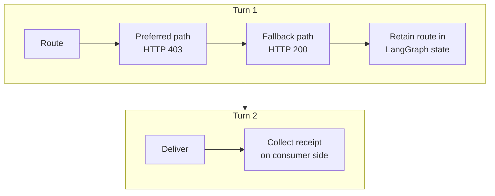

<!--
SPDX-FileCopyrightText: Copyright (c) 2026, NVIDIA CORPORATION & AFFILIATES. All rights reserved.
SPDX-License-Identifier: Apache-2.0
-->

# Run a Stateful LangGraph Agent in OpenShell

Portable Courier is a credential-free end-to-end example of experimental
OpenShell provider support in NVIDIA NeMo Fabric. It runs a custom LangGraph
agent in a real OpenShell sandbox without adding OpenShell-specific logic to
the agent or its Fabric adapter.

For component placement, lifecycle, and ownership, refer to the
[OpenShell environment provider architecture](../../environment-providers/openshell/README.md).

## Scenario

The example sends two inputs to one Fabric runtime:



The first turn tries `GET /priority-lane`. The OpenShell L7 policy permits only
`GET /`, so the agent observes the denial and selects the allowed fallback.

The second turn uses the retained LangGraph state to write
`delivery-receipt.json`. The adapter declares the file, and Fabric collects it
through a traversal-safe, size-bounded operation.

## Run the Example

The primary deployment demonstration uses a caller-owned sandbox:

```bash
OPENSHELL_EXAMPLE_MODE=deployment \
  bash examples/langgraph_openshell/run-demo.sh
```

The script performs the following actions:

1. Builds the agent runtime image and OpenShell environment provider.
2. Downloads and verifies pinned, published OpenShell binaries.
3. Starts the published OpenShell gateway with its Docker driver.
4. Creates a digest-pinned, policy-configured sandbox as the consumer.
5. Attaches Fabric to the sandbox by name and immutable ID.
6. Runs the two-turn LangGraph session and collects the receipt.
7. Stops the Fabric runtime and verifies that Fabric did not delete the
   caller-owned sandbox.

The script deletes the caller-owned sandbox during its own final cleanup.

To run both deployment and optional Fabric-managed development modes, use the
default command:

```bash
bash examples/langgraph_openshell/run-demo.sh
```

To run only the development mode, use the following command:

```bash
OPENSHELL_EXAMPLE_MODE=development \
  bash examples/langgraph_openshell/run-demo.sh
```

Development mode uses `prepare_environment` to create the sandbox. It verifies
that `release_environment` deletes the Fabric-owned sandbox after the runtime
stops.

## Requirements

Install the following tools before running the example:

- Docker
- Rust and Cargo
- `curl`
- Python 3
- `tar`
- `uv`

The first run downloads the pinned OpenShell release and builds the agent
runtime image. Later runs reuse the verified release under `.tmp/`.

Set `OPENSHELL_VERSION` to test another published release. Set
`OPENSHELL_EXAMPLE_PORT` if port `18080` is unavailable.

## Expected Evidence

A successful deployment run demonstrates:

- the same Fabric runtime ID for both turns;
- an HTTP 403 response for the preferred route;
- an HTTP 200 response for the allowed fallback;
- retained LangGraph state during the delivery turn;
- a receipt collected below `.tmp/portable-courier/artifacts/`; and
- a caller-owned sandbox that still exists after Fabric detaches.

On failure, the script prints the tail of the OpenShell gateway log before
cleaning up its temporary state.

## What This Example Proves

- A custom agent and its Fabric adapter can run unchanged inside OpenShell.
- One Fabric runtime preserves one ordered, stateful agent session.
- OpenShell, not Fabric, enforces the sandbox policy.
- The deployment consumer retains sandbox lifecycle and concurrency control.
- Fabric normalizes invocation results and declared artifacts across the
  sandbox boundary.
