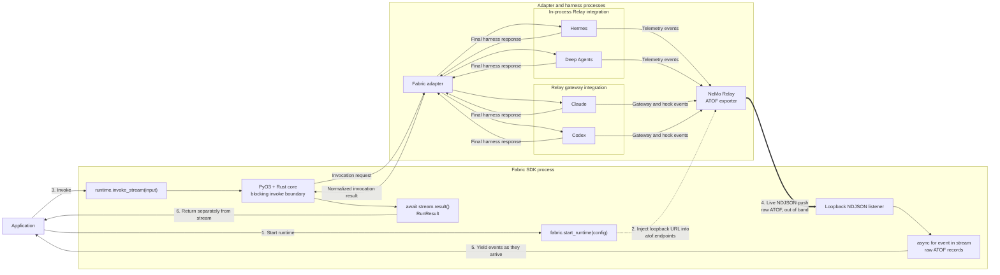

# Streaming POC — implementation spec

How the relay-only streaming works end to end, centered on the **loopback NDJSON
listener** that carries raw ATOF back to the caller *out of band*. The v0.1 API is
`runtime.invoke_stream()` yielding raw ATOF, with `RunResult` delivered separately.

## Architecture

## End-to-end flow

1. **Start runtime.** `fabric.start_runtime(config)`. When Relay is enabled, Fabric
   starts a loopback listener and injects its URL into
   `relay.observability.atof.endpoints` (transport `ndjson`) *before* the adapter
   subprocess is spawned.
2. **Inject loopback URL.** The injected endpoint survives planning verbatim into
   the adapter's relay config (no Rust/core change), so Relay — in-process or
   gateway — knows to push ATOF to the SDK-owned listener.
3. **Invoke.** `runtime.invoke_stream(input)` runs `runtime.invoke()` as a
   background task; the blocking PyO3 + Rust core drives the adapter subprocess.
4. **Live NDJSON push.** As the harness runs, Relay's ATOF exporter pushes each
   record to the listener over a single long-lived chunked
   `application/x-ndjson` POST — **out of band**, sidestepping both the blocking
   invoke boundary and the adapter's one-response-per-op stdio protocol.
5. **Yield events.** The listener enqueues each raw ATOF record; `async for event
   in stream` yields them as they arrive.
6. **Return result separately.** When `invoke()` completes, its normalized
   `RunResult` returns through the Rust core and is delivered by
   `await stream.result()` — never mixed into the event stream.

## The loopback NDJSON listener

- A small loopback HTTP server in the SDK process (`common/atof_stream.py`). Relay
  opens **one chunked `application/x-ndjson` POST** on the first event and streams
  **one JSON ATOF record per line**; the connection stays open for the run and
  closes at shutdown.
- Reads raw chunks and splits on newlines itself — gateway records embed the full
  model request/response and exceed aiohttp's default 512 KB readline limit.
- **Bounded queue + TCP backpressure** caps memory; delivery is best-effort under
  sustained stall (Relay drops past its ~3 s flush/close timeout).
- **One listener per runtime**; `invoke_stream` delimits turns by `invoke`
  completion (two-turn isolation verified — no cross-turn leakage).

## Relay integration modes (one mechanism)

- **In-process** (Hermes, Deep Agents): Relay runs inside the adapter subprocess
  and pushes ATOF directly to the loopback URL.
- **Gateway** (Claude, Codex): the external `nemo-relay` gateway renders the
  endpoint as a `{type: stream, transport: ndjson}` sink and pushes from there.

Both honor the *same* injected endpoint — no per-harness streaming code.

## Key properties

- **Relay-only**: available only when Relay is enabled; else `FabricCapabilityError`.
- **Raw ATOF pass-through**; no Fabric-specific normalization in v0.1.
- **`RunResult` out of band** via `await stream.result()`.
- **Honest early-exit**: `aclose()` detaches the consumer but does not interrupt
  the in-flight turn (blocking native call on a worker thread); `runtime.stop()`
  aborts.
- **No Rust/core change**: streaming rides the existing relay-config path.
