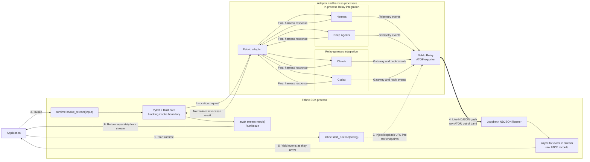

<!--
SPDX-FileCopyrightText: Copyright (c) 2026, NVIDIA CORPORATION & AFFILIATES. All rights reserved.
SPDX-License-Identifier: Apache-2.0
-->

# Streaming POC — Implementation Spec

How the relay-only streaming works end to end, centered on the **loopback NDJSON
listener** that carries raw ATOF back to the caller *out of band*. The v0.1 API is
`runtime.invoke_stream()` yielding raw ATOF, with `RunResult` delivered separately.

> **Proposed v0.1 API — not implemented in the SDK.** The `fabric.start_runtime(config).invoke_stream(...)`
> snippets below show the intended production surface. The runnable POC models it in
> [`common/fabric_stream.py`](common/fabric_stream.py) via `start_streaming_runtime()`
> and `StreamingRuntime`.

## Architecture

## End-to-End Flow

1. **Start runtime.** `fabric.start_runtime(config)`. When Relay is enabled, Fabric
   starts a loopback listener and injects its URL into
   `relay.observability.atof.endpoints` (transport `ndjson`) *before* the adapter
   subprocess is spawned.
2. **Inject loopback URL.** The injected endpoint survives planning verbatim into
   the adapter's relay config (no Rust/core change), so Relay — in-process or
   gateway — knows to push ATOF to the SDK-owned listener.
3. **Invoke.** `runtime.invoke_stream(input)` runs `runtime.invoke()` as a
   background task; the blocking PyO3 + Rust core drives the adapter subprocess.
4. **Live NDJSON push.** As the harness runs, Relay's ATOF exporter pushes each
   record to the listener over a single long-lived chunked
   `application/x-ndjson` POST — **out of band**, sidestepping both the blocking
   invoke boundary and the adapter's one-response-per-op stdio protocol.
5. **Yield events.** The listener enqueues each raw ATOF record; `async for event
   in stream` yields them as they arrive.
6. **Return result separately.** When `invoke()` completes, its normalized
   `RunResult` returns through the Rust core and is delivered by
   `await stream.result()` — never mixed into the event stream.

## The Loopback NDJSON Listener

- A small loopback HTTP server in the SDK process (`common/atof_stream.py`). Relay
  opens **one chunked `application/x-ndjson` POST** on the first event and streams
  **one JSON ATOF record per line**; the connection stays open for the run and
  closes at shutdown.
- Reads raw chunks and splits on newlines itself — gateway records embed the full
  model request/response and exceed aiohttp's default 512 KB readline limit.
- **Bounded queue (default `maxsize=1024`) + TCP backpressure** caps memory: a full
  queue blocks the handler's `put()`, stops reading the socket, and Relay's sender
  backs off; delivery is best-effort under sustained stall (Relay drops past its
  ~3 s flush/close timeout). Pass `maxsize=0` to opt into an unbounded queue.
- **One listener per runtime**; `invoke_stream` delimits turns by `invoke`
  completion, then drains trailing records for a short settle window (`_DRAIN`,
  250 ms). The checked-in artifact
  [`two-turn-isolation.jsonl`](two-turn-isolation.jsonl) (runner:
  [`common/two_turn_isolation.py`](common/two_turn_isolation.py)) demonstrates **one**
  clean run — two turns on one persistent runtime, disjoint record `uuid`s (overlap
  0), no sentinel leakage. **This is best-effort, not a guarantee:** the settle
  window is a timing heuristic, so a trailing record that arrives after it (e.g. at
  300 ms) could still land in the next turn. Production needs a *positive* turn
  boundary — explicit per-record turn attribution or a terminal delivery
  acknowledgement — not a timer (see the work breakdown).

## Relay Integration Modes (One Mechanism)

- **In-process** (Hermes, Deep Agents): Relay runs inside the adapter subprocess
  and pushes ATOF directly to the loopback URL.
- **Gateway** (Claude, Codex): the external `nemo-relay` gateway renders the
  endpoint as a `{type: stream, transport: ndjson}` sink and pushes from there.

Both honor the *same* injected endpoint — no per-harness streaming code.

## Key Properties

- **Relay-only**: available only when Relay is enabled; else `FabricCapabilityError`.
- **Raw ATOF pass-through**; no Fabric-specific normalization in v0.1.
- **`RunResult` out of band** via `await stream.result()`.
- **Honest early-exit**: to stop early, break the `async for` **and then**
  `await stream.aclose()`. Breaking alone only stops iteration — it does **not**
  clean up; `aclose()` is what finalizes: it **waits for the turn to complete** (the
  blocking native call on a worker thread runs to completion — it is not
  interrupted), then drains and discards the unread records (best-effort; the drain
  is the same 250 ms timing heuristic — see the loopback-listener note on isolation).
  `stream.result()` stays awaitable throughout. Until the stream is
  finalized (fully consumed or `aclose()`d), the next `invoke_stream` raises
  `FabricStateError`. **There is no in-flight cancellation in v0.1:**
  `runtime.stop()` also raises while a turn is active (idle-only teardown), so a turn
  is torn down only after it finishes. A real cancellation path is a production
  follow-up (see the work breakdown).
- **No Rust/core change**: streaming rides the existing relay-config path.
